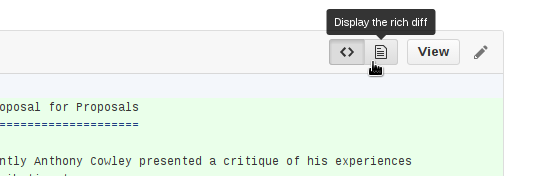
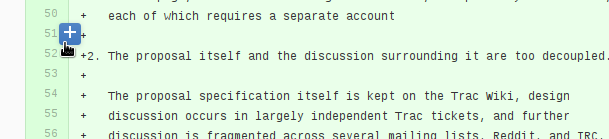

GHC Proposals
=============

This repository contains specifications for proposed changes to the
`Glasgow Haskell Compiler <https://www.haskell.org/ghc>`_.
The purpose of the GHC proposal process and of
the GHC Steering Committee is to broaden the discussion of the evolution of
GHC.

* `≡ List of proposals under discussion <https://github.com/ghc-proposals/ghc-proposals/pulls?q=is%3Aopen+is%3Apr+no%3Alabel>`_
* `≡ List of proposals waiting for shepherd recommendation <https://github.com/ghc-proposals/ghc-proposals/pulls?q=is%3Aopen+is%3Apr+label%3A%22Pending+shepherd+recommendation%22>`_
* `≡ List of proposals waiting for committee decision <https://github.com/ghc-proposals/ghc-proposals/pulls?q=is%3Aopen+is%3Apr+label%3A%22Pending+committee+review%22>`_
* `≡ List of accepted proposals <https://github.com/ghc-proposals/ghc-proposals/pulls?q=is%3Apr+label%3A%22Accepted%22>`_
* `≡ List of rejected proposals <https://github.com/ghc-proposals/ghc-proposals/pulls?q=is%3Apr+label%3A%22Rejected%22>`_
* `≡ List of proposals pending implementation <https://github.com/ghc-proposals/ghc-proposals/pulls?q=is%3Apr+label%3A%22Accepted%22+-label%3A%22Implemented%22>`_
* `≡ List of implemented proposals <https://github.com/ghc-proposals/ghc-proposals/pulls?q=is%3Apr+label%3A%22Implemented%22>`_
* `≡ List of all proposals <https://github.com/ghc-proposals/ghc-proposals/pulls?q=>`_

What is a proposal?
-------------------

A GHC Proposal is a document describing a proposed change to the compiler, the
GHC/Haskell language, or the libraries in the ``GHC.*`` module namespace. These
include,

* A syntactic change to GHC/Haskell (e.g. the various ``ShortImports``
  `proposals <https://gitlab.haskell.org/ghc/ghc/issues/10478>`_, ``do``
  `expressions <https://gitlab.haskell.org/ghc/ghc/issues/10843>`_ without ``$``)

* A major change to the user-visible behaviour of the compiler (e.g. the recent
  `change <https://gitlab.haskell.org/ghc/ghc/issues/11762>`_ in super-class
  solving, and ``-Wall`` `behavior <https://gitlab.haskell.org/ghc/ghc/issues/11370>`_)

* The addition of major features to the compiler (e.g. ``-XTypeInType``, GHCi
  `commands <https://gitlab.haskell.org/ghc/ghc/issues/10874>`_,
  `type-indexed <https://gitlab.haskell.org/ghc/ghc/wikis/typeable>`_
  ``Typeable`` representations)

Changes to the GHC API or the plugin API are not automatically within the scope
of the committee, and can be contributed following the usual GHC workflow.
Should the GHC maintainers deem a change significant or controversial enough to
warrant that, they may, at their discretion, involve the committee and ask the
contributor to write a formal proposal.

Proposals may contain amendments to our principles_, which serve as a guideline
for future proposals and for the general evolution of GHC.

.. _principles: principles.rst

The life cycle of a proposal
-----------------------------------

This section outlines what stages a proposal may go through. The stage is identified by a GitHub label, which is identified in the following list.

1. (No label.) The author drafts a proposal.

   `What is a proposal? <#what-is-a-proposal>`_

2. (No label.) The author submits the proposal to the wider Haskell community for discussion, as a pull request against this repository.

   `How to submit a proposal <#how-to-start-a-new-proposal>`_

3. (No label.)  The wider community discusses the proposal in the commit section of the pull
   request, while the author refines the proposal. This phase lasts as long as necessary.

   `Discussion goals <#discussion-goals>`_ •
   `How to comment on a proposal <#how-to-comment-on-a-proposal>`_ •
   `≡ List of proposals under discussion <https://github.com/ghc-proposals/ghc-proposals/pulls?q=is%3Aopen+is%3Apr+no%3Alabel>`_

4. Label: `Pending shepherd recommendation <https://github.com/ghc-proposals/ghc-proposals/pulls?q=is%3Aopen+is%3Apr+label%3A%22Pending+shepherd+recommendation%22>`_.  Eventually *the proposal author* brings the proposal before the committee for review.

   `How to bring a proposal before the committee <#how-to-bring-a-proposal-before-the-committee>`_ •
   `Who is the committee? <#who-is-the-committee>`_   •
   `≡ List of proposals waiting for shepherd <https://github.com/ghc-proposals/ghc-proposals/pulls?q=is%3Aopen+is%3Apr+label%3A%22Pending+shepherd+recommendation%22>`_

5. Label: `Pending committee review <https://github.com/ghc-proposals/ghc-proposals/pulls?q=is%3Aopen+is%3Apr+label%3A%22Pending+committee+review%22>`_.  One committee member steps up as a shepherd, and generates consensus within the committee within four or five weeks.

   `Committee process <#committee-process>`_ •
   `Review criteria <#review-criteria>`_ •
   `≡ List of proposals under review <https://github.com/ghc-proposals/ghc-proposals/pulls?q=is%3Aopen+is%3Apr+label%3A%22Pending+committee+review%22>`_

6. Eventually, the committee rejects a proposal (label: Rejected), or passes it back to the
   author for review (label: `Needs revision <https://github.com/ghc-proposals/ghc-proposals/pulls?q=label%3A%22Needs+revision%22>`_), or accepts it (label: `Accepted <https://github.com/ghc-proposals/ghc-proposals/pulls?q=label%3A%22Accepted%22>`_).

   Acceptance of the proposal implies that the implementation will be accepted
   into GHC provided it is well-engineered, well-documented, and does not
   complicate the code-base too much.

   `≡ List of accepted proposals <https://github.com/ghc-proposals/ghc-proposals/tree/master/proposals>`_ •
   `≡ List of proposals being revised <https://github.com/ghc-proposals/ghc-proposals/pulls?q=label%3A%22Needs+revision%22>`_ •
   `≡ List of rejected proposals <https://github.com/ghc-proposals/ghc-proposals/pulls?q=label%3A%Rejected%22>`_

7. Label: `Dormant <https://github.com/ghc-proposals/ghc-proposals/pulls?q=is%3Aopen+is%3Apr+label%3A%22Dormant>`_.  If a proposal sees no activity for along time, it is marked as “dormant”,
   and eventually closed.

   `What is a dormant proposal? <#what-is-a-dormant-proposal>`_ •
   `≡ List of dormant proposals <https://github.com/ghc-proposals/ghc-proposals/pulls?q=is%3Apr+label%3A%22dormant%22>`_

8. Label: `Implemented <https://github.com/ghc-proposals/ghc-proposals/pulls?q=is%3Apr+label%3A%22Implemented%22>`_.   Once a proposal is accepted, it still has to be implemented.  The author
   may do that, or someone else. We mark the proposal as “implemented” once it
   hits GHC’s ``master`` branch (and we are happy to be nudged to do so by
   email, GitHub issue, or a comment on the relevant pull request).

   `≡ List of proposals pending implementation <https://github.com/ghc-proposals/ghc-proposals/pulls?q=is%3Apr+label%3A%22Accepted%22+-label%3A%22Implemented%22>`_ •
   `≡ List of implemented proposals <https://github.com/ghc-proposals/ghc-proposals/pulls?q=is%3Apr+label%3A%22Implemented%22>`_

Do not hesitate to `contact <#questions>`_ us if you have questions.

How to start a new proposal
---------------------------

Proposals are written in either `ReStructuredText <http://www.sphinx-doc.org/en/stable/rest.html>`_ or `Markdown <https://github.github.com/gfm/>`_. While the proposal process itself has no preference, keep in mind that the `GHC Users Guide <http://downloads.haskell.org/~ghc/latest/docs/html/users_guide/editing-guide.html>`_ uses ReStructuredText exclusively. Accepted proposals written in ReStructuredText thus have the slight benefit that they can be more easily included in the official GHC documentation.

Proposals should follow the structure given in the `ReStructuredText template <https://github.com/ghc-proposals/ghc-proposals/blob/master/proposals/0000-template.rst>`_, or the `Markdown template <https://github.com/ghc-proposals/ghc-proposals/blob/master/proposals/0000-template.md>`_.  (The two are identical except for format.)

See the section `Review criteria <#review-criteria>`_ below for more information about what makes a strong proposal, and how it will be reviewed.

To start a proposal, create a pull request that adds your proposal as ``proposals/0000-proposal-name.rst`` or ``proposals/0000-proposal-name.md``. Use the corresponding ``proposals/0000-template`` file as a template.

If you are unfamiliar with git and GitHub, you can use the GitHub web interface to perform these steps:

1. Load the proposal template using `this link (ReStructuredText)`__ or `this link (Markdown)`__.
2. Change the filename and edit the proposal.
3. Press “Commit new file”

__ https://github.com/ghc-proposals/ghc-proposals/new/master?filename=proposals/new-proposal.rst;message=Start%20new%20proposal;value=Notes%20on%20reStructuredText%20-%20delete%20this%20section%20before%20submitting%0A%3D%3D%3D%3D%3D%3D%3D%3D%3D%3D%3D%3D%3D%3D%3D%3D%3D%3D%3D%3D%3D%3D%3D%3D%3D%3D%3D%3D%3D%3D%3D%3D%3D%3D%3D%3D%3D%3D%3D%3D%3D%3D%3D%3D%3D%3D%3D%3D%3D%3D%3D%3D%3D%3D%3D%3D%3D%3D%3D%3D%3D%3D%3D%3D%3D%3D%0A%0AThe%20proposals%20are%20submitted%20in%20reStructuredText%20format.%20%20To%20get%20inline%20code%2C%20enclose%20text%20in%20double%20backticks%2C%20%60%60like%20this%60%60.%20%20To%20get%20block%20code%2C%20use%20a%20double%20colon%20and%20indent%20by%20at%20least%20one%20space%0A%0A%3A%3A%0A%0A%20like%20this%0A%20and%0A%0A%20this%20too%0A%0ATo%20get%20hyperlinks%2C%20use%20backticks%2C%20angle%20brackets%2C%20and%20an%20underscore%20%60like%20this%20%3Chttp%3A//www.haskell.org/%3E%60_.%0A%0A%0AProposal%20title%0A%3D%3D%3D%3D%3D%3D%3D%3D%3D%3D%3D%3D%3D%3D%0A%0A..%20author%3A%3A%20Your%20name%0A..%20date-accepted%3A%3A%20Leave%20blank.%20This%20will%20be%20filled%20in%20when%20the%20proposal%20is%20accepted.%0A..%20ticket-url%3A%3A%20Leave%20blank.%20This%20will%20eventually%20be%20filled%20with%20the%0A%20%20%20%20%20%20%20%20%20%20%20%20%20%20%20%20ticket%20URL%20which%20will%20track%20the%20progress%20of%20the%0A%20%20%20%20%20%20%20%20%20%20%20%20%20%20%20%20implementation%20of%20the%20feature.%0A..%20implemented%3A%3A%20Leave%20blank.%20This%20will%20be%20filled%20in%20with%20the%20first%20GHC%20version%20which%0A%20%20%20%20%20%20%20%20%20%20%20%20%20%20%20%20%20implements%20the%20described%20feature.%0A..%20highlight%3A%3A%20haskell%0A..%20header%3A%3A%20This%20proposal%20is%20%60discussed%20at%20this%20pull%20request%20%3Chttps%3A//github.com/ghc-proposals/ghc-proposals/pull/0%3E%60_.%0A%20%20%20%20%20%20%20%20%20%20%20%20%2A%2AAfter%20creating%20the%20pull%20request%2C%20edit%20this%20file%20again%2C%20update%20the%0A%20%20%20%20%20%20%20%20%20%20%20%20number%20in%20the%20link%2C%20and%20delete%20this%20bold%20sentence.%2A%2A%0A..%20contents%3A%3A%0A%0AHere%20you%20should%20write%20a%20short%20abstract%20motivating%20and%20briefly%20summarizing%20the%20proposed%20change.%0A%0A%0AMotivation%0A----------%0AGive%20a%20strong%20reason%20for%20why%20the%20community%20needs%20this%20change.%20Describe%20the%20use%0Acase%20as%20clearly%20as%20possible%20and%20give%20an%20example.%20Explain%20how%20the%20status%20quo%20is%0Ainsufficient%20or%20not%20ideal.%0A%0AA%20good%20Motivation%20section%20is%20often%20driven%20by%20examples%20and%20real-world%20scenarios.%0A%0A%0AProposed%20Change%20Specification%0A-----------------------------%0ASpecify%20the%20change%20in%20precise%2C%20comprehensive%20yet%20concise%20language.%20Avoid%20words%0Alike%20%22should%22%20or%20%22could%22.%20Strive%20for%20a%20complete%20definition.%20Your%20specification%0Amay%20include%2C%0A%0A%2A%20BNF%20grammar%20and%20semantics%20of%20any%20new%20syntactic%20constructs%0A%2A%20the%20types%20and%20semantics%20of%20any%20new%20library%20interfaces%0A%2A%20how%20the%20proposed%20change%20interacts%20with%20existing%20language%20or%20compiler%0A%20%20features%2C%20in%20case%20that%20is%20otherwise%20ambiguous%0A%0AStrive%20for%20%2Aprecision%2A.%20The%20ideal%20specification%20is%20described%20as%20a%0Amodification%20of%20the%20%60Haskell%202010%20report%0A%3Chttps%3A//www.haskell.org/definition/haskell2010.pdf%3E%60_.%20Where%20that%20is%0Anot%20possible%20%28e.g.%20because%20the%20specification%20relates%20to%20a%20feature%20that%0Ais%20not%20in%20the%20Haskell%202010%20report%29%2C%20try%20to%20adhere%20its%20style%20and%20level%0Aof%20detail.%20Think%20about%20corner%20cases.%20Write%20down%20general%20rules%20and%0Ainvariants.%0A%0ANote%2C%20however%2C%20that%20this%20section%20should%20focus%20on%20a%20precise%0A%2Aspecification%2A%3B%20it%20need%20not%20%28and%20should%20not%29%20devote%20space%20to%0A%2Aimplementation%2A%20details%20--%20there%20is%20a%20separate%20section%20for%20that.%0A%0AThe%20specification%20can%2C%20and%20almost%20always%20should%2C%20be%20illustrated%20with%0A%2Aexamples%2A%20that%20illustrate%20corner%20cases.%20But%20it%20is%20not%20sufficient%20to%0Agive%20a%20couple%20of%20examples%20and%20regard%20that%20as%20the%20specification%21%20The%0Aexamples%20should%20illustrate%20and%20elucidate%20a%20clearly-articulated%0Aspecification%20that%20covers%20the%20general%20case.%0A%0AExamples%0A--------%0AThis%20section%20illustrates%20the%20specification%20through%20the%20use%20of%20examples%20of%20the%0Alanguage%20change%20proposed.%20It%20is%20best%20to%20exemplify%20each%20point%20made%20in%20the%0Aspecification%2C%20though%20perhaps%20one%20example%20can%20cover%20several%20points.%20Contrived%0Aexamples%20are%20OK%20here.%20If%20the%20Motivation%20section%20describes%20something%20that%20is%0Ahard%20to%20do%20without%20this%20proposal%2C%20this%20is%20a%20good%20place%20to%20show%20how%20easy%20that%0Athing%20is%20to%20do%20with%20the%20proposal.%0A%0AEffect%20and%20Interactions%0A-----------------------%0AYour%20proposed%20change%20addresses%20the%20issues%20raised%20in%20the%20motivation.%20Explain%20how.%0A%0AAlso%2C%20discuss%20possibly%20contentious%20interactions%20with%20existing%20language%20or%20compiler%0Afeatures.%20Complete%20this%20section%20with%20potential%20interactions%20raised%0Aduring%20the%20PR%20discussion.%0A%0A%0ACosts%20and%20Drawbacks%0A-------------------%0AGive%20an%20estimate%20on%20development%20and%20maintenance%20costs.%20List%20how%20this%20effects%0Alearnability%20of%20the%20language%20for%20novice%20users.%20Define%20and%20list%20any%20remaining%0Adrawbacks%20that%20cannot%20be%20resolved.%0A%0A%0AAlternatives%0A------------%0AList%20alternative%20designs%20to%20your%20proposed%20change.%20Both%20existing%0Aworkarounds%2C%20or%20alternative%20choices%20for%20the%20changes.%20Explain%0Athe%20reasons%20for%20choosing%20the%20proposed%20change%20over%20these%20alternative%3A%0A%2Ae.g.%2A%20they%20can%20be%20cheaper%20but%20insufficient%2C%20or%20better%20but%20too%0Aexpensive.%20Or%20something%20else.%0A%0AThe%20PR%20discussion%20often%20raises%20other%20potential%20designs%2C%20and%20they%20should%20be%0Aadded%20to%20this%20section.%20Similarly%2C%20if%20the%20proposed%20change%0Aspecification%20changes%20significantly%2C%20the%20old%20one%20should%20be%20listed%20in%0Athis%20section.%0A%0AUnresolved%20Questions%0A--------------------%0AExplicitly%20list%20any%20remaining%20issues%20that%20remain%20in%20the%20conceptual%20design%20and%0Aspecification.%20Be%20upfront%20and%20trust%20that%20the%20community%20will%20help.%20Please%20do%0Anot%20list%20%2Aimplementation%2A%20issues.%0A%0AHopefully%20this%20section%20will%20be%20empty%20by%20the%20time%20the%20proposal%20is%20brought%20to%0Athe%20steering%20committee.%0A%0A%0AImplementation%20Plan%0A-------------------%0A%28Optional%29%20If%20accepted%20who%20will%20implement%20the%20change%3F%20Which%20other%20resources%0Aand%20prerequisites%20are%20required%20for%20implementation%3F%0A%0AEndorsements%0A-------------%0A%28Optional%29%20This%20section%20provides%20an%20opportunty%20for%20any%20third%20parties%20to%20express%20their%0Asupport%20for%20the%20proposal%2C%20and%20to%20say%20why%20they%20would%20like%20to%20see%20it%20adopted.%0AIt%20is%20not%20mandatory%20for%20have%20any%20endorsements%20at%20all%2C%20but%20the%20more%20substantial%0Athe%20proposal%20is%2C%20the%20more%20desirable%20it%20is%20to%20offer%20evidence%20that%20there%20is%0Asignificant%20demand%20from%20the%20community.%20%20This%20section%20is%20one%20way%20to%20provide%0Asuch%20evidence.%0A

.. link generated with
   python -c "import urllib;print 'https://github.com/ghc-proposals/ghc-proposals/new/master?filename=proposals/new-proposal.rst;message=%s;value=%s' % (urllib.quote('Start new proposal'), urllib.quote(file('proposals/0000-template.rst').read()))"

__ https://github.com/ghc-proposals/ghc-proposals/new/master?filename=proposals/new-proposal.md;message=Start%20new%20proposal;value=---%0Aauthor%3A%20Your%20name%0Adate-accepted%3A%20%22%22%0Aticket-url%3A%20%22%22%0Aimplemented%3A%20%22%22%0A---%0A%0AThis%20proposal%20is%20%5Bdiscussed%20at%20this%20pull%20request%5D%28https%3A//github.com/ghc-proposals/ghc-proposals/pull/0%3E%29.%0A%2A%2AAfter%20creating%20the%20pull%20request%2C%20edit%20this%20file%20again%2C%20update%20the%20number%20in%0Athe%20link%2C%20and%20delete%20this%20bold%20sentence.%2A%2A%0A%0A%23%20Proposal%20title%0A%0AHere%20you%20should%20write%20a%20short%20abstract%20motivating%20and%20briefly%20summarizing%20the%0Aproposed%20change.%0A%0A%0A%23%23%20Motivation%0A%0AGive%20a%20strong%20reason%20for%20why%20the%20community%20needs%20this%20change.%20Describe%20the%20use%0Acase%20as%20clearly%20as%20possible%20and%20give%20an%20example.%20Explain%20how%20the%20status%20quo%20is%0Ainsufficient%20or%20not%20ideal.%0A%0AA%20good%20Motivation%20section%20is%20often%20driven%20by%20examples%20and%20real-world%20scenarios.%0A%0A%0A%23%23%20Proposed%20Change%20Specification%0A%0ASpecify%20the%20change%20in%20precise%2C%20comprehensive%20yet%20concise%20language.%20Avoid%20words%0Alike%20%22should%22%20or%20%22could%22.%20Strive%20for%20a%20complete%20definition.%20Your%20specification%0Amay%20include%2C%0A%0A%2A%20BNF%20grammar%20and%20semantics%20of%20any%20new%20syntactic%20constructs%0A%2A%20the%20types%20and%20semantics%20of%20any%20new%20library%20interfaces%0A%2A%20how%20the%20proposed%20change%20interacts%20with%20existing%20language%20or%20compiler%0A%20%20features%2C%20in%20case%20that%20is%20otherwise%20ambiguous%0A%0AStrive%20for%20%2Aprecision%2A.%20The%20ideal%20specification%20is%20described%20as%20a%0Amodification%20of%20the%20%5BHaskell%202010%0Areport%5D%28https%3A//www.haskell.org/definition/haskell2010.pdf%29.%20Where%0Athat%20is%20not%20possible%20%28e.g.%20because%20the%20specification%20relates%20to%20a%0Afeature%20that%20is%20not%20in%20the%20Haskell%202010%20report%29%2C%20try%20to%20adhere%20its%0Astyle%20and%20level%20of%20detail.%20Think%20about%20corner%20cases.%20Write%20down%0Ageneral%20rules%20and%20invariants.%0A%0ANote%2C%20however%2C%20that%20this%20section%20should%20focus%20on%20a%20precise%0A%2Aspecification%2A%3B%20it%20need%20not%20%28and%20should%20not%29%20devote%20space%20to%0A%2Aimplementation%2A%20details%20--%20there%20is%20a%20separate%20section%20for%20that.%0A%0AThe%20specification%20can%2C%20and%20almost%20always%20should%2C%20be%20illustrated%20with%0A%2Aexamples%2A%20that%20illustrate%20corner%20cases.%20But%20it%20is%20not%20sufficient%20to%0Agive%20a%20couple%20of%20examples%20and%20regard%20that%20as%20the%20specification%21%20The%0Aexamples%20should%20illustrate%20and%20elucidate%20a%20clearly-articulated%0Aspecification%20that%20covers%20the%20general%20case.%0A%0A%23%23%20Examples%0A%0AThis%20section%20illustrates%20the%20specification%20through%20the%20use%20of%20examples%20of%20the%0Alanguage%20change%20proposed.%20It%20is%20best%20to%20exemplify%20each%20point%20made%20in%20the%0Aspecification%2C%20though%20perhaps%20one%20example%20can%20cover%20several%20points.%20Contrived%0Aexamples%20are%20OK%20here.%20If%20the%20Motivation%20section%20describes%20something%20that%20is%0Ahard%20to%20do%20without%20this%20proposal%2C%20this%20is%20a%20good%20place%20to%20show%20how%20easy%20that%0Athing%20is%20to%20do%20with%20the%20proposal.%0A%0A%23%23%20Effect%20and%20Interactions%0A%0AYour%20proposed%20change%20addresses%20the%20issues%20raised%20in%20the%0Amotivation.%20Explain%20how.%0A%0AAlso%2C%20discuss%20possibly%20contentious%20interactions%20with%20existing%20language%20or%20compiler%0Afeatures.%20Complete%20this%20section%20with%20potential%20interactions%20raised%0Aduring%20the%20PR%20discussion.%0A%0A%0A%23%23%20Costs%20and%20Drawbacks%0A%0AGive%20an%20estimate%20on%20development%20and%20maintenance%20costs.%20List%20how%20this%20effects%0Alearnability%20of%20the%20language%20for%20novice%20users.%20Define%20and%20list%20any%20remaining%0Adrawbacks%20that%20cannot%20be%20resolved.%0A%0A%0A%23%23%20Alternatives%0A%0AList%20alternative%20designs%20to%20your%20proposed%20change.%20Both%20existing%0Aworkarounds%2C%20or%20alternative%20choices%20for%20the%20changes.%20Explain%0Athe%20reasons%20for%20choosing%20the%20proposed%20change%20over%20these%20alternative%3A%0A%2Ae.g.%2A%20they%20can%20be%20cheaper%20but%20insufficient%2C%20or%20better%20but%20too%0Aexpensive.%20Or%20something%20else.%0A%0AThe%20PR%20discussion%20often%20raises%20other%20potential%20designs%2C%20and%20they%20should%20be%0Aadded%20to%20this%20section.%20Similarly%2C%20if%20the%20proposed%20change%0Aspecification%20changes%20significantly%2C%20the%20old%20one%20should%20be%20listed%20in%0Athis%20section.%0A%0A%23%23%20Unresolved%20Questions%0A%0AExplicitly%20list%20any%20remaining%20issues%20that%20remain%20in%20the%20conceptual%20design%20and%0Aspecification.%20Be%20upfront%20and%20trust%20that%20the%20community%20will%20help.%20Please%20do%0Anot%20list%20%2Aimplementation%2A%20issues.%0A%0AHopefully%20this%20section%20will%20be%20empty%20by%20the%20time%20the%20proposal%20is%20brought%20to%0Athe%20steering%20committee.%0A%0A%0A%23%23%20Implementation%20Plan%0A%0A%28Optional%29%20If%20accepted%20who%20will%20implement%20the%20change%3F%20Which%20other%20resources%0Aand%20prerequisites%20are%20required%20for%20implementation%3F%0A%0A%23%23%20Endorsements%0A%0A%28Optional%29%20This%20section%20provides%20an%20opportunty%20for%20any%20third%20parties%20to%20express%20their%0Asupport%20for%20the%20proposal%2C%20and%20to%20say%20why%20they%20would%20like%20to%20see%20it%20adopted.%0AIt%20is%20not%20mandatory%20for%20have%20any%20endorsements%20at%20all%2C%20but%20the%20more%20substantial%0Athe%20proposal%20is%2C%20the%20more%20desirable%20it%20is%20to%20offer%20evidence%20that%20there%20is%0Asignificant%20demand%20from%20the%20community.%20%20This%20section%20is%20one%20way%20to%20provide%0Asuch%20evidence.%0A%0A

.. link generated with
   python -c "import urllib;print 'https://github.com/ghc-proposals/ghc-proposals/new/master?filename=proposals/new-proposal.md;message=%s;value=%s' % (urllib.quote('Start new proposal'), urllib.quote(file('proposals/0000-template.md').read()))"

The pull request summary should include a brief description of your
proposal, along with a link to the rendered view of proposal document
in your branch. For instance,

.. code-block:: md

    This is a proposal augmenting our existing `Typeable` mechanism with a
    variant, `Type.Reflection`, which provides a more strongly typed variant as
    originally described in [A Reflection on
    Types](http://research.microsoft.com/en-us/um/people/simonpj/papers/haskell-dynamic/index.htm)
    (Peyton Jones, _et al._ 2016).

    [Rendered](https://github.com/bgamari/ghc-proposals/blob/typeable/proposals/0000-type-indexed-typeable.rst)

How to amend an accepted proposal
---------------------------------

Some proposals amend an existing proposal. Such an amendment :

* Makes a significant (i.e. not just editorial or typographical) change, and hence warrants approval by the committee
* Is too small, or too closely tied to the existing proposal, to make sense as a new standalone proposal.

Often, this happens
after a proposal is accepted, but before or while it is implemented.
In these cases, a PR that _changes_ the accepted proposal can be opened. It goes through
the same process as an original proposal.

Discussion goals
----------------

Members of the Haskell community are warmly invited to offer feedback on
proposals. Feedback ensures that a variety of perspectives are heard, that
alternative designs are considered, and that all of the pros and cons of a
design are uncovered. We particularly encourage the following types of feedback,

- Completeness: Is the proposal missing a case?
- Soundness: Is the specification sound or does it include mistakes?
- Alternatives: Are all reasonable alternatives listed and discussed. Are the pros and cons argued convincingly?
- Costs: Are the costs for implementation believable? How much would this hinder learning the language?
- Other questions: Ask critical questions that need to be resolved.
- Motivation: Is the motivation reasonable?

How to comment on a proposal
-----------------------------

To comment on a proposal you need to be viewing the proposal's diff in "source
diff" view. To switch to this view use the buttons on the top-right corner of
the *Files Changed* tab.

    Use the view selector buttons on the top right corner of the "Files
    Changed" tab to change between "source diff" and "rich diff" views.

Feedback on a open pull requests can be offered using both GitHub's in-line and
pull request commenting features. Inline comments can be added by hovering over
a line of the diff.

    Hover over a line in the source diff view of a pull request and
    click on the ``+`` to leave an inline comment

For the maintenance of general sanity, try to avoid leaving "me too" comments.
If you would like to register your approval or disapproval of a particular
comment or proposal, feel free to use GitHub's "Reactions"
`feature <https://help.github.com/articles/about-discussions-in-issues-and-pull-requests>`_.

How to bring a proposal before the committee
---------------------------------------------

When the discussion has ebbed down and the author thinks the proposal is ready, they

1. Review the discussion thread and ensure that the proposal text accounts for
   all salient points. *Remember, the proposal must stand by itself, and be understandable
   without reading the discussion thread.*
2. Add a comment to the pull request, briefly summarizing the major points raised
   during the discussion period and stating your belief that the proposal is
   ready for review. In this comment, tag the committee secretary (currently
   ``@nomeata``).

`The secretary <#who-is-the-committee>`_ will then label the pull request with
``Pending shepherd recommendation`` and start the `committee process
<#committee-process>`_.  (If this does not happen within a day or two, please
ping the secretary or the committee.)

What is a dormant proposal?
--------------------------

In order to keep better track of actively discussed proposals, proposals that
see no activity for an extended period of time (a month or two) might be marked
as “``dormant``”. At any time the proposer, or someone else can revive the
proposal by picking up the discussion (and possibly asking `the secretary
<#who-is-the-committee>`_ to remove the ``dormant`` tag).

You can see the `list of dormant proposals <https://github.com/ghc-proposals/ghc-proposals/pulls?q=is%3Aopen+is%3Apr+label%3A%22dormant%22>`_.

Who is the committee?
--------------------
You can reach the committee by email at ghc-steering-committee@haskell.org.

The current members, including their GitHub handle, when they joined first, when their term last renewed and their role, are listed at (sorted when the term last started):

============= ======================  ====================================================  =======  =======  =========
|aspiwack|    Arnaud Spiwack          `@aspiwack <https://github.com/aspiwack/>`_           2019/07
|i-am-tom|    Tom Harding             `@i-am-tom <https://github.com/i-am-tom/>`_           2020/01
|simonmar|    Simon Marlow            `@simonmar <https://github.com/simonmar>`_            2017/02  2021/02  co-chair
|simonpj|     Simon Peyton-Jones      `@simonpj <https://github.com/simonpj>`_              2017/02  2021/02  co-chair
|nomeata|     Joachim Breitner        `@nomeata <https://github.com/nomeata>`_              2017/02  2021/03  secretary
|goldfirere|  Richard Eisenberg       `@goldfirere <https://github.com/goldfirere>`_        2017/02  2021/03
|int-index|   Vladislav Zavialov      `@int-index <https://github.com/int-index/>`_         2021/03
|gridaphobe|  Eric Seidel             `@gridaphobe <https://github.com/gridaphobe>`_        2018/09  2022/03
|cdornan|     Chris Dornan            `@cdornan <https://github.com/cdornan>`_              2022/03
|icelandjack| Baldur Blöndal          `@icelandjack <https://github.com/icelandjack>`_      2022/03
============= ======================  ====================================================  =======  =======  =========

.. |aspiwack| image:: https://github.com/aspiwack.png?size=24
.. |i-am-tom| image:: https://github.com/i-am-tom.png?size=24
.. |simonmar| image:: https://github.com/simonmar.png?size=24
.. |simonpj| image:: https://github.com/simonpj.png?size=24
.. |nomeata| image:: https://github.com/nomeata.png?size=24
.. |goldfirere| image:: https://github.com/goldfirere.png?size=24
.. |int-index| image:: https://github.com/int-index.png?size=24
.. |gridaphobe| image:: https://github.com/gridaphobe.png?size=24
.. |cdornan| image:: https://github.com/cdornan.png?size=24
.. |icelandjack| image:: https://github.com/icelandjack.png?size=24

The committee members have committed to adhere to the `Haskell committee guidelines for respectful communication <GRC.rst>`_ and are subject to the
`committee bylaws <https://github.com/ghc-proposals/ghc-proposals/blob/master/committee.rst>`_.

We would also like to thank our former members:

======================  ====================================================  =================
Ryan Newton             `@rrnewton <https://github.com/rrnewton>`_            2017/02 - 2018/09
Roman Leshchinskiy      `@rleshchinskiy <https://github.com/rleshchinskiy>`_  2017/02 - 2018/11
Ben Gamari              `@bgamari <https://github.com/bgamari>`_              2017/02 - 2019/07
Manuel M T Chakravarty  `@mchakravarty <https://github.com/mchakravarty>`_    2017/02 - 2019/07
Sandy Maguire           `@isovector <https://github.com/isovector>`_          2019/07 - 2019/12
Christopher Allen       `@bitemyapp <https://github.com/bitemyapp>`_          2017/02 - 2020/05
Iavor Diatchki          `@yav <https://github.com/yav>`_                      2017/02 - 2021/05
Cale Gibbard            `@cgibbard <https://github.com/cgibbard/>`_           2020/01 - 2021/07
Alejandro Serrano       `@serras <https://github.com/serras/>`_               2020/01 - 2022/01
Vitaly Bragilevsky      `@bravit <https://github.com/bravit>`_                2018/09 - 2022/02
======================  ====================================================  =================

Committee process for responding to a proposal
----------------------------------------------

The committee process starts once the secretary has been notified that a
proposal is ready for decision.

The steps below have timescales attached, so that everyone shares
the same expectations.  But they are only reasonable expectations.
The committee consists of volunteers with day jobs, who are reviewing
proposals in their spare time.  If they do not meet the timescales
indicated below (e.g. they might be on holiday), a reasonable response
is a polite ping/enquiry.

-  The secretary nominates a member of the committee, the *shepherd*, to oversee
   the discussion. The secretary

   * labels the proposal as ``Pending shepherd recommendation``,
   * assigns the proposal to the shepherd,
   * drops a short mail on the mailing list, informing the committee about the
     status change.

-  Based on the proposal text (but not the GitHub commentary), the shepherd
   decides whether the proposal ought to be accepted or rejected or returned for
   revision.  The shepherd should do this within two weeks.

-  If the shepherd thinks the proposal ought to be rejected, they post their
   justifications on the GitHub thread, and invite the authors to respond with
   a rebuttal and/or refine the proposal. This continues until either

   * the shepherd changes their mind and supports the proposal now,
   * the authors withdraw their proposal,
   * the authors indicate that they will revise the proposal to address the shepherds
     point. The shepherd will label the pull request as
     `Needs Revision <https://github.com/ghc-proposals/ghc-proposals/pulls?q=label%3A"Needs+revision">`_.
   * the authors and the shepherd fully understand each other’s differing
     positions, even if they disagree on the conclusion.

-  Now the shepherd proposes to accept or reject the proposal. To do so, they

   * post their recommendation, with a rationale, on the GitHub discussion thread,
   * label the pull request as ``Pending committee review``,
   * re-title the proposal pull request, appending ``(under review)`` at the end. (This enables easy email filtering.)
   * drop a short mail to the mailing list informing the committee that
     discussion has started.

-  Discussion among the committee ensues, in two places

   * *Technical discussion* takes place on the discussion thread, where others may
     continue to contribute.

   * *Evaluative discussion*, about whether to accept, reject, or return the
     proposal for revision, takes place on the committee's email list,
     which others can read but not post to.

   It is expected that every committee member express an opinion about every proposal under review.
   The most minimal way to do this is to "thumbs-up" the shepherd's recommendation on GitHub.

   Ideally, the committee reaches consensus, as determined by the secretary or
   the shepherd. If consensus is elusive, then we vote, with the Simons
   retaining veto power.

   This phase should conclude within a month.

-  For acceptance, a proposal must have at least *some* enthusiastic support
   from member(s) of the committee. The committee, fallible though its members may be,
   is the guardian of the language.   If all of them are lukewarm about a change,
   there is a presumption that it should be rejected, or at least "parked".
   (See "evidence of utility" above, under "What a proposal should look like".)

-  A typical situation is that the committee, now that they have been asked
   to review the proposal in detail, unearths some substantive technical issues.
   This is absolutely fine -- it is what the review process is *for*!

   If the technical debate is not rapidly resolved, the shepherd
   should return the proposal for revision. Further technical
   discussion can then take place, the author can incorporate that
   conclusions in the proposal itself, and re-submit it.  Returning a
   proposal for revision is not a negative judgement; on the contrary
   it might connote "we absolutely love this proposal but we want it
   to be clear on these points".

   In fact, this should happen if *any* substantive technical debate
   takes place.  The goal of the committee review is to say yes/no to a
   proposal *as it stands*.  If new issues come up, they should be
   resolved, incorporated in the proposal, and the revised proposal
   should then be re-submitted for timely yes/no decision.  In this way,
   *no proposal should languish in the committee review stage for long*,
   and every proposal can be accepted as-is, rather than subject to a raft
   of ill-specified further modifications.

   The author of the proposal may invite committee collaboration on clarifying
   technical points; conversely members of the committee may offer such help.

   When a proposal is returned for revision, GitHub labels are updated accordingly
   and the ``(under review)`` suffix is removed from the title of the PR.

-  The decision is announced, by the shepherd or the secretary, on the GitHub
   thread and the mailing list.

   Notwithstanding the return/resubmit cycle described above, it may be
   that the shepherd accepts a proposal subject to some specified minor changes
   to the proposal text.  In that case the author should carry them out.

   The secretary then tags the pull request accordingly, and either
   merges or closes it.  In particular

   *  **If we say no:**
      The pull request will be closed and labeled
      `Rejected <https://github.com/ghc-proposals/ghc-proposals/pulls?q=label%3Arejected>`_.

      If the proposer wants to revise and try again, the new proposal should
      explicitly address the rejection comments.

      In the case that the proposed change has already been implemented in
      GHC, it will be reverted.

   *  **If we say yes:**
      The pull request will be merged and labeled
      `Accepted <https://github.com/ghc-proposals/ghc-proposals/pulls?q=label%3AAccepted>`_.
      Its meta-data will be updated to include the acceptance date.
      A link to the accepted proposal is added to the top of the PR discussion, together with
      the sentence “The proposal has been accepted; the following discussion is mostly of historic interest.”.

      At this point, the proposal process is technically
      complete. It is outside the purview of the committee to implement,
      oversee implementation, attract implementors, etc.

      The proposal authors or other implementors are encouraged to update the
      proposal with the implementation status (i.e. ticket URL and the
      first version of GHC implementing it.)

      Committee members should see the `acceptance page <https://github.com/ghc-proposals/ghc-proposals/blob/master/acceptance.rst>`_ for a checklist
      to be applied to accepted proposals and the steps necessary in
      order to mark a proposal as accepted.

Review criteria
---------------
Here are some characteristics that a good proposal should have.

* *It should be self-standing*.  Some proposals accumulate a long and interesting discussion
  thread, but in ten years' time all that will be gone (except for the most assiduous readers).
  Before acceptance, therefore, the proposal should be edited to reflect the fruits of
  that discussion, so that it can stand alone.

* *It should be precise*, especially the "Proposed change specification"
  section.  Language design is complicated, with lots of
  interactions. It is not enough to offer a few suggestive examples
  and hope that the reader can infer the rest.  Vague proposals waste
  everyone's time; precision is highly valued.

  We do not insist on a fully formal specification, with a
  machine-checked proof.  There is no such baseline to work from, and
  it would set the bar far too high.  On the other hand, for
  proposals involving syntactic changes, it is very reasonable to ask for
  a BNF for the changes. (Use the `Haskell 2010 Report <https://www.haskell.org/onlinereport/haskell2010/>`_ or GHC's ``alex``\- or ``happy``\-formatted files
  for the `lexer <https://gitlab.haskell.org/ghc/ghc/-/blob/master/compiler/GHC/Parser/Lexer.x>`_ or `parser <https://gitlab.haskell.org/ghc/ghc/-/blob/master/compiler/GHC/Parser.y>`_
  for a good starting point.)

  Ultimately, the necessary degree of precision is a judgement that the committee
  must make; but authors should try hard to offer precision.

* *It should offer evidence of utility*.  Even the strongest proposals carry costs:

  * For programmers: most proposals make the language just a bit more complicated;
  * For GHC maintainers:  most proposals make the implementation a bit more complicated;
  * For future proposers:  most proposals consume syntactic design space add/or add new back-compat burdens, both of which make new proposals harder to fit in.
  * It is much, much harder subsequently to remove an extension than it is to add it.

  All these costs constitute a permanent tax on every future programmer, language designer, and GHC maintainer.
  The tax may well be worth it (a language without polymorphism
  would be simpler but we don't want it), but the case should be made.

  The case is stronger if lots of people express support by giving a "thumbs-up"
  in GitHub. Even better is the community contributes new examples that illustrate
  how the proposal will be broadly useful.
  The committee is often faced with proposals that are reasonable,
  but where there is a suspicion that no one other than the author cares.
  Defusing this suspicion, by describing use-cases and inviting support from others,
  is helpful.

* *It should be copiously illustrated with examples*, to aid understanding. However,
  these examples should *not* be the specification.

Below are some criteria that the committee and the supporting GHC
community will generally use to evaluate a proposal. These criteria
are guidelines and questions that the committee will consider.
None of these criteria is an absolute bar: it is the committee's job to weigh them,
and any other relevant considerations, appropriately.

-  *Utility and user demand*. What exactly is the problem that the
   feature solves? Is it an important problem, felt by many users, or is
   it very specialised? The whole point of a new feature is to be useful
   to people, so a good proposal will explain why this is so, and
   ideally offer evidence of some form.  The "Endorsements" section of
   the proposal provides an opportunity for third parties to express
   their support for the proposal, and the reasons they would like to
   see it adopted.

-  *Elegant and principled*. Haskell is a beautiful and principled
   language. It is tempting to pile feature upon feature (and GHC
   Haskell has quite a bit of that), but we should constantly and
   consciously strive for simplicity and elegance.

   This is not always easy. Sometimes an important problem has lots of
   solutions, none of which have that "aha" feeling of "this is the Right
   Way to solve this"; in that case we might delay rather than forge ahead
   regardless.

-  *Does not create a language fork*.  By a "fork" we mean

   * It fails the test "Is this extension something that most people would be happy to enable, even if they don't want to use it?";
   * And it also fails the test "Do we think there's a reasonable chance this extension will make it into a future language standard?"; that is, the proposal reflects the stylistic preferences of a subset of the Haskell community, rather than a consensus about the direction that (in the committee's judgement) we want to push the whole language.

   The idea is that unless we can see a path to a point where everyone has the extension turned on, we're left with different groups of people using incompatible dialects of the language. A similar problem arises with extensions that are mutually incompatible.

-  *Fit with the language.* If we just throw things into GHC
   willy-nilly, it will become a large ball of incoherent and
   inconsistent mud. We strive to add features that are consistent with
   the rest of the language.

-  *Specification cost.* Does the benefit of the feature justify the
   extra complexity in the language specification? Does the new feature
   interact awkwardly with existing features, or does it enhance them?
   How easy is it for users to understand the new feature?

-  *Implementation cost.* How hard is it to implement?

-  *Maintainability.* Writing code is cheap; maintaining it is
   expensive. GHC is a very large piece of software, with a lifetime
   stretching over decades. It is tempting to think that if you propose
   a feature *and* offer a patch that implements it, then the
   implementation cost to GHC is zero and the patch should be accepted.

   But in fact every new feature imposes a tax on future implementors, (a)
   to keep it working, and (b) to understand and manage its interactions
   with other new features. In the common case the original implementor of
   a feature moves on to other things after a few years, and this
   maintenance burden falls on others.

* *It should conform to existing principles*. This repository contains
  a principles_ document that lays out various principles guiding future
  directions for GHC. Proposals should seek to uphold these principles
  in new features, as much as possible. Note that these principles are not
  absolutes, and regressions against the principles are possible, if a
  proposal is otherwise very strong.

How to build the proposals?
---------------------------

The proposals can be rendered by running::

   nix-shell shell.nix --run "make html"

This will then create a directory ``_build`` which will contain an ``index.html``
file and the other rendered proposals. This is useful when developing a proposal
to ensure that your file is syntax correct.

Questions?
----------

Feel free to contact any of the members of the `GHC Steering Committee
<#who-is-the-committee>`_ with questions. `Email <https://wiki.haskell.org/Mailing_lists>`_
and IRC (``#ghc`` on ``irc.freenode.net``) are both good ways of accomplishing this.
