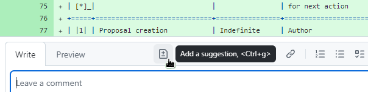

GHC Proposals
=============

.. sectnum::

This repository contains specifications for proposed changes to the
`Glasgow Haskell Compiler <https://www.haskell.org/ghc>`_.
The purpose of the GHC proposal process and of
the GHC Steering Committee is to broaden the discussion of the evolution of
GHC.

* `≡ List of proposals under discussion <https://github.com/ghc-proposals/ghc-proposals/pulls?q=is%3Aopen+is%3Apr+no%3Alabel>`_
* `≡ List of proposals waiting for shepherd recommendation <https://github.com/ghc-proposals/ghc-proposals/pulls?q=is%3Aopen+is%3Apr+label%3A%22Pending+shepherd+recommendation%22>`_
* `≡ List of proposals waiting for committee decision <https://github.com/ghc-proposals/ghc-proposals/pulls?q=is%3Aopen+is%3Apr+label%3A%22Pending+committee+review%22>`_
* `≡ List of accepted proposals <https://github.com/ghc-proposals/ghc-proposals/pulls?q=is%3Apr+label%3A%22Accepted%22>`_
* `≡ List of rejected proposals <https://github.com/ghc-proposals/ghc-proposals/pulls?q=is%3Apr+label%3A%22Rejected%22>`_
* `≡ List of proposals needing revision <https://github.com/ghc-proposals/ghc-proposals/pulls?q=label%3A%22Needs+revision%22>`_
* `≡ List of proposals pending implementation <https://github.com/ghc-proposals/ghc-proposals/pulls?q=is%3Apr+label%3A%22Accepted%22+-label%3A%22Implemented%22>`_
* `≡ List of implemented proposals <https://github.com/ghc-proposals/ghc-proposals/pulls?q=is%3Apr+label%3A%22Implemented%22>`_
* `≡ List of all proposals <https://github.com/ghc-proposals/ghc-proposals/pulls?q=is%3Apr+-label%3ANon-proposal>`_

What is a proposal?
-------------------

A GHC Proposal is a document describing a proposed change to the compiler, the
specification of the language it accepts, or the surrounding ecosystem. These include:

* A change to the syntax or semantics of the GHC/Haskell language (e.g. the various ``ShortImports``
  `proposals <https://gitlab.haskell.org/ghc/ghc/issues/10478>`_, ``do``
  `expressions <https://gitlab.haskell.org/ghc/ghc/issues/10843>`_ without ``$``)

* A major change to the user-visible behaviour of the compiler (e.g. the recent
  `change <https://gitlab.haskell.org/ghc/ghc/issues/11762>`_ in super-class
  solving, and ``-Wall`` `behavior <https://gitlab.haskell.org/ghc/ghc/issues/11370>`_)

* The addition of major features to the compiler (e.g. ``-XTypeInType``, GHCi
  `commands <https://gitlab.haskell.org/ghc/ghc/issues/10874>`_,
  `type-indexed <https://gitlab.haskell.org/ghc/ghc/wikis/typeable>`_
  ``Typeable`` representations)

Changes that are not necessarily within the scope of the committee include:

* changes to declarations in ``base``, which should be addressed to the
  `Core Libraries Committee <https://github.com/haskell/core-libraries-committee>`_;

* changes to other core libraries, which should be addressed to the relevant
  library maintainers;

* changes to the GHC API, the plugin API, or compiler internals, which can be
  contributed following the usual GHC MR review workflow;

* bug fixes and other minor changes that do not warrant additional overheads.

Should the GHC maintainers deem a change significant or controversial enough,
they may, at their discretion, involve the GHC Steering Committee and ask the
contributor to write a formal proposal.

Proposals are evaluated against our principles_, which cover both language *design*
and language *stability*

.. _principles: principles.rst

The life cycle of a proposal
-----------------------------------

This section outlines what stages a proposal may go through.

Table of stages
~~~~~~~~~~~~~~~~~

In brief all stages of the Reviewing process are shown in the table.

.. [*] Click the link to see a detailed description.
.. [*] Click the link to see a list of proposals with this label at this stage / outcome.

+------------------------------+-----------------------------+----------------+----------------------+---------------------------+-------------------------+
| | Stage [*]_ /               | GitHub                      | Max duration   | | Responsibility     | Action                    | | New stage /           |
| | |outcome|                  | label [*]_                  |                | | for next action    |                           | | |outcome|             |
|                              |                             |                |                      |                           |                         |
+==============================+=============================+================+======================+===========================+=========================+
| |st-proposal-creation|       | ‒                           | Indefinite     | Author               | Pull request              | Community discussion    |
+------------------------------+-----------------------------+----------------+----------------------+---------------------------+-------------------------+
| |st-community-discussion|    | ‒ (|no-label|)              | Indefinite     | Author               | Close request             | *Withdrawn*             |
|                              |                             |                |                      +---------------------------+-------------------------+
|                              |                             |                |                      | Submit to committee       | Shepherd appointment    |
+------------------------------+-----------------------------+----------------+----------------------+---------------------------+-------------------------+
| |st-withdrawn|_              | ‒ (|lbl-withdrawn|)         | (PR closed)    | ‒                    | ‒                         | ‒                       |
+------------------------------+-----------------------------+----------------+----------------------+---------------------------+-------------------------+
| |st-shepherd-appointment|    | ‒                           | 1 week         | Secretary            | Assign shepherd           | Shepherd review         |
+------------------------------+-----------------------------+----------------+----------------------+---------------------------+-------------------------+
| |st-shepherd-review|         | |lbl-shepherd|              | 2 weeks        | Shepherd             | Make recommendation       | Committee discussion    |
|                              |                             |                |                      +---------------------------+-------------------------+
|                              |                             |                |                      | Send back for revision    | Needs revision          |
|                              |                             |                |                      |                           |                         |
+------------------------------+-----------------------------+----------------+----------------------+---------------------------+-------------------------+
| |st-committee-discussion|    | |lbl-committee|             | 4-5 weeks      | Shepherd             | Accept                    | Accepted                |
|                              |                             |                |                      +---------------------------+-------------------------+
|                              |                             |                |                      | Reject                    | *Rejected*              |
|                              |                             |                |                      +---------------------------+-------------------------+
|                              |                             |                |                      | Send back for revision    | Needs revision          |
+------------------------------+-----------------------------+----------------+----------------------+---------------------------+-------------------------+
| |st-needs-revision|          | |lbl-needs-revision|        | Indefinite     | Author               | Close request             | *Withdrawn*             |
|                              |                             |                |                      +---------------------------+-------------------------+
|                              |                             |                |                      | Resubmit to committee     | Shepherd review         |
+------------------------------+-----------------------------+----------------+----------------------+---------------------------+-------------------------+
| |st-rejected|_               | |lbl-rejected|              | (PR closed)    | ‒                    | ‒                         | ‒                       |
+------------------------------+-----------------------------+----------------+----------------------+---------------------------+-------------------------+
| |st-accepted|                | |lbl-accepted-open|         | 2 weeks        | | Author &           | Do final corrections      | Implementation          |
|                              |                             |                | | Shepherd           |                           |                         |
|                              |                             |                |                      |                           |                         |
|                              |                             +----------------+----------------------+---------------------------+                         |
|                              |                             | 1 week         | | Shepherd /         | Merge                     |                         |
|                              |                             |                | | Secretary          |                           |                         |
+------------------------------+-----------------------------+----------------+----------------------+---------------------------+-------------------------+
| |st-implementation|          | |lbl-accepted| (PR closed)  | Indefinite     | Unspecified          | Implement the proposal    | *Implemented*           |
+------------------------------+-----------------------------+----------------+----------------------+---------------------------+-------------------------+
| |st-implemented|_            | |lbl-implemented|           | (PR closed)    | ‒                    | ‒                         | ‒                       |
+------------------------------+-----------------------------+----------------+----------------------+---------------------------+-------------------------+

.. _st-withdrawn: #withdrawn
.. _st-rejected: #rejected
.. _st-implemented: #implemented

.. |st-proposal-creation| replace:: `Proposal creation <#proposal-creation>`__
.. |st-community-discussion| replace:: `Community discussion <#community-discussion>`__
.. |st-withdrawn| replace:: *Withdrawn*
.. |st-shepherd-appointment| replace:: `Shepherd appointment <#shepherd-appointment>`__
.. |st-shepherd-review| replace:: `Shepherd review <#shepherd-review>`__
.. |st-needs-revision| replace:: `Needs revision <#needs-revision>`__
.. |st-committee-discussion| replace:: `Committee discussion <#committee-discussion>`__
.. |st-rejected| replace:: *Rejected*
.. |st-accepted| replace:: `Accepted <#accepted>`__
.. |st-implementation| replace:: `Implementation <#implementation>`__
.. |st-implemented| replace:: *Implemented*

.. |no-label| replace:: `No label <https://github.com/ghc-proposals/ghc-proposals/pulls?q=is%3Aopen+is%3Apr+no%3Alabel>`__
.. |lbl-withdrawn| replace:: `Withdrawn <https://github.com/ghc-proposals/ghc-proposals/pulls?q=is%3Aclosed+is%3Apr+-is%3Amerged+no%3Alabel>`__
.. |lbl-shepherd| replace:: `Pending shepherd recommendation <https://github.com/ghc-proposals/ghc-proposals/pulls?q=is%3Aopen+is%3Apr+label%3A%22Pending+shepherd+recommendation%22>`__
.. |lbl-committee| replace:: `Pending committee review <https://github.com/ghc-proposals/ghc-proposals/pulls?q=is%3Aopen+is%3Apr+label%3A%22Pending+committee+review%22>`__
.. |lbl-needs-revision| replace:: `Needs revision <https://github.com/ghc-proposals/ghc-proposals/pulls?q=label%3A%22Needs+revision%22>`__
.. |lbl-rejected| replace:: `Rejected <https://github.com/ghc-proposals/ghc-proposals/pulls?q=label%3ARejected>`__
.. |lbl-accepted-open| replace:: `Accepted <https://github.com/ghc-proposals/ghc-proposals/issues?q=state%3Aopen%20label%3AAccepted>`__
.. |lbl-accepted| replace:: `Accepted <https://github.com/ghc-proposals/ghc-proposals/issues?q=state%3Aclosed%20label%3AAccepted>`__
.. |lbl-implemented| replace:: `Implemented <https://github.com/ghc-proposals/ghc-proposals/pulls?q=is%3Apr+label%3A%22Implemented%22>`__

.. |outcome| replace:: *Outcome*

Detailed list of stages
~~~~~~~~~~~~~~~~~~~~~~~

The stage is identified by a GitHub label, which is identified in the following list.

.. _proposal-creation:

1. **Stage:** Proposal creation.
   (No label.)
   **Responsibility for next action:** author.

   The author drafts / writes / rewrites a proposal. When they are ready they
   submit the proposal to the wider Haskell community for discussion, as a pull request against this repository,
   which moves the proposal to the **Community discussion** stage.

   * `What is a proposal? <#what-is-a-proposal>`__
   * `How to start a new proposal <#how-to-start-a-new-proposal>`__
   * `How to amend an accepted proposal <#how-to-amend-an-accepted-proposal>`__
   * `Language design principles <principles.rst#2language-design-principles>`__

.. _community-discussion:

2. **Stage:** Community discussion.
   (No label.)
   **Responsibility for next action:** author.

   The wider community discusses the proposal by commenting on the pull
   request, while the author refines the proposal.

   * `Discussion goals <#discussion-goals>`__
   * `Guidelines for respectful communication <GRC.rst>`__
   * `How to comment on a proposal <#how-to-comment-on-a-proposal>`__
   * `≡ List of new proposals under discussion <https://github.com/ghc-proposals/ghc-proposals/pulls?q=is%3Aopen+is%3Apr+no%3Alabel>`__

   If the proposal is an amendment to an already accepted proposal,
   the committee secretary additionally labels that proposal with the `Amendment <https://github.com/ghc-proposals/ghc-proposals/pulls?q=is%3Aopen+is%3Apr+label%3AAmendment>`__ label.

   Community discussion may continue indefinitely until the author takes one of the following actions:

   A) **Action**: Submit to committee.

      Once they are satisfied they have addressed everything raised in the discussion, the proposal author should
      explicitly comment on the proposal, asking the committee secretary to bring the proposal before the committee for review.
      This moves the proposal to the **Shepherd appointment** stage.

      The review process does NOT start automatically when the discussion ends.
      The Committee Secretary could remind in comments that it is the author's responsibility to move the proposal forward.

      * `How to bring a proposal before the committee <#how-to-bring-a-proposal-before-the-committee>`__

   B) **Action**: Close request.

      If as a result of the discussion the author no longer wishes to champion the proposal,
      they may withdraw the proposal at any time by closing the pull request.

      * `≡ List of withdrawn proposals after community discussion <https://github.com/ghc-proposals/ghc-proposals/pulls?q=is%3Aclosed+is%3Apr+-is%3Amerged+no%3Alabel>`__

      If the author abandons their own proposal and the proposal sees no activity for a long time (more than a year),
      it might be closed by the committee secretary.
      At any time, the proposer could reopen a proposal.

.. _withdrawn:

3. **Outcome:** Withdrawn.
   (No label with PR closed.)

   Withdrawn proposals are those that have been closed by the author themselves,
   or closed by the secretary because the proposal was dormant for a long time.
   This may be because the idea was unfinished,
   unimplementable, or inconsistent with the Haskell language.

   * `≡ List of withdrawn proposals after community discussion <https://github.com/ghc-proposals/ghc-proposals/pulls?q=is%3Aclosed+-is%3Amerged+is%3Apr+no%3Alabel>`__
   * `≡ List of withdrawn proposals after revision <https://github.com/ghc-proposals/ghc-proposals/pulls?q=is%3Aclosed+is%3Apr+-is%3Amerged+label%3A%22Needs+revision%22>`__
   * `≡ List of all withdrawn proposals <https://github.com/ghc-proposals/ghc-proposals/pulls?q=is%3Apr+is%3Aclosed+-is%3Amerged+-label%3A"Accepted"+-label%3A"Rejected"+-label%3A"Non-proposal">`__

.. _shepherd-appointment:

4. **Stage:** Shepherd appointment.
   (No label.)
   **Responsibility for next action:** committee secretary.
   **Timescale**: a few days.

   The committee secretary appoints a committee member as shepherd, labels the
   pull request as `Pending shepherd recommendation
   <https://github.com/ghc-proposals/ghc-proposals/pulls?q=is%3Aopen+is%3Apr+label%3A%22Pending+shepherd+recommendation%22>`_,
   and notifies the committee for initial preview. This moves the proposal to
   the **Shepherd review** stage.

.. _shepherd-review:

5. **Stage:** Shepherd review.
   **Label**: `Pending shepherd recommendation <https://github.com/ghc-proposals/ghc-proposals/pulls?q=is%3Aopen+is%3Apr+label%3A%22Pending+shepherd+recommendation%22>`_.
   **Responsibility for next action:** shepherd.
   **Timescale**: two weeks.

   The shepherd reviews the proposal. Within two weeks, they should either:

   * submit their recommendation to accept or reject the proposal to the committee, and
     change the label to `Pending committee review <https://github.com/ghc-proposals/ghc-proposals/pulls?q=is%3Aopen+is%3Apr+label%3A%22Pending+committee+review%22>`__,
     moving the proposal to the **Committee discussion** stage; or

   * provide feedback and request changes by changing the label to `Needs revision <https://github.com/ghc-proposals/ghc-proposals/pulls?q=label%3A%22Needs+revision%22>`__,
     moving the proposal to the **Needs revision** stage.

   A request for revision does not imply that the shepherd is opposed to the proposal, but is merely meant to indicate that
   there are outstanding comments the author of the proposal needs to address before the shepherd can continue.

   * `Committee process <#committee-process-for-responding-to-a-proposal>`__
   * `≡ List of proposals waiting for shepherd recommendation <https://github.com/ghc-proposals/ghc-proposals/pulls?q=is%3Aopen+is%3Apr+label%3A%22Pending+shepherd+recommendation%22>`_

.. _committee-discussion:

6. **Stage:** Committee discussion.
   **Label**: `Pending committee review <https://github.com/ghc-proposals/ghc-proposals/pulls?q=is%3Aopen+is%3Apr+label%3A%22Pending+committee+review%22>`__.
   **Responsibility for next action**: shepherd.
   **Timescale**: four or five weeks.

   The shepherd actively guides the committee towards a consensus.
   Within four or five weeks the committee should come to a conclusion, which may be:

   * Accept the proposal, perhaps subject to minor corrections (new stage: **Accepted**).
   * Invite the author to revise the proposal (new stage: **Needs revision**)
   * Reject the proposal (new stage: **Rejected**)

   The shepherd should announce the result in a comment on the pull request, and change the label appropriately.

   Acceptance of the proposal implies that the implementation will be accepted
   into GHC provided it is well-engineered, well-documented, conforms to the
   specification and does not complicate the code-base too much.  However, the
   GHC maintainers may reject an implementation if there turn out to be
   significant gaps in the specification, unforeseen interactions with existing
   features, or unexpected breaking changes not covered by the backwards
   compatibility assessment. In this case the proposal should be revised.

   * `Committee process <#committee-process-for-responding-to-a-proposal>`__
   * `Review criteria <#review-criteria>`__
   * `≡ List of proposals under committee review <https://github.com/ghc-proposals/ghc-proposals/pulls?q=is%3Aopen+is%3Apr+label%3A%22Pending+committee+review%22>`__

.. _needs-revision:

7. **Stage:** Needs revision.
   **Label**: `Needs revision <https://github.com/ghc-proposals/ghc-proposals/pulls?q=label%3A%22Needs+revision%22>`__.
   **Responsibility for next action:** author.

   "Needs revision" is a common result of shepherd or committee review,
   including for proposals that the committee is enthusiastic about.
   It should be accompanied with guidance about the revisions that are sought.
   There may be multiple iterations of revision followed by committee discussion.
   The goal is to be clear about where the next action lies: with the committee or with the author.

   The author should resubmit to the committee by commenting on the pull request when they have addressed the
   review feedback. This moves the proposal back to the **Shepherd review**
   stage (unless the previous shepherd is no longer on the committee or is
   otherwise unable to review the proposal, in which case it moves back to the
   **Shepherd appointment** stage).

   * `≡ List of open proposals needing revision <https://github.com/ghc-proposals/ghc-proposals/pulls?q=is%3Aopen+is%3Apr+label%3A%22Needs+revision%22>`__
   * `≡ List of withdrawn proposals after revision <https://github.com/ghc-proposals/ghc-proposals/pulls?q=is%3Aclosed+is%3Apr+label%3A%22Needs+revision%22>`__

.. _rejected:

8. **Outcome:** Rejected.
   **Label**: `Rejected <https://github.com/ghc-proposals/ghc-proposals/pulls?q=label%3ARejected>`__.

   If the committee rejects the proposal, the shepherd should close
   the pull request and apply the `Rejected <https://github.com/ghc-proposals/ghc-proposals/pulls?q=label%3A%22Rejected%22>`__  label.

   * `≡ List of rejected proposals <https://github.com/ghc-proposals/ghc-proposals/pulls?q=label%3ARejected>`__

.. _accepted:

9. **Stage:** Accepted.
   **Label**: `Accepted <https://github.com/ghc-proposals/ghc-proposals/issues?q=state%3Aopen%20label%3AAccepted>`__ with PR open.
   **Responsibility for next action:** shepherd, author and committee secretary
   **Timescale**: two to three weeks.

   If the committee accepts the proposal, the shepherd labels the proposal as `Accepted <https://github.com/ghc-proposals/ghc-proposals/issues?q=state%3Aopen%20label%3AAccepted>`__.
   The author and shepherd work together to make any final edits.
   (In particular, if the committee requested any minor corrections, the shepherd should verify that these are addressed.)
   Once all corrections and revisions are complete, the shepherd or committee secretary
   merges the PR and (if necessary) creates a tracking ticket on the GHC issue tracker.
   This moves the proposal to the **Implementation** stage.

   * `How to accept a proposal <acceptance.rst>`__
   * `≡ List of proposals being accepted <https://github.com/ghc-proposals/ghc-proposals/issues?q=state%3Aopen%20label%3AAccepted>`__

.. _implementation:

10. **Stage:** Implementation.
    **Label**: `Accepted <https://github.com/ghc-proposals/ghc-proposals/issues?q=state%3Aclosed%20label%3AAccepted+-label%3A%22Implemented%22>`__ with PR merged.

    Once a proposal is accepted, the review and discussion part of the process is
    technically complete, but it still has to be implemented.
    The author may do that, or ask someone else to do so. GHC is a volunteer-driven project,
    so there is unfortunately no guarantee that accepted proposals will be implemented promptly.

    Any later changes must be submitted as a separate amendment proposal.

    We label the proposal as `Implemented <https://github.com/ghc-proposals/ghc-proposals/pulls?q=is%3Apr+label%3A%22Implemented%22>`__
    once it hits GHC’s ``master`` branch (and we are happy to be nudged to do so by email,
    GitHub issue, or a comment on the relevant pull request).

    * `≡ Current texts of proposals <https://github.com/ghc-proposals/ghc-proposals/tree/master/proposals>`__
    * `≡ List of proposals pending implementation <https://github.com/ghc-proposals/ghc-proposals/pulls?q=is%3Apr+label%3A%22Accepted%22+-label%3A%22Implemented%22>`__

.. _implemented:

11. **Outcome:** Implemented.
    **Label**: `Implemented <https://github.com/ghc-proposals/ghc-proposals/pulls?q=is%3Apr+label%3A%22Implemented%22>`__.

    Once a proposal is implemented, the life cycle of the proposal process is fully completed.

    * `≡ List of implemented proposals <https://github.com/ghc-proposals/ghc-proposals/pulls?q=is%3Apr+label%3A%22Implemented%22>`__

Do not hesitate to `contact <#questions>`_ us if you have questions.

How to start a new proposal
---------------------------

Proposals are written in `ReStructuredText <http://www.sphinx-doc.org/en/stable/rest.html>`_ .

The reason for using this format only is that
`GHC Users Guide <http://downloads.haskell.org/~ghc/latest/docs/html/users_guide/editing-guide.html>`_
uses ReStructuredText exclusively. Accepted proposals written in ReStructuredText format
can be easily included in the official GHC documentation.

Proposals should follow the structure given in the
`ReStructuredText template <https://github.com/ghc-proposals/ghc-proposals/blob/master/proposals/0000-template.rst>`_ .

See the section `Review criteria <#review-criteria>`__ below for more information
about what makes a strong proposal, and how it will be reviewed.

To start a proposal, create a pull request that adds your proposal as ``proposals/0000-proposal-name.rst``.
Use ``proposals/0000-template.rst`` file as a template.

The pull request summary should include a brief description of your
proposal, along with a link to the rendered view of proposal document
in your branch. For instance,

.. code-block:: md

    This is a proposal augmenting our existing `Typeable` mechanism with a
    variant, `Type.Reflection`, which provides a more strongly typed variant as
    originally described in [A Reflection on
    Types](http://research.microsoft.com/en-us/um/people/simonpj/papers/haskell-dynamic/index.htm)
    (Peyton Jones, _et al._ 2016).

    [Rendered](https://github.com/bgamari/ghc-proposals/blob/typeable/proposals/0000-type-indexed-typeable.rst)

How to amend an accepted proposal
---------------------------------

Some proposals amend an existing proposal. Such an amendment :

* Makes a significant (i.e. not just editorial or typographical) change,
  and hence warrants approval by the committee
* Is too small, or too closely tied to the existing proposal,
  to make sense as a new standalone proposal.

Often, this happens
after a proposal is accepted, but before or while it is implemented.
In these cases, a PR that *changes* the accepted proposal can be opened. It goes through
the same process as an original proposal.

Discussion goals
----------------

Members of the Haskell community are warmly invited to offer feedback on
proposals. Feedback ensures that a variety of perspectives are heard, that
alternative designs are considered, and that all of the pros and cons of a
design are uncovered. We particularly encourage the following types of feedback,

- Completeness: Is the proposal missing a case?
- Soundness: Is the specification sound or does it include mistakes?
- Alternatives: Are all reasonable alternatives listed and discussed.
  Are the pros and cons argued convincingly?
- Costs: Are the costs for implementation believable?
  How much would this hinder learning the language?
- Other questions: Ask critical questions that need to be resolved.
- Motivation: Is the motivation reasonable?

How to comment on a proposal
-----------------------------

To comment on a proposal you need to be viewing the proposal's diff in "source
diff" view. To switch to this view use the buttons on the top-right corner of
the *Files Changed* tab.

.. figure:: rich-diff.png
    :alt: The view selector buttons.
    :align: right

    Use the view selector buttons on the top right corner of the "Files
    Changed" tab to change between "source diff" and "rich diff" views.

Feedback on a open pull requests can be offered using both GitHub's in-line and
pull request commenting features. Inline comments can be added by hovering over
a line of the diff.

.. figure:: inline-comment.png
    :alt: The ``+`` button appears while hovering over line in the source diff view.
    :align: right

    Hover over a line in the source diff view of a pull request and
    click on the ``+`` to leave an inline comment.

    Click on the ``±`` button to suggest an alternative inside the comment.

For the maintenance of general sanity, try to avoid leaving "me too" comments.
How to comment respectfully is described in detail in the
`Guidelines for respectful communication <GRC.rst>`__.

If you would like to register your approval or disapproval of a particular
comment or proposal, feel free to use GitHub's "Reactions"
`feature <https://help.github.com/articles/about-discussions-in-issues-and-pull-requests>`_.

How to bring a proposal before the committee
---------------------------------------------

When the discussion has ebbed down and the author thinks the proposal is ready, they

1. Review the discussion thread and ensure that the proposal text accounts for
   all salient points. *Remember, the proposal must stand by itself, and be understandable
   without reading the discussion thread.*
2. Add a comment to the pull request, briefly summarizing the major points raised
   during the discussion period and stating your belief that the proposal is
   ready for review. In this comment, tag the committee secretary (currently
   `@adamgundry <https://github.com/adamgundry/>`__).

`The secretary <#who-is-the-committee>`__ will then label the pull request with
``Pending shepherd recommendation`` and start the `committee process
<#committee-process>`__.  (If this does not happen within a few days, please
ping the secretary or the committee.)

Who is the committee?
---------------------
You can reach the committee by email at ghc-steering-committee@haskell.org. This is a mailing list with
`public archives <https://mail.haskell.org/cgi-bin/mailman/listinfo/ghc-steering-committee>`_.

The current members
~~~~~~~~~~~~~~~~~~~~

The current members, including their GitHub handle, when they joined first,
when their term last renewed, when their term expires and their role, are:

===============  =========================  =====================================================  =======  =======  =======  =========
Avatar           Full name                  GitHub handle                                          Joined   Renewed  Expired  Role
===============  =========================  =====================================================  =======  =======  =======  =========
|simonmar|       Simon Marlow               `@simonmar <https://github.com/simonmar>`_             2017/02  2024/02  2027/02  co-chair
|simonpj|        Simon Peyton-Jones         `@simonpj <https://github.com/simonpj>`_               2017/02  2024/02  2027/02  co-chair
|aspiwack|       Arnaud Spiwack             `@aspiwack <https://github.com/aspiwack/>`_            2019/07  2022/10  2025/10  member
|adamgundry|     Adam Gundry                `@adamgundry <https://github.com/adamgundry/>`_        2022/10  -        2025/10  secretary
|angerman|       Moritz Angermann           `@angerman <https://github.com/angerman/>`_            2023/02  -        2026/02  member
|maralorn|       Malte Ott                  `@maralorn <https://github.com/maralorn/>`_            2024/03  -        2027/03  member
|Tritlo|         Matthías Páll Gissurarson  `@Tritlo <https://github.com/Tritlo>`_                 2024/03  -        2027/03  member
|erikd|          Erik de Castro Lopo        `@erikd  <https://github.com/erikd>`_                  2024/05  -        2027/05  member
|JakobBruenker|  Jakob Brünker              `@JakobBruenker <https://github.com/JakobBruenker>`_   2024/05  -        2027/05  member
|sgraf812|       Sebastian Graf             `@sgraf812 <https://github.com/sgraf812>`_             2024/05  -        2027/05  member
===============  =========================  =====================================================  =======  =======  =======  =========

.. |adamgundry| image:: https://github.com/adamgundry.png?size=24
.. |aspiwack| image:: https://github.com/aspiwack.png?size=24
.. |simonmar| image:: https://github.com/simonmar.png?size=24
.. |simonpj| image:: https://github.com/simonpj.png?size=24
.. |nomeata| image:: https://github.com/nomeata.png?size=24
.. |goldfirere| image:: https://github.com/goldfirere.png?size=24
.. |int-index| image:: https://github.com/int-index.png?size=24
.. |angerman| image:: https://github.com/angerman.png?size=24
.. |maralorn| image:: https://github.com/maralorn.png?size=24
.. |Tritlo| image:: https://github.com/Tritlo.png?size=24
.. |erikd| image:: https://github.com/erikd.png?size=24
.. |JakobBruenker| image:: https://github.com/JakobBruenker.png?size=24
.. |sgraf812| image:: https://github.com/sgraf812.png?size=24

The committee members have committed to adhere to the
`Haskell committee guidelines for respectful communication <GRC.rst>`_
and are subject to the `committee bylaws <committee.rst>`_.

The former members
~~~~~~~~~~~~~~~~~~~~

We would also like to thank our former members:

======================  ====================================================  =================
Full name               GitHub handle                                         Participation
======================  ====================================================  =================
Ryan Newton             `@rrnewton <https://github.com/rrnewton>`_            2017/02 - 2018/09
Roman Leshchinskiy      `@rleshchinskiy <https://github.com/rleshchinskiy>`_  2017/02 - 2018/11
Ben Gamari              `@bgamari <https://github.com/bgamari>`_              2017/02 - 2019/07
Manuel M T Chakravarty  `@mchakravarty <https://github.com/mchakravarty>`_    2017/02 - 2019/07
Sandy Maguire           `@isovector <https://github.com/isovector>`_          2019/07 - 2019/12
Christopher Allen       `@bitemyapp <https://github.com/bitemyapp>`_          2017/02 - 2020/05
Iavor Diatchki          `@yav <https://github.com/yav>`_                      2017/02 - 2021/05
Cale Gibbard            `@cgibbard <https://github.com/cgibbard/>`_           2020/01 - 2021/07
Alejandro Serrano       `@serras <https://github.com/serras/>`_               2020/01 - 2022/01
Vitaly Bragilevsky      `@bravit <https://github.com/bravit>`_                2018/09 - 2022/02
Baldur Blöndal          `@icelandjack <https://github.com/icelandjack>`_      2022/03 - 2022/09
Tom Harding             `@i-am-tom <https://github.com/i-am-tom/>`_           2020/01 - 2023/02
Joachim Breitner        `@nomeata <https://github.com/nomeata>`_              2017/02 - 2024/03
Richard Eisenberg       `@goldfirere <https://github.com/goldfirere>`_        2017/02 - 2024/03
Vladislav Zavialov      `@int-index <https://github.com/int-index/>`_         2021/03 - 2024/03
Chris Dornan            `@cdornan <https://github.com/cdornan>`_              2022/03 - 2024/06
Eric Seidel             `@gridaphobe <https://github.com/gridaphobe>`_        2018/09 - 2025/05
======================  ====================================================  =================

Committee process for responding to a proposal
----------------------------------------------

The committee process starts once the secretary has been notified that a
proposal is ready for decision.

The steps below have timescales attached, so that everyone shares
the same expectations.  But they are only reasonable expectations.
The committee consists of volunteers with day jobs, who are reviewing
proposals in their spare time.  If they do not meet the timescales
indicated below (e.g. they might be on holiday), a reasonable response
is a polite ping/enquiry.

-  The secretary nominates a member of the committee, the *shepherd*, to oversee
   the discussion. The secretary

   * labels the proposal as ``Pending shepherd recommendation``,
   * assigns the proposal to the shepherd,
   * drops a short mail on the mailing list, informing the committee about the
     status change.

-  Based on the proposal text (but not the GitHub commentary), the shepherd
   decides whether the proposal ought to be accepted or rejected or returned for
   revision.  The shepherd should do this within two weeks.

-  If the shepherd thinks the proposal ought to be rejected, they post their
   justifications on the GitHub thread, and invite the authors to respond with
   a rebuttal and/or refine the proposal. This continues until either

   * the shepherd changes their mind and supports the proposal now,
   * the authors withdraw their proposal,
   * the authors indicate that they will revise the proposal to address the shepherds
     point. The shepherd will label the pull request as
     `Needs Revision <https://github.com/ghc-proposals/ghc-proposals/pulls?q=label%3A%22Needs+revision%22>`_.
   * the authors and the shepherd fully understand each other’s differing
     positions, even if they disagree on the conclusion.

-  Now the shepherd proposes to accept or reject the proposal. To do so, they

   * post their recommendation, with a rationale, on the GitHub discussion thread,
   * label the pull request as ``Pending committee review``,
   * re-title the proposal pull request, appending ``(under review)`` at the end.
     (This enables easy email filtering.)
   * drop a short mail to the mailing list informing the committee that
     discussion has started.

-  Discussion among the committee ensues, in two places

   * *Technical discussion* takes place on the discussion thread, where others may
     continue to contribute.

   * *Evaluative discussion*, about whether to accept, reject, or return the
     proposal for revision, takes place on the committee's email list,
     which others can read but not post to.

   It is expected that every committee member express an opinion about every proposal under review.
   The most minimal way to do this is to "thumbs-up" the shepherd's recommendation on GitHub.

   Ideally, the committee reaches consensus, as determined by the secretary or
   the shepherd. If consensus is elusive, then we vote, with the Simons
   retaining veto power.

   This stage should conclude within a month.

-  For acceptance, a proposal must have at least *some* enthusiastic support
   from member(s) of the committee. The committee, fallible though its members may be,
   is the guardian of the language.   If all of them are lukewarm about a change,
   there is a presumption that it should be rejected, or at least "parked".
   (See "evidence of utility" above, under "What a proposal should look like".)

-  A typical situation is that the committee, now that they have been asked
   to review the proposal in detail, unearths some substantive technical issues.
   This is absolutely fine -- it is what the review process is *for*!

   If the technical debate is not rapidly resolved, the shepherd
   should return the proposal for revision. Further technical
   discussion can then take place, the author can incorporate that
   conclusions in the proposal itself, and re-submit it.  Returning a
   proposal for revision is not a negative judgement; on the contrary
   it might connote "we absolutely love this proposal but we want it
   to be clear on these points".

   In fact, this should happen if *any* substantive technical debate
   takes place.  The goal of the committee review is to say yes/no to a
   proposal *as it stands*.  If new issues come up, they should be
   resolved, incorporated in the proposal, and the revised proposal
   should then be re-submitted for timely yes/no decision.  In this way,
   *no proposal should languish in the committee review stage for long*,
   and every proposal can be accepted as-is, rather than subject to a raft
   of ill-specified further modifications.

   The author of the proposal may invite committee collaboration on clarifying
   technical points; conversely members of the committee may offer such help.

   When a proposal is returned for revision, GitHub labels are updated accordingly
   and the ``(under review)`` suffix is removed from the title of the PR.

-  The decision is announced, by the shepherd or the secretary, on the GitHub
   thread and the mailing list.

   Notwithstanding the return/resubmit cycle described above, it may be
   that the shepherd accepts a proposal subject to some specified minor changes
   to the proposal text.  In that case the author should carry them out.

   The secretary then tags the pull request accordingly, and either
   merges or closes it.  In particular

   *  **If we say no:**

      The pull request will be closed and labeled
      `Rejected <https://github.com/ghc-proposals/ghc-proposals/pulls?q=label%3ARejected>`_.

      If the proposer wants to revise and try again, the new proposal should
      explicitly address the rejection comments.

      In the case that the proposed change has already been implemented in
      GHC, it will be reverted.

   *  **If we say yes:**

      Committee members should see the `acceptance checklist page <acceptance.rst>`_
      for a detail checklist to be applied to accepted proposals and the steps necessary in
      order to label a proposal as accepted:

      - The pull request will be labeled
        `Accepted <https://github.com/ghc-proposals/ghc-proposals/pulls?q=label%3A%22Accepted%22>`_.

      - If the committee accepts the proposal with minor corrections,
        the author and shepherd work together to make any final edits.

      - Then the "Accepted" pull request will be merged.

      - Its meta-data will be updated to include the acceptance date.

      - A link to the accepted proposal is added to the top of the PR discussion, together with
        the sentence “The proposal has been accepted; the following discussion is mostly of historic interest.”.

   At this point, the proposal process is technically
   complete. It is outside the purview of the committee to implement,
   oversee implementation, attract implementors, etc.

   The proposal authors or other implementors are encouraged to update the
   accepted proposal with the implementation status (i.e. ticket URL and the
   first version of GHC implementing it.)

What is a dormant proposal?
---------------------------

Label `Dormant <https://github.com/ghc-proposals/ghc-proposals/pulls?q=is%3Aopen+is%3Apr+label%3A%22Dormant%22>`__
is *outdated* label. It is no longer in use.
Labeled proposal had similar meaning to proposal with "Needs revision" label.

Review criteria
---------------
Here are some characteristics that a good proposal should have.

* *It should follow our design principles*.
  These principles_ cover both the language *design* and its *stability* over time.

* *It should be self-standing*.  Some proposals accumulate a long and interesting discussion
  thread, but in ten years' time all that will be gone (except for the most assiduous readers).
  Before acceptance, therefore, the proposal should be edited to reflect the fruits of
  that discussion, so that it can stand alone.

* *It should be precise*, especially the "Proposed change specification"
  section.  Language design is complicated, with lots of
  interactions. It is not enough to offer a few suggestive examples
  and hope that the reader can infer the rest.  Vague proposals waste
  everyone's time; precision is highly valued.

  We do not insist on a fully formal specification, with a
  machine-checked proof.  There is no such baseline to work from, and
  it would set the bar far too high.  On the other hand, for
  proposals involving syntactic changes, it is very reasonable to ask for
  a BNF for the changes. (Use the `Haskell 2010 Report <https://www.haskell.org/onlinereport/haskell2010/>`_
  or GHC's ``alex``\- or ``happy``\-formatted files
  for the `lexer <https://gitlab.haskell.org/ghc/ghc/-/blob/master/compiler/GHC/Parser/Lexer.x>`_
  or `parser <https://gitlab.haskell.org/ghc/ghc/-/blob/master/compiler/GHC/Parser.y>`_
  for a good starting point.)

  Ultimately, the necessary degree of precision is a judgement that the committee
  must make; but authors should try hard to offer precision.

* *It should offer evidence of utility*.  Even the strongest proposals carry costs:

  * For programmers: most proposals make the language just a bit more complicated;
  * For GHC maintainers:  most proposals make the implementation a bit more complicated;
  * For future proposers:  most proposals consume syntactic design space add/or add new back-compat burdens,
    both of which make new proposals harder to fit in.
  * It is much, much harder subsequently to remove an extension than it is to add it.

  All these costs constitute a permanent tax on every future programmer, language designer, and GHC maintainer.
  The tax may well be worth it (a language without polymorphism
  would be simpler but we don't want it), but the case should be made.

  The case is stronger if lots of people express support by giving a "thumbs-up"
  in GitHub. Even better is the community contributes new examples that illustrate
  how the proposal will be broadly useful.
  The committee is often faced with proposals that are reasonable,
  but where there is a suspicion that no one other than the author cares.
  Defusing this suspicion, by describing use-cases and inviting support from others,
  is helpful.

* *It should be copiously illustrated with examples*, to aid understanding. However,
  these examples should *not* be the specification.

Below are some criteria that the committee and the supporting GHC
community will generally use to evaluate a proposal. These criteria
are guidelines and questions that the committee will consider.
None of these criteria is an absolute bar: it is the committee's job to weigh them,
and any other relevant considerations, appropriately.

-  *Utility and user demand*. What exactly is the problem that the
   feature solves? Is it an important problem, felt by many users, or is
   it very specialised? The whole point of a new feature is to be useful
   to people, so a good proposal will explain why this is so, and
   ideally offer evidence of some form.  The "Endorsements" section of
   the proposal provides an opportunity for third parties to express
   their support for the proposal, and the reasons they would like to
   see it adopted.

-  *Elegant and principled*. Haskell is a beautiful and principled
   language. It is tempting to pile feature upon feature (and GHC
   Haskell has quite a bit of that), but we should constantly and
   consciously strive for simplicity and elegance.

   This is not always easy. Sometimes an important problem has lots of
   solutions, none of which have that "aha" feeling of "this is the Right
   Way to solve this"; in that case we might delay rather than forge ahead
   regardless.

-  *Does not create a language fork*.  By a "fork" we mean

   * It fails the test "Is this extension something that most people would be happy to enable,
     even if they don't want to use it?";
   * And it also fails the test "Do we think there's a reasonable chance this extension will make it
     into a future language standard?"; that is, the proposal reflects the stylistic
     preferences of a subset of the Haskell community, rather than a consensus about the direction
     that (in the committee's judgement) we want to push the whole language.

   The idea is that unless we can see a path to a point where everyone has the extension turned on,
   we're left with different groups of people using incompatible dialects of the language.
   A similar problem arises with extensions that are mutually incompatible.

-  *Fit with the language.* If we just throw things into GHC
   willy-nilly, it will become a large ball of incoherent and
   inconsistent mud. We strive to add features that are consistent with
   the rest of the language.

-  *Specification cost.* Does the benefit of the feature justify the
   extra complexity in the language specification? Does the new feature
   interact awkwardly with existing features, or does it enhance them?
   How easy is it for users to understand the new feature?

-  *Implementation cost.* How hard is it to implement?

-  *Maintainability.* Writing code is cheap; maintaining it is
   expensive. GHC is a very large piece of software, with a lifetime
   stretching over decades. It is tempting to think that if you propose
   a feature *and* offer a patch that implements it, then the
   implementation cost to GHC is zero and the patch should be accepted.

   But in fact every new feature imposes a tax on future implementors, (a)
   to keep it working, and (b) to understand and manage its interactions
   with other new features. In the common case the original implementor of
   a feature moves on to other things after a few years, and this
   maintenance burden falls on others.

* *It should conform to existing principles*. This repository contains
  a principles_ document that lays out various principles guiding future
  directions for GHC. Proposals should seek to uphold these principles
  in new features, as much as possible. Note that these principles are not
  absolutes, and regressions against the principles are possible, if a
  proposal is otherwise very strong.

* *Backward compatibility.* Will the change break existing code, and if so, has
  an adequate impact assessment been carried out to determine whether the
  benefits outweigh the costs? Is there a clearly documented migration path?
  Will users receive warnings in advance of the breaking change, and reasonable
  error messages afterwards? See `the Backward Compatibility section of the
  proposal template <proposals/0000-template.rst#backward-compatibility>`_
  for specifics of how breakage is assessed.

How to build the proposals?
---------------------------

The proposals can be rendered by running::

   nix-shell shell.nix --run "./build.sh"

This will then create a directory ``_build`` which will contain an ``index.html``
file and the other rendered proposals. This is useful when developing a proposal
to ensure that your file is syntax correct.

To build without Nix, run::

   ./build.sh

To view the docs at http://127.0.0.1:8000 and rebuild on changes, add ``--autobuild``.

Questions?
----------

Feel free to contact any of the members of the `GHC Steering Committee
<#who-is-the-committee>`_ with questions. `Email <https://mail.haskell.org/cgi-bin/mailman/listinfo/ghc-steering-committee>`_
and Matrix (`#ghc:matrix.org <https://matrix.to/#/#ghc:matrix.org>`_) are both good ways of accomplishing this.
