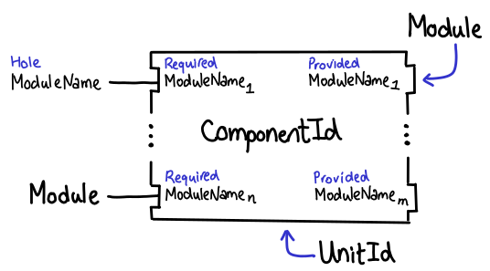

Backpack
========

#. `Introduction`_

   a. `Motivation`_

   #. `Overview`_

   #. `The Cabal Pipeline`_

#. `Unit identifiers`_

#. `Cabal`_

   a. `Library structure`_

   #. `Exports`_

   #. `Mixins`_

   #. `Mixin linking`_

   #. `Modules and signatures`_

#. `Setup interface`_

#. `GHC`_

   a. `GHC command line flags`_

   #. `Installed library database`_

   #. `Signatures`_

   #. `Dependencies`_

#. `Drawbacks`_

#. `Alternatives`_

#. `Unresolved Questions`_

Introduction
------------

Backpack is a proposal to add *mixin libraries* to Haskell.  Mixin
libraries can have *signatures* which permit implementations of values
and types to be deferred, while allowing a library with missing
implementations to still be type-checked.

Motivation
~~~~~~~~~~

Suppose that you are writing a string-processing library which, in
principle, could operate on ``ByteString``, ``Text`` and ``String``
equally well.  Ideally, you would be able to write a library to
support all three types, while at the same time achieving the following
properties:

1. **No copy-pasting.** It shouldn't be necessary to duplicate
   implementation code which is identical across all possible
   representations.

2. **Just normal Haskell.** The code you write should
   look identical to the code you would have written if you had
   just written your implementation against one representation
   (except perhaps with a stronger abstraction barrier.)
   In particular, the ability to parametrize over *types*
   is extremely important.

3. **No performance overhead.** The compiled code for
   each representation should be equivalent in performance to what you
   would have gotten by compiling it against the representation directly
   (modulo performance issues related to the API.)

4. **Egalitarian interfaces.** You should be able to declare what
   abstract interface your implementation depends on, without
   having to rely on some central authority having defined what
   it means for something to be *string-like.*

5. **Interface composability.** Oppositely, it should be possible
   to publish and reuse an interface declaration, possibly extending it
   as necessary.

6. **Extensibility.** If I so choose, it should be possible to publish
   my library in such a way that a user could provide their own
   backing representation.

7. **Package-level modularity.** It should be possible to parametrize
   over an entire package, since libraries of this form often
   encompass multiple modules.

8. **Separate type-checking.** It should be possible to typecheck
   a parametrized package without committing to any particular
   implementation.

Backpack seeks to solve all of these problems, where
existing language features in Haskell are not up to the task.

**Dictionary passing style**  The dictionary-passing approach to modularity
defines a dictionary type, with type parameters for every type we
want to parametrize over, and fields for every value or function we
parametrize over.  For example, a dictionary parametrizing over
string implementations might look like this::

    data StrDict str
        = StrDict {
            null :: str,
            append :: str -> str -> str
        }

    concat :: StrDict str -> [str] -> str
    concat d xs = foldr (append d) (null d) xs

Dictionary passing fails criteria (2), (3), (5) and (7):

* **Just normal Haskell?**  While the encoding cost of this scheme is
  not too heavy, it is still not as nice as the code you could write
  if you didn't need to be parametric over multiple implementations.
  A more serious problem is that it is not possible to define new
  types based on the record (indeed, one could say this is the *point*
  of a module system).  "F-ing modules" demonstrates that
  the definition of types in this way is simply a mode of use of
  universal and existential quantifiers: however, such encodings would be
  extremely unwieldy to do by hand.  (Although, it does suggest someone
  could write a Template Haskell extension to elaborate ML-style modules
  into existentially quantified Haskell records.  We leave this for
  a future RFC.)

* **No performance overhead?**  Modulo optimizations, code written
  this way clearly must be indirected through a record of functions.
  For some interfaces, this would constitute an unacceptable overhead.
  If GHC can inline ``concat`` into a call-site where the the dictionary
  is known, it is possible to avoid this overhead; however, ``concat``
  must be re-optimized at every such call-site, and its code duplicated!

* **Interface composability?**  Dictionary-passing style inherits
  many of the same problems that plague Haskell's record system:
  records of this form simply cannot be composed in a nice way.
  If you want to extend ``StrDict`` to contain another field,
  you have to define a new type; if someone else does the same,
  you have to explicitly convert to the two.  Structural *row types*
  (and encodings thereof) would help alleviate this problem.

* **Package-level modularity?**  It is clear that passing a dictionary
  operates only on a per-function basis, and there is no special
  dispensation for modularizing an entire package, except laboriously
  adding a dictionary to every function in the package.

Dictionary passing does have the benefit that it is easy to swap
implementation at runtime: so-called *first-class modules*
are expressly not a problem Backpack seeks to address (you should
use dictionary-passing in this case!)

**Traditional type classes** permit dictionaries to be computed automatically
based on the *types* at a dictionary call site.  For example,
instead of defining a ``StrDict`` type, we simply define a
``StrLike`` type class::

    class StrLike str where
        null :: str
        append :: str -> str -> str

    concat :: StrLike str => [str] -> str
    concat xs = foldr append null xs

Clearly, type classes can reduce some of the encoding overhead
seen in dictionary-passing style.  But it does not solve all
the issues of dictionary-passing style (performance, composability,
and applicability to the package level all apply to type classes),
and they introduce some issues of their own:

1. If there is no natural type for what we are modularizing
   over (e.g., we are simply parametric over an implementation),
   type class resolution cannot be carried out without introducing
   a dummy proxy type.

2. In a multi-parameter type class, some methods may not mention
   all of the types in the type class: these methods cannot be
   resolved unambiguously without introducing a functional dependency.
   Similarly, every type parameter must be listed in the constraints,
   even if they are not used.  If there is a natural type to
   modularize over, these issues can be alleviated by introducing
   an *associated type*.

3. And of course, you still have to put the damn constraint on
   every parametrized function.

**Preprocessor.**  A classic way to swap out a backing implementation
is to replace it textually using a pre-processor.  In such a scheme, you
might write your Haskell program like this::

    import Data.ByteString as Str

    #include "Impl.hs"

Besides the intrinsic ugliness of such an approach, it fails to define
the *interface* between an implementation and the backing
implementations it relies on.  Without this type information, separate
typechecking is impossible.  Separate typechecking is extremely
useful: otherwise, you get extremely difficult to understand error
messages, as is seen in C++ template error messages.

Overview
~~~~~~~~

In this section, we give a high-level overview of Backpack, using the
string-processing problem as our running example. In this section, we
will introduce important terminology (**bolded**) that we will be used
in the rest of this specification.

Backpack solves this string-processing problem in the following way:
To parametrize over a string implementation, a user of Backpack writes a
**signature** describing the necessary supported interface for their
strings  (an *egalitarian interface.*) A signature is much like an
``hs-boot`` file, in that it contains only type signatures and type
declarations, but no implementations::

    -- in Str.hsig
    signature Str where
    data Str
    null   :: Str
    append :: Str -> Str -> Str

Other modules in the library import this signature and can use
the types and functions declared in the signature as if it were
an ordinary module (i.e., *just normal Haskell*, with *no copy-pasting*)::

    -- in Concat.hs
    module Concat where
    import Str
    concat xs = foldr append null xs

Locally defined ``hsig`` files are declared in the Cabal file via the
``signatures`` field::

    library concat-indef
        signatures: Str
        exposed-modules: Concat

Diagramatically, we represent the library ``concat-indef`` as a
component with one input port (the signature ``Str``) and one
output port (the module ``Concat``):

Signatures can also be inherited from other libraries (more on this
shortly); we refer to the set of all locally defined and inherited
signatures as the set of **required signatures**.
A library with required signatures is called an **indefinite library**.
As it is missing implementations for its required signatures, it cannot be
compiled; however, it can still be type-checked (*separate
type-checking*) and registered with the compiler, so that it can be used
by other indefinite libraries which depend on it.  In contrast, a
**definite library** is a library with no required signatures (any library that
doesn't use Backpack features is a definite library).

An indefinite library can be **instantiated** (possibly multiple times)
with implementations for all of its required signatures, allowing it to
be compiled.  Instantiation happens
automatically when a user depends on an indefinite library and another
library which provides modules with the same name as the signatures.
For implementation reasons, it is only possible to fill required signatures with
modules from ``build-depends`` (and not locally defined ones)::

     library str-bytestring
         exposed-modules: Str

     library concat-bytestring
         build-depends: str-bytestring, concat-indef
         reexported-modules:
             -- Concat from concat-indef is instantiated
             -- with Str from str-bytestring.  We can
             -- reexport it under a qualified name for
             -- more convenient use.
             Concat as Concat.ByteString

.. image:: backpack/concat-bytestring.png

Thus, indefinite libraries can be thought of parametrized modules,
but rather than explicitly specifying each parameter, it is
implicitly specified with module namespaces.  This process
of determining the explicit instantiations is called **mixin linking**.

An indefinite library can be instantiated to various degrees.
Compilation does not occur unless *all* required signatures are implemented,
allowing a compiler to optimize as if Backpack was not present (*no
performance overhead.*)  An indefinite library can also be partially
instantiated, or not instantiated at all.  If a required signature is not
instantiated, it gets inherited by the user of the library::

    -- in the Cabal file
    library stringutils-indef
        -- No Str module in scope, so Str is left uninstantiated,
        -- giving stringutils-indef an (implicit) requirement
        -- on Str.
        build-depends: concat-indef
        exposed-modules: StringUtils

    -- in StringUtils.hs
    module StringUtils where
    import Concat
    import Str -- the signature is importable

It's worth reiterating that contents of a ``signatures`` field
do not specify the *required* signatures of a library, since a library
may also inherit many other required signatures from its dependencies.
(TODO: A user can explicitly specify all implicit signatures using
the ``implicit-signatures`` field.)

Backpack is quite flexible about the way the uninstantiated
required signatures can be handled:

* If you depend on two indefinite libraries, both of which
  have the same required signature (e.g., ``Str``), then you
  have a single required signature ``Str`` that is the union
  of these two signatures: signatures are identified only
  by module name::

    library one-string
        -- One requirement, named Str
        build-depends: concat-indef, stringutils-indef

  .. image:: backpack/one-string.png

  To keep these two requirements separate,
  you would rename one of the requirements to a different name
  using the ``mixins`` directive::

    library two-string
        -- Two requirements, Str and Str2
        build-depends: concat-indef, stringutils-indef
        mixins: stringutils-indef requires (Str as Str2)

  .. image:: backpack/two-string.png

* In addition to the inherited requirements from dependencies,
  a user can also define a local ``hsig`` to refine the required
  signature further (i.e., define extra types).

The current implementation of Backpack in GHC has some notable
user-facing limitations:

1. It is not possible to define a module in a library, and then
   use it to immediately to instantiate an indefinite library::

        library concat-bytestring-bad
            build-depends: concat-indef -- has Str requirement
            exposed-modules: Str, ConcatUser -- can't use these to fill

   Instead, ``Str`` must be pulled out into a separate library
   of its own (Cabal 2.0 supports multiple libraries in a package,
   making this less burdensome.)  The reason for this restriction
   is to simplify implementation of the build system: if this
   mode of use was allowed, it would be necesary to first build
   ``Str``, then build ``concat-indef``, and then come back to
   ``concat-bytestring-bad`` and finish building the rest of the
   modules.

   Note, however, it is permissible to inherit a signature while also
   defining a local signature.

2. Mutual recursion is not allowed.  For example, these libraries
   cannot be instantiated with each other::

        library p
            signatures: A
            exposed-modules: B
        library q
            signatures: B
            exposed-modules: A

   Signature merging can also result in mutual recursion; suppose
   a library has these two signatures::

        signature A where
        signature B where
            import A

   and another library has the import swapped: merging these would
   result in a cycle between ``A`` and ``B``; thus it is not allowed.

   Eventually we do want to support mutual recursion in all these cases
   (the theory certainly allows for it), but we declared it as out of
   scope for the initial release of Backpack.

3. It's not possible to declare what the signature of a module
   is (e.g., you can't have both ``A.hsig`` and ``A.hs`` in the
   same module), nor is it possible to declare *exactly* what
   the required signature of a library is (merging always takes
   place.)

The Cabal Pipeline
~~~~~~~~~~~~~~~~~~

The Cabal pipeline is the entire lifecycle of compiling a set of Cabal
packages from beginning to end.  The core part of Backpack is performing
mix-in linking and then appropriately invoking GHC to actually compile
modules and signatures, but the end-to-end process also involves
dependency solving, reusing already installed packages and installing
the build products output by GHC.

1.  **Dependency solving.**
    Dependency solving resolves the version-range bounded dependencies of a
    package to specific versions of the dependencies, and picks a flag
    assignment for each package, simplifying away all conditional sections
    in the Cabal file.  This step must happen first: prior to dependency
    solving, we don't know which source packages we are compiling!  The
    input to dependency solving is the entire Hackage index; the output is a
    graph of packages to be compiled.

2.  **Componentization.**
    Cabal packages can define multiple independent components (libraries,
    executables, test suites and benchmarks).  Componentization decomposes
    the graph of packages into a graph of components, exposing finer-grained
    dependency structure and simplifying subsequent Backpack passes which
    apply only to libraries.

3.  **Mix-in linking.**
    Components implicitly instantiate mixin libraries by combining the
    namespaces of their provided modules and required signatures.  Mix-in
    linking elaborates each component into a form where its dependencies are
    explicitly instantiated. For libraries, mix-in linking also infers a
    library shape, which describes what the library requires and provides
    (though similar to a type, we use a different term, as a library shape
    knows nothing about the Haskell-level type system).  Mix-in linking is
    compositional, in that the shape and elaboration of a library is derived
    only from the shapes of its direct dependencies.

4.  **Instantiation.**
    We expect typechecking of libraries to be compositional: the type of a
    library should be derivable from the types of its uninstantiated
    dependencies.  However, this compositionality is in tension with
    Backpack's promise of no overhead:  a library can only be specialized
    against its instantiation if we compile it for that specific
    instantiation.  The instantiation phase recursively adds these fully
    instantiated libraries to the component graph, giving us the full
    graph of components that will eventually be installed.  If any of
    these components has already been installed, we can skip building
    them in this run (this step is called *improvement.*)

5.  **Typechecking and compiling.**
    Finally, we build and install each of the resulting components in
    topological order.  Instantiated libraries and components with no
    holes are compiled, while indefinite libraries are typechecked only,
    using the signatures to provide types for the uninstantiated holes.

Notational conventions
----------------------

We use the following conventions for presenting syntax::

    pat +           one or more repetitions
    pat *           zero or more repetitions
    ( pat )         grouping
    pat1 | pat2     choice
    [chars]         bracket expression
    "foo"           terminal syntax

In general, this document defines syntax abstractly; in both the
cases of the Cabal package description language and the Haskell source
language, there are existing authoritative specifications of the
concrete syntax; e.g., we will not consider questions of layout or
whitespace.  The one exception is the concrete syntax of unit
identifiers, which are defined precisely (as GHC consumes unit
identifiers in its command line interface).

Unit identifiers
----------------

At the core of Backpack is the expression language of unit
identifiers.  A unit identifier can be thought of in two
ways:

1. A unit identifier is an *expression* in the language of
   applicative functor applications, specifying how a
   library is instantiated.  In this sense, ``p[A=q:B]``
   says, ``p`` applied with ``q:B`` at its hole (argument) ``A``.

2. A unit identifier uniquely *identifies* a library: if
   two instances of a library are instantiated in the same
   way, they provide the same types and will be compiled
   and installed only once in the package database.

Unit identifiers are pervasive in both the Cabal and GHC: Cabal mix-in
links libraries to determine the unit identifiers of the libraries that
are in scope; GHC consumes these unit identifiers to determine what
modules are in scope for import and what requirements are inherited.
Unit identifiers are not intended to be written by hand.

Syntax
~~~~~~

The concrete syntax of unit identifiers is given below:

::

    ComponentId      ::= [A-Za-z0-9-_.]+
    ModuleName       ::= [A-Z][A-Za-z0-9_']* ( "." [A-Z][A-Za-z0-9_']* ) +

    UnitId          ::= ComponentId "[" ModuleSubst "]"
    ModuleSubst     ::= ( ModuleName "=" Module ) *
    Module          ::= UnitId ":" ModuleName
                      | "<" ModuleName ">"      # hole

We fix a set of **component identifiers** and **module names**, which
serve as labels to identify libraries prior to instantiation and
the modules within them, respectively.  Component identifiers are allocated
by the package manager after dependency solving and componentization,
and generally encode the source package name, version, and transitive
dependency structure.

A **unit identifier** consists of a library (specified by a
component identifier) and a **module substitution**, specifying how
each of its holes is to be filled.  A module substitution is
a mapping from module name to **module identifier**, which specifies
a particular module name from an instantiated component (specified
by a unit identifier), or a hole module (indicating that the
module is uninstantiated).  Each module name key of the substitution
must be distinct; to ensure a canonical form for the concrete syntax,
entries are given in lexicographically sorted order.

Pictorial language
~~~~~~~~~~~~~~~~~~

Another way to understand unit identifiers is to visualize a graph of
component boxes:

Each component box is labelled with a component identifier and has a
series of input ports (on the left) and output ports (on the right).
The input ports represent all of the required module names of the
component, while the output ports signify a subset of the provided
modules from this component (output ports can be elided if they are
unused).  An output port can be wired up to an input port to indicate
the module is being used to instantiate the requirement; if a hole
module name is wired to an input port, it indicates that this port is
uninstantiated.  Component graphs are acyclic.

A unit identifier represents a specific box in a component graph,
while a module identifier represents a specific output port on one
of these boxes.  It is worth emphasizing that the inputs to a
component box determine its identity (for example, the component
box for a component identifier can appear multiple times with
different inputs.)

Component graphs are equivalent up to the following relation, which
states that we can common up component boxes which have the same
component identifier and input modules, or (in reverse) duplicate a
component box and all of its inputs into two identical graphs.

For example, on the left below we have the most expanded representation
of a component graph, while on the right we have the most compact
representation (with one component box per distinct unit identifier):

The most expanded representation is always a tree of component boxes, each
with only a single output port; this representation corresponds exactly
to the abstract syntax tree of unit identifiers:

Substitutions
~~~~~~~~~~~~~

Module substitutions can be applied to identifiers, treating hole
modules as variables. In the equations below, ``p`` ranges over
``ComponentId``, ``P`` ranges over ``UnitId``, ``S`` ranges over
``ModuleSubst``, ``m`` ranges over ``ModuleName`` and ``M`` ranges over
``Module``::

    -- Substitution on UnitId
    (p[S])S'   = p[SS']

    -- Substitution on Module
    <m>        = <m>
    <m>m=M,  S = M
    <m>m'=M, S = <m>S    (m ≠ m')
    (P:m)S     = PS:m

    -- Substitution on ModuleSubst (NOT substitution composition)
    (m=M, S')S = m=MS, S'S

Pictorially, substitution plugs a component into an unfilled
hole module:

Compactly representing installed unit identifiers
~~~~~~~~~~~~~~~~~~~~~~~~~~~~~~~~~~~~~~~~~~~~~~~~~

In some situations, the full structure of a unit identifier is not
needed; for example, if a unit identifier has no module holes, it is
invariant under substitution.  Thus, we fix a set of **definite unit
identifiers**, which label unit identifiers with no holes, and add them
to the grammar of unit identifiers:

::

    DefiniteUnitId  ::= [A-Za-z0-9-_.+]+

    UnitId          ::= ComponentId "[" ModuleSubst "]"
                      | DefiniteUnitId

With definite unit identifiers, we can enforce the invariant
that module substitutions are non-empty: a unit identifier
with an empty module substitution is simply a definite unit
identifier (with ``ComponentId`` equal to ``DefiniteUnitId``.)

Unit identifiers are equivalent up to "unfoldings" of definite
unit identifiers, as seen in the diagram below (definite unit
identifiers are highlighted in blue):

Recursive components
~~~~~~~~~~~~~~~~~~~~~~

**Warning:** The extension described in this section is not implemented
in GHC 8.2.  It can be skipped upon a first reading.

Backpack with recursive components requires generalizing unit
identifiers to be infinite regular trees.  These trees can be
represently finitely using μ-binders (ala recursive types),
with the following abstract syntax (where α ranges over
unit identity variables):

::

    UnitId ::= μα. ComponentId[ModuleSubst]
             | α

A more parsimonious extension to the concrete syntax is to
have every ``ComponentId`` "constructor" implicitly introduce
a μ-binding, and represent the variables with de Bruijn indexes.
Let ``UnitIdVar`` range over natural numbers, then:

::

    UnitId ::= ComponentId "[" ModuleSubst "]"
             | UnitIdVar

Pictorially, recursive components simply relax the acyclicity restriction on
the component graph:

These graphs are equivalent up to unfoldings (i.e., unrolling the
cycles).

For every unit identifier, there exists a canonical form which can be
computed by Moore machine minimization.  Canonicalization can be achieved
in three steps:

1. Convert the unit identifier into a Moore machine,
2. Minimize the Moore machine (the procedure is similar to DFA
   minimization, except that states with differing outputs are
   initialized to be in separate equivalence classes initially), and
3. Convert the Moore machine back into a unit identifier.

Intuitively, the Moore machine of a unit identifier recognizes paths
(from right to left) through the component graph, outputting the
component identifiers of the component boxes it traverses.

Formally, we define the partial Moore machine corresponding to a unit
identifier as follows:

1. The state set ranges over component boxes and hole modules in the
   graph (in the diagram above, we simply assigned a number to each
   box/hole).
2. The input alphabet is the Cartesian product of output module names
   and input module names.  Intuitively, each member of the alphabet
   corresponds to a wire labeled with the name of the input and output
   ports it is wired to.
3. The output alphabet is the set of component identifiers, as well
   as a distinguished element ``HOLE`` for hole modules.
4. The inital state is the state corresponding to the component box of
   the unit identifier we want to denote.
5. A transition from S to S' on the input (m, m') exists
   if there is a wire from the input port m' of S to the output
   port m of S' (or a hole module m, if S' corresponds to a hole
   module.)
6. The output of a state is the component identifier of its component
   box, or ``HOLE`` if it is a hole module.

We can complete the partial Moore machine into a total Moore machine by
adding a new sink state ``SINK``, which outputs a new output value
``SINK``, and directing all undefined transitions to it (not depicted on
the diagram.)

Here are two examples of recursive components expressed as Moore
machines:

The unit identifier corresponding to a Moore machine is defined by
recursively traversing the Moore machine, creating unit identifiers
whose component identifier is the output at a state, and module
substitution is all of the outgoing transitions to non-sink states. During
this traversal, we maintain a stack of seen states:  when we reach a
state that is already on our stack, we emit a de Bruijn index
corresponding to the depth of the state in the stack.  This traversal
is guaranteed to terminate as the size of the state set is finite.

Cabal
-----

The basic unit of modularity in Backpack is a **library**.

* Libraries have dependencies, modules and signatures
* Libraries are ascribed a shape, which specify what they require
  (module names) and what they the provide (module identities).
  Shapes are computed and consumed by mix-in linking.
  Shapes are represented diagramatically similarly to unit identifiers,
  except that some output ports can be provided by "inner" libraries,
  and it's the inner identity that matters for type identity.
* Libraries are handled by Cabal.  This processing is agnostic to
  the source code (treat modules/signatures as opaque.)

Packages versus Libraries
~~~~~~~~~~~~~~~~~~~~~~~~~

A **package** is a tree of source code described by a ``cabal`` file,
which can be distributed to other users.  What does a package contain?
There are two ways to think about this:

1. The traditional perspective is that a package represents a library,
   which may also have some tests, benchmarks and executables bundled
   with it.  This perspective encourages users to identify packages
   and libraries: for example, build dependencies are declared on
   packages, even though what you are really depending on is the library
   of the package (and not the tests, benchmarks or executables).

2. The more modern perspective is that a package is simply a bundle
   of libraries, executables, tests and benchmarks.  This perspective
   reflects the fact that each of these components has independent
   dependencies and can be built seperately; here, the package is
   simply a purely a way of specifying common metadata for a collection
   of components.

Colloquially, if we say that we "instantiated a package", what is really
meant is that we instantiated the *primary library* of the package.
If a package contains only a single library, the intent is clear; but
if a package contains multiple libraries, saying "the package was
instantiated" is confusing: only one library was instantiated.  To avoid
confusion, we will be precise, and use the term library (not package)
when describing the unit of modularity: the unit of code that can have
requirements and be instantiated.

    It's interesting to compare Cabal's approach to supporting test
    suites and executables in packages to other package systems.  A
    critical question to answer is the meaning of a package: is a
    package a library, which may also have some auxiliary components
    (library-oriented packages) or a collection of components
    (collection-oriented packages)?

    For example, most test suites commonly rely on some external test
    framework.  How can you specify a "test-only" dependency, which
    should not be built if you are not using the test framework?
    In a library-oriented setting, a common way to resolve this
    problem is to support conditional dependencies, where the
    extra test dependencies can be disabled if a package is being
    built solely as a library.  In a collection-oriented setting,
    this problem can be resolved by allowing dependencies to be
    specified on a per-component basis.

    By in large, most package managers are library-oriented:

    * `Cargo <http://doc.crates.io/manifest.html>`_ allows you to
      specify `multiple targets (our components)
      <http://doc.crates.io/manifest.html#configuring-a-target>`_ in a
      package. A package can have any number of tests, benchmarks and
      executables, but at most one library (library-oriented!)  Cargo
      offers some degree of independent configuration for each target,
      but dependencies are always global to the entire package; however, Cargo
      supports developer-only dependencies (dependencies are only needed
      during development, e.g., for tests).  On the more
      collection-oriented side, however, Cargo would like to eventually
      support `separate dependencies for targets
      <https://github.com/rust-lang/cargo/issues/1982>`_.

    * `npm <https://docs.npmjs.com/files/package.json>`_, `gem
      <http://guides.rubygems.org/specification-reference/>`_ and
      `Composer <https://getcomposer.org/doc/04-schema.md>`_, a trio of
      package managers for interpreted languages, all operate
      quite similarly.  A package is primarily a library, but it may
      have some number of scripts to be installed into the PATH when
      it is installed (`npm' <https://docs.npmjs.com/files/package.json#bin>`_,
      `gem' <http://guides.rubygems.org/specification-reference/#executables>`_,
      `Composer' <https://getcomposer.org/doc/04-schema.md#bin>`_).  None
      of these explicitly handle tests or benchmarks, but they
      support developer-only dependencies
      (`npm'' <https://docs.npmjs.com/files/package.json#devdependencies>`_,
      `ruby'' <http://guides.rubygems.org/specification-reference/#add_development_dependency>`_,
      `Composer'' <https://getcomposer.org/doc/04-schema.md#require-dev>`_)
      for things like test harnesses.

Fields
~~~~~~

A Cabal file (file extension ``cabal``) contains a number of fields
describing the package as a whole, as well as a series of stanzas, which
describe the components of the package.  The set of valid fields inside
a stanza varies between the different types of component, although there
is a common set of build information fields common to all components.

Backpack adds a number of new fields and interacts closely...

Syntax
~~~~~~

::

    library ::=
        "library" ( PackageName )?
            library-fields *

    library-fields ::=
        "exposed-modules:"      ModuleName ...
      | "other-modules:"        ModuleName ...
      | "signatures:"           ModuleName ...
      | "reexported-modules:"   reexported-module "," ...
      | buildinfo-fields
      | ... -- Cabal supports more fields

    exposed-module    ::= ModuleName
    other-module      ::= ModuleName
    signature         ::= ModuleName
    reexported-module ::= ( PackageName ":" ) ModuleName ( "as" ModuleName )?

    buildinfo-fields ::=
        "mixins:"        mixin  "," ... "," mixin
      | "build-depends:" build-depend      "," ... "," build-depend
      | ... -- Cabal supports more fields

    mixin  ::= PackageName MixinRenaming
    build-depend      ::= PackageName VersionBound

    MixinRenaming      ::= ModuleRenaming ( "requires" ModuleRenaming )?
    ModuleRenaming    ::= ""
                        | "(" entry "," ... "," entry ")"
                        | "hiding" "(" ModuleName "," ... "," ModuleName ")"
    entry ::= ModuleName
            | ModuleName "as" ModuleName
    WithModuleRenaming ::= ""
                         | "(" with_entry "," ... "," with_entry ")"
    with_entry ::= ModuleName "with" ModuleName

Library structure
~~~~~~~~~~~~~~~~~~~

A library defines a scope containing declarations for modules
and signatures.

A library begins with a header: the keyword ``library``, an
optional library name (if omitted, the name defaults to the
name of the package), and then a series of library fields defining
what is brought into scope, what is defined and what is exported.

Cabal also defines test suite, benchmark and executable components
which only include ``buildinfo-fields``; we will ignore them for
the purposes of this specification.

Exports
~~~~~~~

::

    exposed-module    ::= ModuleName
    reexported-module ::= ( PackageName ":" ) ModuleName ( "as" ModuleName )?

The ``exposed-modules`` field consists of a list of module names to
be exported by the component.  Declaration identifies the locally
defined modules (not signature) that are exported by the library
component.

The ``reexported-modules`` field consists of a list of possibly
package qualified module name to be reexported from a component, possibly under
a different name.  Every named module must be in scope.  The (possibly)
qualified module name must unambiguously identify a module: while it is
not an error to have to modules in scope under the same name, it is an
error to reexport such a module name without qualification.  Like in
Haskell, it is possible to construct a scope where it is not possible
to unambiguous refer to a module name.

The unqualified names of every exposed and reexported module must be
distinct.  For example, the following component is invalid::

    exposed-modules: A
    reexported-modules: B as A

Reexported modules are NOT available for locally defined modules to
``import``; they strictly affect the exports of a component.

Mixins
~~~~~~~~

::

    mixin  ::= PackageName MixinRenaming

    MixinRenaming      ::= ModuleRenaming ( "requires" ModuleRenaming )?
    ModuleRenaming    ::= ""
                        | "(" entry "," ... "," entry ")"
                        | "hiding" "(" ModuleName "," ... "," ModuleName ")"
    entry ::= ModuleName
            | ModuleName "as" ModuleName
    WithModuleRenaming ::= ""
                         | "(" with_entry "," ... "," with_entry ")"
    with_entry ::= ModuleName "with" ModuleName

Entities exported by a library can be brought into scope in
another component via the ``mixins`` field.

What provisions are brought into scope
''''''''''''''''''''''''''''''''''''''

Exactly which provided modules are to be brought into scope in two
ways:

1. The imported module names can be specified explicitly by listing them
   in parentheses.  A module name can be renamed using the ``as``
   keyword: ``p (A as B)`` imports the module exported from component
   ``p`` with name ``A`` under the new name ``B``.

2. If the module renaming is omitted, all modules provided by the
   specified component are brought into scope.

Package qualified modules
'''''''''''''''''''''''''

For each module brought into scope, it is brought into scope both as an
unqualified module name, and a package-qualified name qualified by the
package name of the ``mixin`` which brought it into scope.

A programmer can refer to a package-qualified in several situations:

1. With the GHC extension ``PackageImports``, a package qualified
   import ``import "pkgname" M`` can disamiguate between two
   modules which have the same unqualified name.

2. In the ``reexported-modules``, the package qualifier can be used
   to disambiguate which module should be reexported.

Implicit build-depends mixins
'''''''''''''''''''''''''''''''

::

    buildinfo-fields ::=
        "build-depends:"        build-depend      "," ... "," build-depend
      | ...

    build-depend      ::= PackageName VersionBound

Traditionally, the ``build-depends`` field both specifies
version bounds for each external package dependency of the component
(to be used by the dependency solver) AND brings all of the
exported modules of that component into scope.

We preserve this behavior by introducing the following "implicit
mixin" rule: every package name ``p`` in ``build-depends`` which is
not mentioned in ``mixins`` adds an implicit
mixin ``p`` (with the default provision and requirement renaming).
Since the implicit mixin is only added when the package name is not
mentioned by ``mixins``, it can be suppressed simply by specifying
an mixin, e.g., ``mixins: p ()``, which does not bring any
provided modules into scope.

Conversely, as the dependency solver requires version bounds for all
external packages, any package name referenced in a ``mixin``
must also be mentioned in a ``build-depends`` version bound, so that
the dependency solver solves for it.

Mixin linking
~~~~~~~~~~~~~~

A mixin may also specify some requirements.  Like
provided modules, these requirements are brought into the same scope
as provided modules.  However, when a requirement has has the
same name as a module, mixin linking occurs.  Mixin linking
follows the following rules:

1. Unlike provided modules, a requirement cannot be hidden; it is
   always brought into scope.  Like provided modules, they can be
   renamed using the ``as`` keyword in the module renaming
   after the ``requires`` keyword.

   TODO: An alternative proposed syntax is ``satisfy`` keyword:
   ``p (Impl) satisfy (Str with ByteString, Path with FilePath)``
   specifies that the holes ``Str`` and ``Path`` are brought
   into scope under the names ``ByteString`` and ``FilePath``,
   respectively, making it clearer in intent.

2. If a requirement is brought into scope under the same module
   name as an unambiguous provided module, the requirement is *linked*:
   that module is used to instantiate the component with this
   requirement.  It is an error if the module is ambiguous.

3. If a requirement is brought into scope without being linked
   against an implementation, it automatically becomes
   a requirement of this component.  Components inherit
   unlinked requirements of components they depend on.

4. If two requirements are brought into scope under the same name,
   they are *merged* into a single requirement, which is merged
   by itself.  (This process is carried out by the compiler
   under the name of `signature merging`_.)

5. Every include of a component generates a fresh set of requirements.
   These requirements may be *merged* together, but they do not
   have to be (i.e., if they are renamed).

Intuitively, every component can be represented as a box with
outgoing wires labeled by module name for the modules it provides, and
incoming wires labeled by module name for the signatures it requires.
When two wires have the same module name, they are linked up.  The
wiring diagram then is translated into unit identifiers which
are passed to the compiler in the unit language.

Modules and signatures
~~~~~~~~~~~~~~~~~~~~~~

::

    exposed-module  ::= ModuleName
    other-module    ::= ModuleName
    signature       ::= ModuleName

The ``exposed-modules``, ``other-modules`` and ``signatures``
field specify the Haskell modules (``hs``) and signatures (``hsig``)
which are locally defined by this package.  It is NOT required for all
the transitive requirements of a component
to be listed in ``signatures``: only requirements which have
locally defined ``hsig`` files are needed.

These modules are added to the scope *after* all ``mixins``
have been linked together, but before ``reexported-modules`` is
processed.  This is because using a locally defined module to implement
an included component constitutes a mutually recursive reference, which
we consider out-of-scope for this proposal.  (TODO: Does this work right? Test.)

Setup interface
---------------

The ``./Setup configure`` interface is extended with a new
``--instantiated-with`` flag, which may be specified multiple times,
taking an argument with the grammar ``ModuleName "=" Module`` (i.e., an
entry in a module substitution).  This parameter specifies how the
public library (if the package is being configured for all components)
or the specified component (if the package is being configured in
one-component mode) should be instantiated.  The module specified in
this flag MUST NOT contain any free module variables; that is to say,
this flag is only used to instantiate a package with *definite modules*.
Combined with the ``--cid`` parameter, this forms the unit identifier
of the library we are compiling.

In all situations (including instantiated components), the ``--dependency``
flag is used to specify a component identifier, NOT a unit identifier. The
``Setup`` script is responsible for performing `mixin linking`_ in order to determine
the actual unit identifier dependencies, when a unit is fully instantiated,
which are then passed to the compiler.

GHC
---

Syntax
~~~~~~

::

    mlib  ::= "library" ComponentId
                "<" ModuleName "," ... "," ModuleName ">"
              "where" "{"
                mdecl_0 ";" ... ";" mdecl_n
              "}"
    mdecl ::= "dependency" UnitId ThinningRenaming
            | "module"    ModuleName
            | "signature" ModuleName

    ThinningRenaming    ::= ""
                        | "(" tr "," ... "," tr ")"
    tr ::= ModuleName
         | ModuleName "as" ModuleName

A mixed library begins with a header recording its component identity
and a list of its signatures.  The body of a library consists
of any number of dependencies, modules and signatures.

For example, ``concat-indef`` and ``stringutils-indef`` would have the
following ASTs::

    library concat-indef-0.1-abcdefg <Str> where
        signature Str
        module Concat

    library stringutils-indef-0.1-xxx <Str> where
        dependency concat-indef-0.1-abcdefg[Str=<Str>]
        module StringUtils

There are two operations we can perform on a mixed library with
signatures:

1. We can **typecheck** it, which can be done with the library
   all by itself and generates interface files or

2. We can **compile** it against some instantiation of its signatures
   to implementations, giving us object code.

**Typechecking an uninstantiated mixed library.** Each
declaration in ``ghc --make`` desugars into a flag (defined in
the next section) or an argument:

1. ``"dependency" UnitId ModuleRenaming`` is translated into
   the flag ``-unit-id "UnitId ModuleRenaming"`` (the
   unit identity and module renaming are passed as a single
   argument with a literal space separating them).

2. ``"module" ModuleName`` is translated into the argument ``ModuleName``,
   identifying an ``hs`` file in the include path.

3. ``"signature" ModuleName`` is translated into the argument
   ``ModuleName``, identifying an ``hsig`` file in the include path.
   Every signature *must* have an ``hsig`` file (unlike
   the Cabal syntax, where required signatures can be implicit);
   it is expected that Cabal generates blank signature files for
   all inherited signatures.  (This restriction simplifies the
   compilation model: one source file per compilation product. It may be
   lifted in the future.)

4. The header of a mixed library ``"library" ComponentId "<" ModuleName + ">"``
   is translated into
   ``-this-unit-id UnitId``, where ``UnitId`` consists of ``ComponentId``
   and a generalized module substitution ``m=<m>``, for each ``ModuleName``.

Thus, these two ASTs would translate into these two command lines::

    ghc -this-unit-id "concat-indef-0.1-abcdefg" \
        -instantiated-with "Str=<Str>" \
        --make Str.hsig Concat.hs

    ghc -this-unit-id "stringutils-indef-0.1-xxx[Str=<Str>]" \
        -unit-id "concat-indef-0.1-abcdefg[Str=<Str>]" \
        --make Str.hsig StringUtils.hs

**Compiling an instantiated mixed library.**  To compile an instantiated
mixed library, we specify specify an instantiated unit identifier::

    ghc -this-unit-id "concat-indef-0.1-abcdefg+xyz12345" \
        -instantiated-with "Str=str-bytestring-0.2-xxx:Str" \
        --make Str.hsig Concat.hs

    ghc -this-unit-id "stringutils-indef-0.1-xxx+hijklm" \
        -instantiated-with "Str=str-bytestring-0.2-xxx:Str" \
        -unit-id "concat-indef-0.1-abcdefg+xyz12345" \
        --make Str.hsig StringUtils.hs

There are a few other differences in the command line format:

1. ``-this-unit-id`` is provided in *hashed form*.
   We must also provide how this unit is to be instantiated
   using the `-instantiated-with` flag.  The hashed unit identifier is
   passed to GHC (rather than GHC computing it itself) so that Cabal can
   allocate the hash, and also use it to name the library in the file
   system.

2. The ``-unit-id`` flag accepts a hashed unit identifiers.

GHC command line flags
~~~~~~~~~~~~~~~~~~~~~~~

In this section, we summarize the accepted command line flags of GHC:

``-this-unit-id``
    Specifies the unit identifier of the library we are compiling
    (the **home library**).  This unit identifier must either be
    completely uninstantiated or a hashed unit identifier (partially
    instantiated unit identifiers are illegal.)  If it is
    uninstantiated, this means we are typechecking the code only.

``-instantiated-with``
    The *module substitution* of the library we are
    instantiating.

``-unit-id``
    Specifies the unit identifier of a library we depend on.
    The module variables of these unit identifiers can only refer
    to module variables in ``-this-unit-id``.

``ghc --make`` accepts a list of modules and signatures that are
to be typechecked or compiled.

Installed library database
~~~~~~~~~~~~~~~~~~~~~~~~~~~

The **installed library database** (previously known as the installed
package database) records uninstantiated and instantiated libraries
that have been typechecked or compiled (respectively) so that they can be reused
in later invocations of GHC.

Logically, the installed library database is composed of three parts:

1. Uninstantiated indefinite libraries, which are uniquely
   identified by component identifier.  These libraries have only been
   typechecked, but they can be instantiated on the fly according to a
   unit identifier::

        library p <H>
            signature H

2. Fully instantiated indefinite libraries, which are uniquely identifed by
   unit identifier with no free module variables in its instantiating
   substitution. These libraries have been compiled::

        library p[H=himpl:H]
            signature H

3. Definite libraries, which don't have any signatures and
   thus can't be instantiated in any meaningful way.  These libraries
   have been compiled.  These are uniquely identified by component
   or unit identifier (as without instantiations, these identifiers
   are equivalent)::

        library p
            module M

To typecheck an indefinite library, you need to have first
installed all the uninstantiated and definite libraries you
depend on.  To compile a definite library, you need the
fully instantiated and definite libraries you depend on.

Instantiated/definite libraries cannot depend on uninstantiated
libraries (since there's no compiled code to actually depend on);
however, uninstantiated libraries can depend on
instantiated/definite libraries.

(TODO: This ties into some tricky implementation business, where
an uninstantiated library depends on a non-immediate instantiated
library, because it partially instantiates a dependency which
in turn instantiates the full library.)

Note that there are never partially instantiated libraries in
the database: instead, these instantiations are computed "on the
fly" from the corresponding fully uninstantiated library.

During the course of compilation, a user may look up an uninstantiated
or instantiated/definite library by querying for a component
or unit identifier (respectively).
An entry in the installed library database records a variety of
information, but the most important for the purposes of Backpack
are the **exposed modules**, which are a mapping from module names
to module identities, which specify what modules get brought into
scope when we declare a dependency on the library.

Signatures
~~~~~~~~~~~~~~~~~

A **signature** defines a collection of type signatures, datatypes,
abstract types, type synonyms, classes, etc.  A signature
contains enough information to typecheck any modules which
depend on it, but not enough to compile them.

::

    mdecl ::= "signature" ModuleName

A **source signature** is a locally defined signature
signature file whose contents are exactly that of an `hs-boot file <https://downloads.haskell.org/~ghc/latest/docs/html/users_guide/separate_compilation.html#how-to-compile-mutually-recursive-modules>`_,
except with the following differences:

* The file extension is ``hsig``, not ``hs-boot``.

* A signature at module ``A`` is imported directly by using ``import A``
  (no ``{-# SOURCE #-}`` pragma is necessary.)

* It is an error to define a module with the same name as a
  signature; in this version of Backpack, signatures are
  *not* used to implement mutual recursion (although, in
  principle, they can be).

* Entities defined in the signature ``H`` are given the
  original name ``{H.T}``, stating that ``T`` comes from
  some unspecified module.  (This module need not be ``<H>``,
  since the implementor may reexport it from elsewhere.)  For example::

    signature H where
    data T
    x :: T

  ...defines two entities with original names ``{H.T}`` and ``{H.x}``.

* TODO not implemented: Explicit declarations of type equalities, e.g.,
  ``instance T ~ S`` are permitted.

Notably, type classes and instances can be declared in a signature file.

A module **implements** a signature in the same way an
``hs`` file implements an ``hs-boot`` file, except with
the following differences:

* A declaration in a signature may be implemented by a
  *reexport* in the implementation, so long as the reexported
  entity implements the declaration according to these rules.
  For example::

    module M(Bool) where
    import Prelude(Bool)

  ...is an adequate implementation of::

    signature M where
    data Bool

* An abstract data type declaration ``data T`` can be implemented
  by a type synonym with the same kind.  For example::

    module M where
    type T = Bool

  ...is an adequate implementation of::

    signature M where
    data T

A notable restriction carried over from ``hs-boot`` files is that a
polymorphic function cannot be used to implement a monomorphic one: the
user must monomorphize it in the implementing module. (TODO: maybe
we can lift this by adding dummy definitions to impedance match.)

Signatures can be **merged** with other signatures to form
merged signatures.  The merge of signature S1 and S2 is
the minimal signature S, such that any module which implements S
also implements S1 and S2.  Signature merging can be specified
algorithmically as follows:

* For each export of the signatures which have the same
  occurrence name, we unify their original names, with
  the flexible variables (ones that can be the target
  of a unifying substitution) of the form ``{S.n}``,
  and otherwise union the other exports.
  So for example, if we merge these two signatures::

    signature A(Bool,x) where
        data Bool -- original name {A.Bool}
        x :: Bool

    signature A(Bool,y) where
        import Prelude(Bool)
        y :: Bool

  ...the resulting signature is::

    signature A(Bool, x, y)
        import Prelude(Bool)
        -- {A.Bool} was unified to base:Prelude.Bool
        x :: Bool
        y :: Bool

* For each occurrence name exported by both signatures,
  if the declaration d implements another declaration d',
  d and d' merge to d.  (So, for example, ``data T = MkT`` implements
  ``data T``, so they merge to ``data T = MkT``.)  This is
  deterministic, as the *implements* relation for signatures
  is trivial.  So for example::

    signature A where
        data Bool

    signature A where
        data Bool = True | False

  merges to::

    signature A where
        data Bool = True | False

* The other declarations are simply unioned.

The **home signature** of a unit at some module name ``m``
is the merge of all signatures from unit dependencies which were
instantiated with ``<m>``, as well as the local source signature at ``m``.
This merged signature is what is brought into scope when a module
or source signature writes ``import m``.

Dependencies
~~~~~~~~~~~~

::

    mdecl ::= "dependency" UnitId ModuleRenaming
    ModuleRenaming    ::= ""
                        | "(" entry "," ... "," entry ")"
                        | "hiding" "(" ModuleName "," ... "," ModuleName ")"
    entry ::= ModuleName
            | ModuleName "as" ModuleName

A ``dependency`` declaration specifies a dependency on an
external library.  For example::

    dependency p[A=<B>]

...states that we depend on the library ``p``, with its requirement ``A``
instantiated with the ``B`` requirement from our **home library** (the
library the dependency is in).  The unit identity of a dependency
declaration specifies what implementations we feed *in* to the dependency
and provides modules for us to import.  (For example, if ``p`` provides
the module named ``M``, this dependency brings ``M`` into scope.)

More subtly, the dependency identifier feeds *out* required signatures
which get merged to the signature of the home library.  For example,
``p[A=<B>]`` additionally states that, to compute the required signature
``B`` in our home library, we must merge in the requirement ``A`` from
``p``.  The operation of the unit identifier is bidirectional: it
feeds out signatures for us to **merge**, but we feed in the merged
signatures and implementations to **instantiate** it.

Signature merging
'''''''''''''''''''''

When we want to merge all external signatures for a signature in the
home library ``m``, we must find all occurrences of ``<m>`` in the
dependencies of our library.  Let us call the **inherited signatures**
of a library a mapping from a required signature module name to a
set of module identifiers identifying signatures to be merged into that
required signature.

The inherited signatures induced by a ``dependency`` are determined by
the following recursive procedure:

Given a unit identity ``p[S]``:

1. For each entry of the form ``m = <m'>`` in ``S``, add
   a mapping from ``m'`` to ``p[S]:m`` to the in-scope signatures.

2. For each entry of the form ``m = P:m'`` in ``S``, recursively
   process ``P``.

For example, a unit with the declaration::

    dependency p[A=q[B=<H>]:C,D=<H>]:E

specifies that signatures ``q[B=<H>]:B`` and ``p[A=q[B=<H>]:C,D=<H>]:D``
must be merged to form the home signature ``H``.

Dependency instantiation
''''''''''''''''''''''''

A library with requirements can be thought of as a collection of modules
which import some signatures.  The process of *instantiating* such a
unit replaces the imports of these signatures with the modules specified
by the module substitution::

    unit p where          p/A.hs ---imports---> p/H.hsig
      signature H
      module A -- import H

    -- Import on p/H.hsig is replaced with import to q/H.hs
    dependency p[H=q:H]   p/A.hs -\             p/H.hsig <-\
                                   \--imports-> q/H.hs ----/ implements

    -- Import on p/H.hsig is replaced with import of home merged signature H
    dependency p[H=<H>]   p/A.hs -\             p/H.hsig
                                   \--imports-> (home merged signature H)

For each dependency, we must show that each implementing module
*implements* the signature of the unit it is instantiating.  We can
check if a unit identity is *well-typed* with the following recursive
procedure: given a unit identity ``p[S]``, for each entry ``m = M`` in
``S``, if ``M`` has the form ``P:m`` recursively check that ``P`` is
well-typed.  Then, check that ``M`` *matches* the signature ``p[S]:m``.

The instantiated modules are then brought into scope for import
in the following ways:

1. The modules to bring into scope form a dependency can be specified
   explicitly by listing them in the ``ModuleRenaming``. An entry can
   either be a bare ``ModuleName``, in which case the exposed module at
   that name is brought into scope, or using ``m as m'``, in which case
   the exposed module at ``m`` is brought into scope under the name
   ``m'``.

2. If the ``ModuleRenaming`` is omitted, all modules exposed by the
   specified unit are brought into scope.

Drawbacks
---------

Language design is always about trade-offs, and Backpack positions
itself in a very specific part of the design space:

* It is NOT a compiler only change; it is a cross-cutting design
  that affects GHC, Cabal and cabal-install.  An alternative
  package manager like Stack will not get support for Backpack
  out of the box; it must be taught how to instantiate Backpack
  packages.  Similarly, it will not integrate seamlessly with GHCi,
  which only knows about GHC and not Cabal, and may cause a headache
  for OS distributors, who now have to create
  a package for every instantiation of a library.

* It operates at the package level, which makes it inconvenient
  for some uses of small scale modularity.  We believe this is
  compensated for by Haskell's support for type classes, which
  already provide a very convenient mechanism for small-scale
  modularity, and that modularity at the *large-scale* is where
  a module system can have the most leverage.

* Backpack does not and cannot give a guarantee that if an
  implementation matches a signature, it will be guaranteed
  to link against all code that uses that signature.  In fact,
  in the presence of open type families such a guarantee
  `is impossible <http://blog.ezyang.com/2014/09/open-type-families-are-not-modular/>`_.

Alternatives
------------

* The most obvious alternative, competing design are ML functors.
  However, adding ML functors to Haskell would have made
  Haskell's already complicated surface language even more
  complicated, and would have inherited all of the same
  complexity problems of ML functors, including the preponderance
  of *sharing constraints*.

* Backpack implements applicative functors, so that so long
  as a unit is instantiated in the same way (i.e., its unit identity
  is the same) the types are also equivalent.  Backpack could
  have equally well been generative, which would have simplified
  many implementation considerations.  It is unclear how important
  applicativity actually is in practice, but given that instantiation
  via mixin linking is an *implicit* process, it seems like the
  right choice.

* If one is willing to give up on typechecking against interfaces,
  Backpack's functionality could be implemented entirely at the
  package management layer.  To a limited extent, vendoring already
  allows users to replace dependencies on packages with customized
  code; the only missing ingredient is to instantiate a package
  multiple times with different vendored packages.

* A more radical redesign of Haskell would do away with the concept
  of a *module*, such that every type and expression is its own
  "atomic module" (ala 1ML).  Such a change seems difficult to
  retrofit onto Haskell, and poses some thorny implementation
  questions (e.g., what gets put into a dynamic library?)

Unresolved Questions
--------------------

* The original POPL'14 Backpack paper described a module system
  that supports mutual recursion; in the interest of getting
  Backpack out there, we have decided not to support this.
  In principle it is supportable, but requires compiler support
  for cross-package mutual recursion.

* We do not have any formal proofs about this iteration of Backpack,
  though heuristically we believe it to be sound as it is not too
  different from POPL'14 Backpack, which Scott Kilpatrick showed
  to be sound with respect to an elaboration to Haskell with ``hs-boot``
  files.
