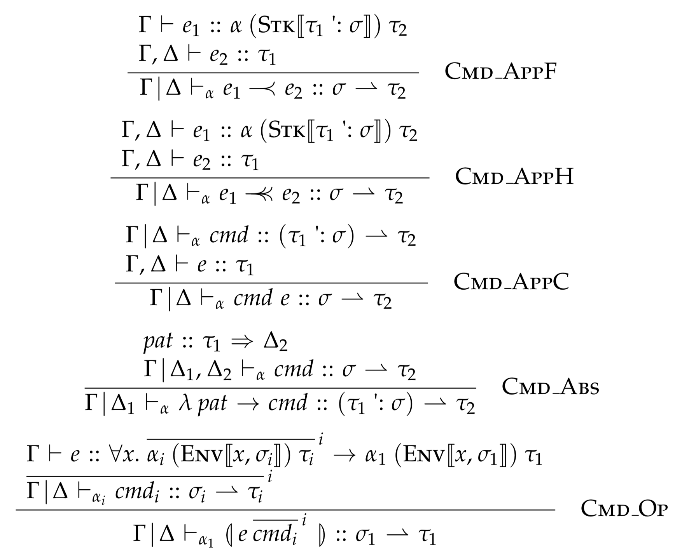

This proposal is [discussed at this pull request](https://github.com/ghc-proposals/ghc-proposals/pull/303).

# Constraint based arrow notation

Since GHC 7.8, the desugaring of custom commands (aka `(|` banana brackets `|)`) in [arrow notation][] has differed from that used in both [the original paper][Paterson01] and [the original implementation in GHC][Paterson04]. The current desugaring is easier to typecheck and theoretically provides the same expressive power as the original desugaring, but in practice, it is incompatible with the types programmers assign to control operators. For example, consider the type of `handle` given in the paper and [the `arrows` library][hackage:arrows]:

```haskell
handle :: ArrowError e arr => arr a b -> arr (a, e) b -> arr a b
```

The original desugaring supported the use of `handle` as a control operator, but under GHC’s current desugaring, it fails to typecheck. This proposal presents an alternate, constraint-based approach that is more faithful to the original notation, allowing many more operations to be used directly as control operators.

## Motivation

As mentioned above, arrow notation provides special syntax to support so-called “user defined commands,” which allows user-defined control operators to take advantage of the automatic environment passing afforded by `proc`. A motivating example given in Paterson’s original paper, [A New Notation for Arrows][Paterson01], is the aforementioned `handle` operator, intended for use in arrow notation with the following syntax:

```haskell
c1 `handle` \e -> c2
```

The key feature of this syntax is that arguments to `handle` are specified as *commands*, not expressions, and those commands may refer to arrow-local variables currently in scope in the enclosing `proc` expression. GHC’s original implementation of arrow notation accepted the above use of `handle`, as documented in Paterson’s `arrows` library, but on modern versions of GHC, it is rejected with an error like the following:

```
error:
  • Occurs check: cannot construct the infinite type: a1 ~ (a1, ())
    Expected type: arr (a1, ()) b
                   -> arr (a1, (e, b0)) b -> arr (a1, ()) b
      Actual type: arr (a1, ()) b
                   -> arr ((a1, ()), (e, b0)) b -> arr (a1, ()) b
  • In the expression: handle
```

The discrepancy comes from a change made in GHC 7.8 to the way the current “argument stack” is passed to commands. In earlier versions of GHC, each argument to a control operator was expected to have the following shape:

```haskell
((... ((e, s1), s2), ...), sn)
```

The first value, `e`, is the current *command environment*, a compiler-defined representation of the current lexical environment used to thread the values of variables in scope through the generated arrow expression. The other values, `s1` through `sn`, form the initial *argument stack* passed to the subcommand. In the simplest case, the stack is empty, such as in the first argument to `handle`, but a non-empty stack can be used to pass values to subcommands, in this case the value of a caught exception. The `\e -> c2` term is not actually a lambda expression, but a lambda *command*, which binds the topmost element of the argument stack to a variable in the local environment.

Modern versions of GHC also use an environment and argument stack, but they use a different representation:

```haskell
(e, (s1, (s2, ... (sn, ()) ...)))
```

At first blush, this is quite similar—it uses the same strategy of nesting tuples—but the key difference is the use of `()` as a terminating element. This is easier for GHC’s constraint-based typechecker to understand, but it causes trouble for programmers. The expected type of `handle` becomes

```haskell
handle :: ArrowError e arr => arr (a, ()) b -> arr (a, (e, ())) b -> arr (a, ()) b
```

which is both much more complicated to read and a pretty stupid type to write if one is not specifically cooperating with arrow notation. This is a problem, as not *all* uses of operations such as `handle` are in arrow notation, and the original version with the simpler type is much more natural to work with in those situations. Programmers are forced to choose between three options: provide the simpler type and forgo arrow notation, provide the complicated one and require arrow notation, or provide both and write an adapter from one to the other by hand. None of these is ideal!

Some operations, such as `(<+>)`, are sufficiently polymorphic that they work under both desugaring schemes. However, `handle` is not alone in its incompatibility with GHC’s current approach:

  1. The `newReader` operation from the `ArrowReader` class (which is the analog to `local` from `MonadReader`) fails in a similar way to `handle`, but with the extra stack argument appearing in the return type rather than the argument type.

  2. The examples given in GHC’s own User’s Guide include several example operations that were required to change under the new approach, including `bracketA`, `runReader`, `runState`, `bind`, and `cond`.

  3. Various types that appear in the wild are dramatically more likely to work with the old approach than the new one. For example, the codebase I work on for my day job includes the following function:

     ```haskell
     keyed :: (Eq k, Applicative m) => Rule m (e, k, a) b -> Rule m (e, Map k a) (Map k b)
     ```

     Making this work with the old notation only requires adding an extra level of nesting in the first argument, but making it work with the new notation requires a dramatically more complicated type. Under this proposal, it would work in arrow notation as-written with no changes at all.

In other words, the original rules were carefully designed to align with the types programmers *naturally* write, allowing ordinary arrow combinators to be used as control operators. The current desugaring used by GHC falls flat precisely because it does *not* align with those types, making it significantly less useful (so much so that users seem confused about the notation’s purpose).

## Aside: Understanding the GHC 7.8 behavior

One might wonder *why* GHC 7.8 chose to make such an unhelpful change. Alas, I have been unable to find the precise rationale discussed anywhere: it is not mentioned in the changelog, nor have I found any issue tracker discussions. However, I’ve gathered enough hints to reconstruct the general rationale.

The problems revolve wholly around the typing rule for arrow control operators. Recall that the original, pre-7.8 rule expected tuples of the following shape:

```haskell
((... ((e, s1), s2), ...), sn)
```

Also note that both the current and pre-7.8 typechecking rules pass the types of values on the stack as an *input* to the judgment. This means that the exact number of values on the stack must be known as the typechecker recurs through the program during constraint generation. For example, given a command like

```haskell
(| handle cmd1 cmd2 |)
```

the typechecker must deduce that no values are pushed onto the stack for `cmd1` but one value is pushed onto the stack for `cmd2`. It must deduce this information **from the type of `handle` alone, without even looking at `cmd1` or `cmd2`.** This is tricky, as the type of `handle` just looks like this:

```haskell
handle :: ArrowError e arr => arr a b -> arr (a, e) b -> arr a b
```

How can GHC figure this out? It must inspect the type of `handle` structurally:

  1. It must deduce that `a` is a bound type variable that corresponds to the input environment.

  2. With that information, it can discover that `arr a b` just takes `a` as an input, so no values are pushed onto the stack.

  3. Likewise, it can discover that `arr (a, e) b` tuples `a` with one additional value, so it pushes a single value onto the stack.

But this is somewhat unsatisfying. After all, we could instantiate `a` with `(c, d)` to get

```haskell
handle :: ArrowError e arr => arr (c, d) b -> arr ((c, d), e) b -> arr (c, d) b
```

Now suddenly `handle` appears to accept one value on the stack as input and provide one and two values on the stack to its argument commands. These are two simultaneously valid interpretations of `handle`’s type, so the old typechecker relied on the structure of the type GHC inferred, with foralls still in place.

As the GHC type system grew increasingly sophisticated with the addition of GADTs and type families, this eager, structural approach became less and less viable. The type could have type family applications or existentially-bound skolems. Much of the structure of a type cannot be known until constraint solving, but the old approach required this information be discovered during constraint generation.

So GHC 7.8 switched to a new representation that did not require so much groveling through delicately-preserved inferred types:

  1. *All* arguments can be checked against a tuple of the shape `(e, si)`, where `e` is a skolem representing the environment, and `si` is a metavariable representing that argument’s stack.

  2. Since the stack is now defined inductively, with a base case of `()`, GHC can simply emit unification constraints like `s1 ~ ()` or `s2 ~ (t1, s3)` in an entirely syntax-directed way. Much simpler!

Unfortunately, as described in the motivation above, this leads to very user-unfriendly types.

**The key idea behind this proposal is twofold:**

  1. If we want to preserve the old types, we need a way to somehow **defer learning about the shape of the stack** to constraint solving type, *not* constraint generation time.

  2. We can express these special “arrow stack constraints” as **ordinary equalities involving type families** that relate tuples and type-level lists.

The following section describes this strategy in gory detail.

## Proposed Change Specification

To restore the spirit of the original system, I propose the following modifications to GHC’s implementation of arrow notation.

### Typechecking

Both the original and current system [are specified][Paterson04] using judgments of the following form:

```
G;D |-a c :: stk --> t
```

These judgments should be read as follows: under contexts `G` and `D` containing the types of non-local and local variables, respectively, the command `c` accepts a stack of type `stk` and returns a value of type `t` in some arrow `a`. The special `-->` arrow is *not* a Haskell type, but part of the syntax of the `|-a` judgment itself. The `stk` term is a list of (mono-)types, and it is an “input” to the judgment for the purposes of an algorithmic implementation.

Here is an example of an existing typechecking rule, this one for command application:

```
G;ys |-a cmd :: (t1, stk) --> t2
G,xs |- exp :: t1
ys \subseteq xs
--------------------------------
G;xs |-a cmd exp :: stk --> t2
```

I do not propose any radical changes to the structure of the `|-a` judgment or its rules, but I suggest the following key modifications:

  1. Eliminate the requirement that `stk` be strictly an input to `|-a`. Instead, allow it to be an arbitrary type of kind `[Type]`. This allows `stk` to be a (potentially unsolved) metavariable rather than a concrete list, which allows GHC’s typechecker to propagate information bidirectionally using the ordinary type inference mechanism.

  2. Introduce two wired-in type families:

     1. `ArrowStackTup :: [Type] -> Type`, which converts a stack type to a tuple. Morally, it is a closed type family with the following infinitely-long definition:

        ```haskell
        type family ArrowStackTup stk where
          ArrowStackTup '[a]       = a
          ArrowStackTup '[a, b]    = (a, b)
          ArrowStackTup '[a, b, c] = (a, b, c)
          ...
        ```

        This type family is non-injective, as the RHS of the first case overlaps with all other cases.

     2. `ArrowEnvTup :: Type -> [Type] -> Type`, which accepts an environment and a stack and produces a tuple. This is quite similar to `ArrowStackTup`, and it has a similar definition:

         ```haskell
         data ArrowEnv env -- an opaque type that represents the local environment

         type family ArrowEnvTup env stk = arg | arg -> env stk where
           ArrowEnvTup env '[]     = ArrowEnv env
           ArrowEnvTup env '[a]    = (ArrowEnv env, a)
           ArrowEnvTup env '[a, b] = (ArrowEnv env, a, b)
           ...
         ```

         Crucially, this type family *is* injective, which preserves important type inference properties.

  3. Change the `|-a` rules for `f -< e`, `f -<< e`, `c e`, `\p -> c`, and `(| e c ... |)` to use the above type families in the relevant places. In the context of GHC’s implementation, this means emitting equality constraints between applications of those type families rather than solving everything up front.

Because the ASCII-art versions of the modified rules are more difficult to read than properly typeset versions, I’ve created readable renderings of the key rules (where Sᴛᴋ⟦𝜎⟧ is used in place of `ArrowStackTup` and Eɴᴠ⟦𝜏,𝜎⟧ is used in place of `ArrowEnvTup`):



The full set of rules, rendered from [this Ott model](0000-typechecking-rules.ott), are [available here in PDF form](0000-typechecking-rules.pdf).

### Desugaring

To specify how `proc` notation is translated to ordinary Haskell code, the `|-a` judgment given by Paterson is further extended with desugaring rules:

```
G;D |-a c :: stk --> t    --->  e
```

The added `--->  e` clause specifies that the command `c` desugars to the expression `e`. Here is the rule for command application extended with desugaring rules:

```
G;ys |-a cmd :: (t1, stk) --> t2    --->  cmd'
G,xs |- exp :: t1
ys \subseteq xs
--------------------------------
G;xs |-a cmd exp :: stk --> t2      --->  premap (\((xs), stk) -> ((ys), (exp, stk))) cmd'
```

In GHC, the desugaring rules can remain essentially unchanged under this proposal, since the desugarer runs after typechecking, and it has access to fully-solved type information. However, *in principle* that is not necessary, as it is possible to define arrow notation as a type-agnostic translation into applications of special typeclass methods. I have worked out a set of desugaring rules that use that approach, but I have omitted them here because I believe them to be unnecessary; please let me know if you feel otherwise, and I can provide them.

### Other details

#### Error reporting

In practice, it is unlikely that the generated equality constraints on `ArrowStackTup` and `ArrowEnvTup` will ever fail to solve. The strict type required by the `(| e c ... |)` rule is almost always enough to propagate information downwards, and the other rules cannot introduce any ambiguity about the shape of the stack. However, while unlikely, it is not impossible, especially in partially-written programs containing `undefined` or typed holes, such as this one:

```haskell
bad :: () -> ()
bad = proc () -> (| undefined (not -< True) |)
```

In this case, `undefined`’s type is so polymorphic that the stack it “provides” to its argument could be absolutely anything. This means we eventually end up with the constraint `ArrowStackTup (Bool ': t0) ~ Bool` when trying to typecheck `not -< True`, where `t0` is ambiguous, and GHC barfs:

```
error:
    • Couldn't match type ‘GHC.Desugar.ArrowStackTup (Bool : t0)’ with ‘Bool’
      Expected type: GHC.Desugar.ArrowStackTup (Bool : t0) -> Bool
        Actual type: Bool -> Bool
      The type variable ‘t0’ is ambiguous
    • In the expression: not
      In the command: not -< True
      In the command: (| undefined (not -< True) |)
```

This error message is unhelpful, since the programmer doesn’t have any idea what `ArrowStackTup` is. For that reason, it likely makes sense for GHC to generate custom type error messages upon failure to solve `ArrowStackTup` and `ArrowEnvTup` equalities to prevent implementation details from leaking out to the programmer.

#### The `ArrowEnv` type

The `ArrowEnvTup` rule wraps the environment type in an opaque, compiler-defined `ArrowEnv` type, unlike the current implementation, which simply uses a large tuple. The separate `ArrowEnv` type is necessary primarily to ensure the `ArrowEnvTup` type family is injective: if it were a tuple, the RHS of the empty stack case would overlap with other cases. Additionally, the `ArrowEnv` wrapper allows the `(| e c ... |)` rule to check `e` against a type with a skolem variable in place of `env` without destroying injectivity.

Fortunately, the wrapper itself is only necessary at the type level, so the actual representation can be identical to the current one. A logical implementation of `ArrowEnv` would be

```haskell
newtype ArrowEnv env = ArrowEnv env
```

so the current representation can be passed as the `env` parameter directly.

#### The stack and large tuples

This proposal eliminates the use of a nested tuple for the argument stack completely. Instead, a stack of *n* arguments is represented directly be a tuple of size *n* (or *n*+1 when combined with an environment). Theoretically, this could cause trouble, as GHC does not support tuples of arbitrary size.

I don’t think this is actually a problem—61 arguments really ought to be enough for anyone! The only situation where the tuple limit could possibly be relevant is the environment, but the existing technique of nesting tuples works fine there, since the representation of the environment is opaque. It’s probably a good idea to make `ArrowStackTup` and `ArrowEnvTup` report meaningful error messages if that limit is ever somehow exceeded, but otherwise, I don’t expect this to be an issue.

## Examples

### The `bind` combinator

For a particularly extreme illustration of why the proposed desugaring is desirable while the current desugaring is not, consider the definition of the canonical `bind` operation on arrows:

```haskell
bind :: Arrow a => a e b -> a (e, b) c -> a e c
bind f g = (id &&& f) >>> g
```

This operation is useful in its own right when used as an ordinary arrow combinator. Given two arrows `f :: Arr A B` and `g :: Arr (A, B) C`, `bind` can be used to compose them together as follows:

```haskell
foo :: Arr A C
foo = f `bind` g
```

Under the proposed desugaring (and the pre-7.10 desugaring), `bind` is accepted as a control operator, allowing `bind` on arrows to serve double-duty as `bind` on commands. However, under the current desugaring, `bind` on commands has to be defined the following (enormously uglier) way:

```haskell
bind :: Arrow a => a (e, ()) b -> a (e, (b, ())) c -> a (e, ()) c
bind f g = (id &&& f) >>> arr (\((e, ()), x) -> (e, (x, ()))) >>> g
```

Worse still, this definition of `bind` is utterly useless outside of `proc` notation, as to use it as an arrow combinator, the above definition of `foo` would need to be rewritten to the following:

```haskell
foo :: Arr A C
foo = arr (, ()) >>> ((arr fst >>> f) `bind` (arr (\(x, (y, ())) -> (x, y)) >>> g)
```

This construction is completely unreadable by comparison, so the current desugaring makes it impractical to use control operators outside of `proc` notation. The proposed desugaring restores the reuse afforded by Paterson’s original desugaring.

### A worked example using `handle`

The canonical example supported by this proposal is the `handle` operator, a member of the `ArrowError` class:

```haskell
class Arrow arr => ArrowError e arr | arr -> e where
  throw :: arr e a
  handle :: arr a b -> arr (a, e) b -> arr a b
```

The type of `handle` is quite natural, and it is the most logical type to write in the absence of `proc` notation. However, GHC 7.8+ does not allow `handle` to be used as a control operator in `proc` notation, rejecting the following `ArrowError` instance for the `ReaderA` arrow transformer:

```haskell
newtype ReaderA r arr a b = ReaderA { runReaderA :: arr (a, r) b }

instance ArrowError e arr => ArrowError e (ReaderA r arr) where
  throw = lift throw
  handle (ReaderA f) (ReaderA g) = ReaderA $ proc (a, r) ->
    (f -< (a, r)) `handle` \e -> g -< ((a, e), r)
```

(Note that commands using infix syntax, e.g. ``c1 `x` c2``, are implicitly treated as applications of control operators, even without banana brackets. The command ``c1 `handle` c2`` is therefore sugar for `(| handle c1 c2 |)`.)

GHC rejects the above instance because it expects the type for `handle` mentioned in the motivation section. Under this proposal, the instance would be accepted. To understand why, we can work through the typechecking process by hand:

  1. The first rule that applies is the rule for `proc`, which is an ordinary expression typing rule. If we use `c` to abbreviate the body of the above use of `proc`, we have:

     ```
     (a, r) :: (a, r) => a,r
     G;a,r |-arr c :: '[] --> b
     -------------------------------------
     G |- proc (a, r) -> c :: arr (a, r) b
     ```

  2. Next, we need to check that `|-arr c` holds. Taking `c1 = f -< (a, r)` and `c2 = \e -> g -< ((a, e), r)`, we have:

     ```
     s1, s2, t1, t2 fresh
     G |- handle :: forall w
                  . arr (ArrowEnvTup w s1) t1
                 -> arr (ArrowEnvTup w s2) t2
                 -> arr (ArrowEnvTup w '[]) b
     G;a,r |-arr c1 :: s1 --> t1
     G;a,r |-arr c2 :: s2 --> t2
     -------------------------------------------------------------------------
     G;a,r |-arr (| handle c1 c2 |) :: '[] --> b
     ```

  3. First, let’s look at what happens when checking the `|- handle` judgment.

     1. To start, the typechecker will unify the type of `handle` and the expected type given above, yielding the following equality constraints:

        ```haskell
        arr (ArrowEnvTup w s1) t1 ~ arr a1 b1
        arr (ArrowEnvTup w s2) t2 ~ arr (a1, e) b1
        arr (ArrowEnvTup w '[]) b ~ arr a1 b1
        ```

        After some simplification, the above constraints are reduced to

        ```haskell
        t1, t2, b1 := b
        ArrowEnvTup w s1 ~ a1
        ArrowEnvTup w s2 ~ (a1, e)
        ArrowEnvTup w '[] ~ a1
        ```

     2. Next, the solver for `ArrowEnvTup` can have a go at the constraints. `ArrowEnvTup w '[]` is trivially reducible to `ArrowEnv w`, so we can take `a1 := ArrowEnv w` and discharge the constraint. With that substitution, the remaining constraints become

        ```haskell
        ArrowEnvTup w s1 ~ ArrowEnv w
        ArrowEnvTup w s2 ~ (ArrowEnv w, e)
        ```

        which are solvable via injectivity, and we get `s1 := '[]` and `s2 := '[e]`.

  4. With those constraints solved, we can move on to checking `c1` and `c2`.

     1. `c1` is a simple arrow application command, so typechecking it is straightforward:

        ```
        t3 fresh
        G,a,r |- (a, r) :: t3
        G |- f :: arr (ArrowStackTup '[t3]) b
        ------------------------------------
        G;a,r |-arr f -< (a, r) :: '[] --> b
        ```

        After unification, `t3` is solved to `(a, r)`. `ArrowStackTup '[(a, r)]` reduces to `(a, r)`, so `f` is checked against type `arr (a, r) b`, which is trivially true.

     2. `c2` is a little more interesting, since it is a lambda command:

        ```
        a,r, e :: e => a,r,e
        G;a,r,e |-arr g -< ((a, e), r) :: '[] --> b
        ------------------------------------------------
        G;a,r |-arr \e -> g -< ((a, e), r) :: '[e] --> b
        ```

        Checking the application of `g` is essentially identical to the checking of `f` above.

  5. Everything is checked and all constraints are solved, so we’re done.

This example concretely illustrates why it is crucial that `ArrowEnvTup` is injective: in step 3, it allowed us to infer the expected stack for each argument to `handle`. Consider that if we didn’t learn that information that way, we’d be totally stuck in step 4, since `ArrowStackTup` is non-injective! We would gain no information from the types of `f` and `g`, so if `s1` and `s2` remained unsolved metavariables, resulting in a type error due to insoluble equalities.

### Case study: `keyed`

As mentioned in the motivation section, the codebase I work on for a living defines an arrow named `Rule`. A value of type `Rule m a b` can be thought of as a “build rule” that describes how to produce a `b` from an `a` in some monad `m`. The key feature of `Rule` that distinguishes it from `Kleisli` is that it supports automatic caching of built products using a `cache` combinator:

```haskell
cache :: (Eq a, Applicative m) => Rule m a b -> Rule m a b
```

This is, incidentally, why `Rule` is an arrow: `Monad` is too powerful to automatically determine the dependency graph, but `Arrow` + `ArrowChoice` is just right. Using arrows, a composition of `Rule`s effectively describes a *static* dependency graph where the shape of the graph is known at compile-time but can contain conditional branches.

The `cache` combinator is itself a control operator, but it is sufficiently polymorphic to work with both the current GHC rules and the rules in this proposal. A more interesting combinator is `keyed`, which has the following type:

```haskell
keyed :: (Eq k, Applicative m) => Rule m (e, k, a) b -> Rule m (e, Map k a) (Map k b)
```

`keyed` allows a restricted form of dynamic dependencies: the dependency graph dynamically adapts to the keys in the map, and the values of the keys are used to relate dependencies to each other across builds.

The type of `keyed` was not originally written with `proc` notation in mind, but it, too, is a control operator. In our codebase, we would like to be able to use it in `proc` notation in examples such as the following:

```haskell
proc (tableInfo, permissions) ->
  (| keyed (\roleName permission -> do
       let permDef = PermDef roleName (_cpDef permission) Nothing
       Inc.ruleA -< buildPermInfo tableInfo permDef)
  |) (M.groupOn _cpRole permissions)
```

We *really want to use `proc` notation here*, since without it, we’d need to do manually thread the `tableInfo` variable from the outer scope through `keyed`. In other situations, we might need to thread a half dozen different variables, creating quite the confusing mess! Sadly, as with `handle`, GHC’s current implementation of arrow notation rejects the above use of `keyed`, instead requiring the following significantly worse type:

```haskell
keyed :: (Eq k, Applicative m)
      => Rule m (e, (k, (a, ()))) b
      -> Rule m (e, (Map k a, ())) (Map k b)
```

The original type has great explanatory power: it lifts a `Rule` that operates on keys and values to one that works on maps. The second type expresses the same thing, but it’s significantly harder to see at a glance. Fortunately, this proposal also handles `keyed` quite nicely, working essentially identically to how it does with `handle`.

### Other operators

The same process outlined above works for all of the examples given in the motivation section. Here is a list of control operators and their types, all of which are accommodated by this proposal:

```haskell
(<+>) :: ArrowPlus a => a e c -> a e c -> a e c
untilA :: ArrowChoice a => a e () -> a e Bool -> a e ()
handleA :: ArrowError ex a => a e c -> a (e, ex) c -> a e c
bracketA :: ArrowMask a => a e b -> a (e, b) c -> a (e, c) d -> a e d
localA :: ArrowReader r a => a e b -> a (e, r) b
runReaderA :: Arrow a => ReaderA r a e b -> a (e, r) b
runStateA :: Arrow a => StateA s a e b -> a (e, s) (b, s)
bind :: Arrow a => a e b -> a (e, b) c -> a e c
bind_ :: Arrow a => a e b -> a e c -> a e c
cond :: ArrowChoice a => a e b -> a e b -> a (e, Bool) b
```

Of the above list, only `(<+>)`, `untilA`, and `bind_` are accepted as control operators in the current implementation.

## Effect and Interactions

Aside from the direct, intended effect on this particular feature of `proc` notation, the impact of the proposed change should be small to nonexistent. Programs that do not use `proc` notation will not be impacted at all, and programs that use `proc` notation but do not use custom control operators are unlikely to be impacted, either. The scope of this change is small.

## Costs and Drawbacks

There are two primary drawbacks to this change:

  1. It is backwards-incompatible.

     Ordinarily, a change that is *this* backwards-incompatible would need to be handled with great care, and it would likely need to be hidden behind a separate language extension. However, in this case, my recommendation is to simply make the change.

     The number of users of `proc` notation is small to begin with, and the number of users using custom control operators is vanishingly tiny. Consider that GHC 7.8 made an equally backwards-incompatible change to this same feature, and as far as I can tell, precisely zero users complained (and possibly roughly as many noticed). The change was considered so inconsequential that despite being very backwards incompatible, it was not even mentioned in the release notes!

     Furthermore, an audit of all packages on Hackage found just *three* packages that use banana brackets at all (ignoring packages that parse Haskell code and only include them in parsing test cases):

       1. [Ross Paterson’s `arrows` package](https://hackage.haskell.org/package/arrows), which is mentioned in this proposal. As mentioned above, this package is *already* broken under the current arrow desugaring rules; this proposal would fix it, not break it further.

       2. @dwincort’s [UISF package](https://hackage.haskell.org/package/UISF), which uses banana brackets with operators like `leftRight` and `setSize`. These operators are [sufficiently polymorphic](https://github.com/ghc-proposals/ghc-proposals/pull/303#issuecomment-570813964) to be unaffected by this change; they work under all versions of the arrow desugaring.

       3. The third and final package is [HSoM](https://hackage.haskell.org/package/HSoM), which only uses banana brackets because it depends on UISF and uses them in the same way.

     Therefore, it seems unlikely that anyone (except me) will even notice this change. (Maybe not the most exciting argument—“we shouldn’t worry about compatibility because nobody cares”—but at least you can’t call me unrealistic.)

  2. It adds new functionality into the constraint solver (indirectly, via the wired-in type families) specifically to support arrows, which seem somewhat maligned in the Haskell community. Arguably, this moves in the wrong direction: some people might prefer `proc` notation be removed, not further cemented.

     I think, however, such fear would be unfounded. The proposed change doesn’t make `proc` notation any more difficult to remove should someone wish to do it in the future, nor does it introduce any meaningful maintenance burden on any other part of the compiler. As long as `proc` notation is here (and some programmers, myself included, do find it useful!), it might as well work properly.

## Alternatives

This proposal has the following alternatives:

  1. **Implement this change, but gate it behind a separate language extension.**

     I outlined in the previous section why I think this isn’t worth doing, and it would significantly complicate the implementation to maintain support for both desugarings yet provide relatively little value. Still, it’s an option if backwards-compatibility is deemed too important.

  2. **Implement this change, but use the nested tuple representation of the original paper instead of the flat representation of this proposal.**

     This is basically just a subjective choice. Arguably, the original implementation worked the way it did because it wasn’t clear how to make it work differently at the time. I think the flat representation is more useful to programmers, and I don’t think it has any significant downsides, but I’m not completely attached to it either.

  3. **Implement this change, but define the type families in Haskell rather than making them wired-in.**

     Technically, this is possible to do, since GHC has a maximum tuple size, so the type families could just list out all the cases. The primary downside of doing this is that it eliminates the possibility of performing improvement on constraints involving `ArrowStackTup`. For example, suppose we have the wanted constraint `[W] ArrowStackTup stk ~ Int`. From this, we can generate the derived equality `[D] stk ~ '[Int]`, since no other cases can possibly match.

     In theory, GHC could do this kind of improvement for *all* closed type families, which would eliminate this difference. But currently, it does not, so it would be a difference barring other changes.

  4. **Do nothing.**

     Arrows are a pretty low-priority feature in GHC right now, so not doing this isn’t going to leave too many people upset. Still, I think it’s a small enough change to be worth the effort, assuming someone (me) is willing to volunteer their time to implement it.

## Implementation Plan

I, Alexis King, have already implemented most of this proposal on [my `constraint-based-arrow-notation` branch of GHC](https://gitlab.haskell.org/lexi.lambda/ghc/-/tree/constraint-based-arrow-notation). [MR !3191 on GitLab](https://gitlab.haskell.org/ghc/ghc/-/merge_requests/3191) includes a high-level overview of the changes, as well as what is left to be done. Discussing further implementation details is out of scope for this proposal, but those interested can look at and/or comment on the MR.

[arrow notation]: https://downloads.haskell.org/ghc/8.8.1/docs/html/users_guide/glasgow_exts.html#arrow-notation
[hackage:arrows]: https://hackage.haskell.org/package/arrows
[Paterson01]: http://www.staff.city.ac.uk/~ross/papers/notation.html
[Paterson04]: https://downloads.haskell.org/~ghc/papers/arrow-rules.pdf
