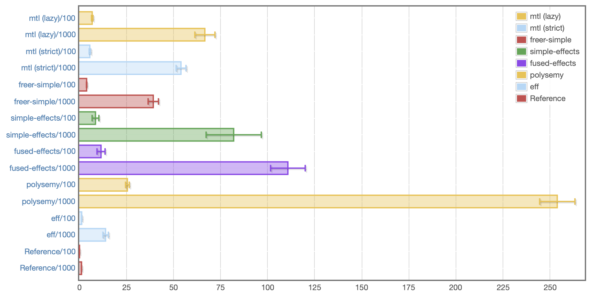

This proposal is [discussed at this pull request](https://github.com/ghc-proposals/ghc-proposals/pull/313).

# Delimited continuation primops

In recent years, the Haskell community has demonstrated serious interest in algebraic effect systems. Though several implementations already exist, performance remains a significant obstacle to broader adoption. Stephen Diehl put it well in [a recent blog post][diehl:decade]:

> In the usual Haskell tradition, there are several models exploring different points in the design space. In their current state, these projects introduce quite a bit of overhead, and some of them even require a plethora of GHC plugins to optimise away certain abstractions or to fix type inference problems.

A limiting factor for effect system performance is the need to implement delimited continuations outside of the runtime. Accordingly, this proposal presents a design for native delimited continuation primops that can be used to efficiently capture the RTS stack.

A guiding principle of the design is to be *minimal*. Rather than burden GHC with the full complexity of designing and implementing algebraic effects, this proposal provides a path for users to experiment with designs as ordinary Haskell libraries without sacrificing performance.


## Motivation

As described above, the primary use case for this proposal is effect libraries. Discussing the full complexity of effect systems is outside the scope of this proposal, but the relevant detail is that effect systems provide the ability to capture portions of the current continuation. Without native support for first-class continuations from the runtime, this must be implemented by CPSing the program. In Haskell, this is naturally expressed using a monad. Various monadic implementations of delimited control already exist:

  * [“A Monadic Framework for Delimited Continuations” by Kent Dybvig, Simon Peyton Jones, and Amr Sabry][dybvig:monadic] is the canonical resource, [further refined by Oleg Kiselyov][oleg:cc-monads] and implemented as the [CC-delcont][hackage:CC-delcont] library.

  * Also presented by Kiselyov, [the so-called “freer monad”][oleg:freer] has been used in several libraries to implement delimited continuations specifically for the purpose of effect systems.

  * The [effects][hackage:effects] library uses nested continuation transformers to achieve delimited control.

These approaches have various performance tradeoffs, but all of them suffer from a fatal flaw: programs must pay for the cost of continuation capture, **even if they never actually capture the continuation!** This is a real problem for effect systems, as many programs that use effects have no need to capture the continuation. The `Reader`, `State`, and `Writer` effects need no continuation manipulation, and the `Error` effect only needs to abort the continuation early, not capture it.

To make this cost more concrete, consider the following example monadic code:

```haskell
f a b = g a >>= \c -> h $! (b + c)
```

Depending on the particular monad used, this code may be compiled in dramatically different ways. Suppose for a moment that the monad in question is `IO`. Even if `g` and `h` are not inlined, GHC will compile `f` efficiently, producing STG code along these lines:

```haskell
f = \r [a b void]
  case g a void# of { Unit# c ->
  case b of { I# x ->
  case c of { I# y ->
  case +# [x y] of z { __DEFAULT ->
  let { d = I#! [z] } in
  h d void# }}}}
```

Notice that there is only one use of `let` in this program, which is good, since at the STG level, `let` means “heap allocation.” This STG has a straightforward translation to native code: the call to `g` can be made in the usual way by pushing a return address onto the stack and jumping to `g`, and `g`’s result will be on the top of the stack when it returns.

Now suppose the monad in question isn’t `IO`, but `Cont`, the continuation monad. Looking at the STG output reveals something dramatically worse:

```haskell
f = \r [a b]
  let { m = \u [] g a } in
  let { k1 = \r [k3]
    let { k2 = \r [c]
      case b of { I# x ->
      case c of { I# y ->
      case +# [x y] of z { __DEFAULT ->
      let { d = I#! [z] } in
      h d k3 }}}
    } in m k2
  } in k1
```

Unlike the `IO` code, this has not one but *four* uses of `let`! CPS is the culprit: the calls to `g` and `h` are each passed a continuation, which must be a closure, and closures are allocated on the heap. This means that all computations in `Cont` end up traversing a long chain of heap-allocated closures, whether they ever actually capture the continuation or not.

Note that this example is the best case scenario if `g` and `h` are not inlined. The STG above still assumes `>>=` is specialized and inlined and that its unfolding is simple. In practice, effect systems usually add even more overhead:

  * Real systems have to implement tagged delimited continuations, which requires extra bookkeeping.

  * Some effect systems use `mtl`-style constraints to be polymorphic in the monad instead of using a concrete type, but this makes things even worse. Each call to `>>=` becomes an unknown call, and GHC can’t even avoid allocating a closure in an expression like `pure x >>= f y`.

  * The CPS transformation obscures the structure of the code from the simplifier and demand analyzer and makes user-defined `RULES` far trickier to write.

Without support from the runtime, this overhead is inevitable. This is especially frustrating because GHC’s implementation presents no real obstacles to implementing continuation capture directly. What’s more, the needed primitive functionality is small: given only the ability to capture and restore a slice of the RTS stack, more complicated patterns (such as tagged continuation prompts) can be efficiently implemented as derived operations in library code.

### Putting numbers to the cost

To help motivate this proposal, I have implemented the proposed primops and used them to build [a fully-featured effect library, `eff`.][github:eff] Pitted against other effect systems in use today, `eff` is the decisive victor on the CountDown microbenchmark used to evaluate the performance of effect dispatch:



This benchmark is extremely synthetic—it just uses a `State` effect to decrement a counter until it reaches zero—so its results should be taken with a grain of salt. The “reference” implementation is just a recursive function that uses no effect system at all, and it does unrealistically well because the program is so simple GHC just turns it into a tight loop on unboxed integers. Still, it’s simple way to illustrate the unnecessary overhead of existing implementations.

It’s worth reiterating that this benchmark is **not** evaluating the performance of continuation capture and restore—this benchmark never captures any continuations at all. Rather, it benchmarks the cost that libraries have to pay to support continuations even when they aren’t used. `eff` does better because it is able to avoid paying that cost unless it actually becomes necessary.


## Proposed Change Specification

The scope of the proposed change is limited to the RTS: no other part of the compiler needs to be touched. The user-facing interface consists of two new primops, `prompt#` and `control0#`, which have the following types:

```haskell
prompt#
  :: forall (a :: Type)
   . (State# RealWorld -> (# State# RealWorld, a #))
  -> State# RealWorld -> (# State# RealWorld, a #)

control0#
  :: forall (a :: Type) (r :: RuntimeRep) (b :: TYPE r)
   . (((State# RealWorld -> (# State# RealWorld, b #))
       -> State# RealWorld -> (# State# RealWorld, a #))
      -> State# RealWorld -> (# State# RealWorld, a #))
  -> State# RealWorld -> (# State# RealWorld, b #)
```

The type of `control0#` is rather intimidating, so it is more useful to consider the types in terms of `IO` rather than functions on `State#` tokens:

```haskell
prompt :: IO a -> IO a
control0 :: ((IO b -> IO a) -> IO a) -> IO b
```

However, note that I do **not** propose actually providing the `IO` versions anywhere! There is **no** safe way to use these operations in arbitrary `IO` code, for reasons given below. The intended use of `prompt#` and `control0#` is in library code that can arrange for them to be used safely; an example is given in the Examples section.

### Operational semantics

The names and semantics of `prompt` and `control0` come from [the paper “Shift to control” by Chung-chieh Shan][shan:shift-to-control]. As their names imply, they are closely related to both Felleisen’s original `prompt` and `control` operators, which in turn are closely related to Danvy and Filinski’s `reset` and `shift`. The differences lie in whether the prompt is included in the captured continuation and whether it is removed upon aborting; the reduction rules show the differences clearly:

  * prompt *v* ⟶ *v*  
    prompt *E*[control *x*<sub>1</sub> *e*] ⟶ prompt ((λ *x*<sub>1</sub>. *e*) (λ *x*<sub>2</sub>. *E*[*x*<sub>2</sub>]))

  * reset *v* ⟶ *v*  
    reset *E*[shift *x*<sub>1</sub> *e*] ⟶ reset ((λ *x*<sub>1</sub>. *e*) (λ *x*<sub>2</sub>. reset *E*[*x*<sub>2</sub>]))

  * prompt *v* ⟶ *v*  
    prompt *E*[control0 *x*<sub>1</sub> *e*] ⟶ ((λ *x*<sub>1</sub>. *e*) (λ *x*<sub>2</sub>. *E*[*x*<sub>2</sub>]))

`control0` is unique in that it neither leaves the prompt behind *nor* includes it in the captured continuation. Under the classification given by Dybvig et al. in section 2.2 of [the Monadic Framework paper][dybvig:monadic], `control0` implements the <sup>−</sup>ℱ <sup>−</sup> semantics. They explain why this semantics is desirable:

> We have chosen <sup>−</sup>ℱ <sup>−</sup> semantics for our building-block operator `withSubCont` because the <sup>−</sup>ℱ <sup>−</sup> semantics easily models each of the others with the trivial addition of `pushPrompt` forms where necessary to leave behind or reinstate a prompt.

In other words, `control0` is the most general of the standard continuation operators, so it’s the obvious choice to implement as a primitive.

The meaning of “the current evaluation context” is complicated in a call-by-need language, so the behavior of `prompt#` and `control0#` is only well-defined in strict `State#` threads (where each call to `control0#` has a corresponding call to `prompt#` in the same state thread). Furthermore, `control0#` is not type safe; it is the responsibility of the caller to ensure that the `a` type argument to `control0#` is representationally equivalent to the `a` type argument of the nearest enclosing `prompt#` call. Failing to preserve these invariants can lead to segfaults and other badness.

In addition to these restrictions, `control0` includes a minor departure from its conventional semantics: the captured continuation accepts a *computation* as an argument rather than a *value*. That is, `prompt#` and `control0#` are properly defined by the following reduction rules:

  * <code>prompt# (\s2 -> (# s2, *e* #)) *s1*</code> ⟶ <code>(# *s1*, *e* #)</code>

  * <code>prompt# *E*[control0# *e*] *s1*</code> ⟶ <code>*e* (\m s2 -> *E*[m s2]) *s1*</code>  
    where *`E`* contains no intervening `prompt#`

This mimics the semantics of the `pushPrompt` operator of Dybvig et al., and it allows a continuation to be restored before proceeding with further computation. In Haskell, this is useful for reinstalling exception handlers or interrupt masking state. For example, using the `IO`-wrapped operators,

```haskell
prompt $ catch (control0 $ \k -> k $ throwIO (ErrorCall "bang"))
               (\(ErrorCall msg) -> pure msg)
```

is equivalent to `pure "bang"`, since the application of `k` will reinstall the exception handler before executing the `throwIO` call. In contrast,

```haskell
prompt $ catch (control0 $ \k -> k . pure =<< throwIO (ErrorCall "bang"))
               (\(ErrorCall msg) -> pure msg)
```

raises an exception, since `k` is not restored until after the call to `throwIO` returns.

**Note that prompts are not in any way tagged.** Each call to `control0#` captures up to the nearest `prompt#` and no further. This is an intentional design decision. There are many ways to implement prompt tagging, and implementing them in the RTS rather than in library code would require committing to an implementation strategy without much benefit. It is straightforward to implement tagged prompts as a derived concept; [`eff`][github:eff] provides one possible implementation.

### Behavior of unwinding and rewinding

For the most part, capturing a continuation just involves copying a slice of the stack into the heap, and restoring it just involves copying it onto the current stack. However, continuation capture and restore requires extra care to respect modifications to the asynchronous exception masking state. When capturing a continuation that includes `maskAsyncExceptions#`, `maskUninterruptible#`, or `unmaskAsyncExceptions#` frames, the masking state is properly adjusted when the stack is unwound and rewound.

Capturing a continuation that includes thunk update frames or STM frames is undefined behavior. The presence of a thunk update frame in the captured continuation implies the nearest `prompt#` frame was pushed by a different state thread than the one that called `control0#`, so the captured continuation would be unpredictable. Similarly, STM transactions are not re-entrant, so jumping back into an in-progress STM transaction has no meaning.

### Runtime implementation

Concretely, `prompt#` and `control0#` are implemented in the RTS via direct manipulation of the current thread’s stack. `prompt#` pushes a `RET_SMALL` frame with a well-known info table, and `control0#` copies the stack above the `prompt#` frame into the heap. The stack pointer is adjusted to point just below the `prompt#` frame, and execution resumes by applying the function provided to `control0#` to the captured continuation.

Dually, applying a continuation pushes the captured frames onto the stack, then applies the provided function. Because the continuation accepts a function rather than a value, there is no obstacle to making that “side” of the continuation levity-polymorphic. (The inverse is not true; making `prompt#` levity-polymorphic would be more involved, so this proposal requires a lifted type.)

`CONTINUATION` is a new closure type. It is similar to the existing `AP_STACK`, but while an `AP_STACK` is a thunk with a chunk of stack attached to it, a `CONTINUATION` is a *function* represented by a chunk of stack. For the most part, a `CONTINUATION` behaves exactly like a `FUN` of arity 2 that accepts a pointer and a `RealWorld` token, but its representation requires some cooperation from the runtime to allow the garbage collector to traverse the captured stack frames.

Some extra care is needed to handle capturing certain kinds of stack frames, such as underflow frames and frames that adjust the interrupt masking state. To accommodate these, `CONTINUATION`s use a special calling convention that allows a single continuation to actually be represented by a chain of separate `CONTINUATION` chunks; this strategy is described in gory detail in comments in the existing implementation linked at the end of this proposal.


## Examples

The motivation section already mentions a significant worked example, [the `eff` effect library.][github:eff] That motivates the proposal’s usefulness, but it is rather complicated, so I present a much simpler example below as a simple illustration of the primops’ behavior.

To start, we can define a safe interface for `prompt#` and `control0#`:

```haskell
type role Cont representational representational
newtype Cont r a = Cont (State# RealWorld -> (# State# RealWorld, a #))
  deriving (Functor, Applicative, Monad) via IO

reset :: Cont a a -> Cont r a
reset (Cont m) = Cont $ prompt# m

shift :: ((Cont r a -> Cont r r) -> Cont r r) -> Cont r a
shift f = Cont $ control0# $ \k ->
  case reset $ f $ \(Cont a) -> reset $ Cont $ k a of Cont b -> b

runCont :: Cont a a -> a
runCont (Cont m) = case runRW# (prompt# m) of (# _, a #) -> a
```

I’ve chosen to implement the more traditional `shift` and `reset` operations because they’re much easier to safely statically type. `reset` is just `prompt#`, but `shift` wraps `control0#` to reinstall the prompt after both continuation capture and continuation application.

We can define an `Alternative` instance for `Cont [r]` that combines the results of all branches of a computation, a la the `[]` monad:

```haskell
instance Alternative (Cont [r]) where
  empty = shift $ \_ -> pure []
  a <|> b = shift $ \k -> (++) <$> k a <*> k b
```

Using this, we can write a simple backtracking implementation of n-queens:

```haskell
choose :: Alternative f => [a] -> f a
choose = asum . map pure

nQueens :: Int -> [[Int]]
nQueens n = runCont (go []) where
  go queens
    | length queens == n = pure [reverse queens]
    | otherwise = do
        i <- choose [1..n]
        -- check vertical
        traverse (guard . (i /=)) queens
        -- check diagonal
        for_ (zip [1..] queens) $ \(j, q) -> do
          guard $ i /= q - j
          guard $ i /= q + j
        go (i:queens)
```


## Effect and Interactions

The changes required to implement `prompt#` and `control0#` are relatively minimal. They only impact the RTS, and they do not require any changes to existing functionality. Though capturing portions of the RTS stack may seem like a radical proposition, GHC actually already does it when raising an asynchronous exception to avoid the need to duplicate work for any blackholed thunks. In fact, getting that right is significantly more subtle than implementing `control0#`, which is quite straightforward in comparison.

A more important consideration is how `control0#` might interact with user programs. As alluded to above, `control0#` is fundamentally dangerous when used with arbitrary `IO` code, as existing programs do not account for the possibility of re-entrant `IO` computations. For example, consider code such as the following:

```haskell
m = withFile path ReadMode $ \h -> hGetLine h >> control0 f >> hGetContents h
```

Internally, `withFile` uses `bracket` to manage the lifetime of a `Handle`, but it isn’t clear what the behavior ought to be if a captured continuation includes a `withFile` frame. Several possibilities come to mind:

  * The most lax approach is to do nothing when the continuation is captured and restored, but this may cause resource leaks or nonsensical behavior if a continuation is captured but never restored or restored multiple times.

  * Continuation capture unwinds the stack, so arguably the `Handle` should be closed upon the call to `control0`. This is reasonable, but it precludes legitimate use cases where a continuation may be captured and re-applied shortly thereafter.

  * A more satisfying approach would be to make `bracket` behave like Scheme’s `dynamic-wind`, where the “allocate” and “destroy” actions are executed upon every jump in or out of the delimited context. This might work better for some resources, like a mutex, but it doesn’t work for `withFile`, since any state of the `Handle` will be destroyed. (And even if it could somehow be recreated, the captured continuation already closes over the *old* `Handle`.)

Existing code just isn’t equipped to deal with continuations. Furthermore, adequately handling these situations in general is not a solved problem. Therefore, this proposal punts the problem to library authors, who may experiment with different solutions outside of GHC proper.


## Costs and Drawbacks

The cost of implementing this change is small. As mentioned in the previous section, most of the assumptions needed to implement continuations are already necessary to support async exceptions. The added maintenance burden to support continuations is minimal.


## Alternatives

The design space for higher-order control operators is enormous. While many approaches are equivalently expressive, different choices of primitives can influence implementation decisions and performance characteristics. Any implementation must answer all of the following questions:

  1. **Should capturing a continuation include an implicit abort?**

     There is no fundamental need to unwind the stack during continuation capture. If a continuation is captured only to be immediately restored, it would be better to just avoid aborting in the first place.

     This proposal chooses to include an implicit abort in `control0#` because it is more useful in the context of effect systems, and aborting to the prompt as a separate operation would require needlessly traversing the stack twice. This decision doesn’t lose any expressiveness, just some potential performance. A variant of `control0#` that leaves the stack intact could always be added later if it proves useful.

  2. **Should applying a continuation include an implicit abort?**

     Traditional `call/cc` continuations *replace* the current continuation when applied rather than simply extend it. If such replacements are common, an implementation can optimize for them.

     This proposal chooses to implement non-abortive (aka “functional”) continuations because they seem to be significantly more useful in practice, and it’s always possible to abort before applying a continuation.

  3. **Should copying happen at continuation capture or continuation application?**

     Fundamentally, multi-shot continuations require *some* copying, but some implementations defer the copying to continuation application rather than continuation capture. Chez Scheme, for example, implements `call/cc` by repurposing the current call stack as the continuation and creating a new stack chunk that underflows to an application of the continuation.

     Deferring copying to continuation application sounds attractive, but the implementation strategy used by Chez only makes sense for undelimited `call/cc`. Adapting the approach to `control0#` would require eagerly allocating a new stack chunk for each use of `prompt#`, a significant cost.

The proposed implementation strategy is designed to be simple and conservative. Certain approaches can be more efficient for particular usage patterns, but in the absence of real-world benchmarks to guide such optimization, adding complexity for the sake of small performance gains seems premature. The simple interface of `prompt#` and `control0#` allows the representation of continuations to be optimized in the future if it proves useful.


## Unresolved Questions

There are no unresolved questions at this time.


## Implementation Plan

The proposed change is already mostly implemented. The implementation is available on the [`first-class-continuations` branch](https://gitlab.haskell.org/lexi.lambda/ghc/compare/master...first-class-continuations) of my fork of GHC.


[diehl:decade]: http://www.stephendiehl.com/posts/decade.html
[dybvig:monadic]: https://legacy.cs.indiana.edu/~dyb/pubs/monadicDC.pdf
[github:eff]: https://github.com/hasura/eff
[hackage:CC-delcont]: https://hackage.haskell.org/package/CC-delcont
[hackage:effects]: https://hackage.haskell.org/package/effects
[oleg:cc-monads]: http://okmij.org/ftp/continuations/implementations.html#CC-monads
[oleg:freer]: http://okmij.org/ftp/Computation/free-monad.html#freer
[shan:shift-to-control]: http://homes.sice.indiana.edu/ccshan/recur/recur.pdf
