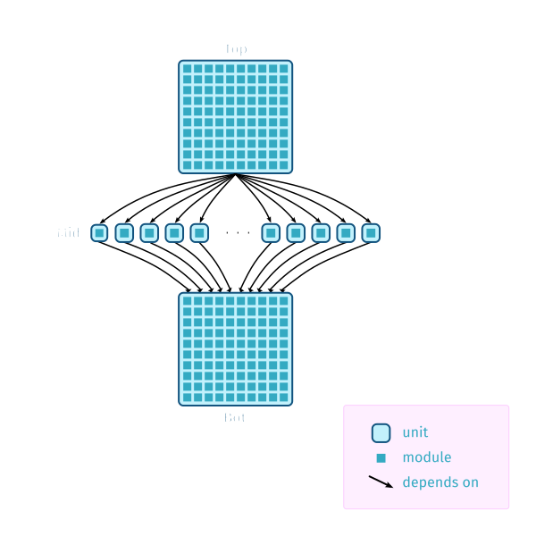

jsem: parallelism semaphores for GHC
====================================

.. author:: Douglas Wilson, Sam Derbyshire, Matthew Pickering
.. date-accepted:: 2023-03-22
.. ticket-url:: https://gitlab.haskell.org/ghc/ghc/-/issues/19416
.. implemented:: 9.8
.. highlight:: haskell
.. header:: This proposal was `discussed at this pull request <https://github.com/ghc-proposals/ghc-proposals/pull/540>`_.
.. sectnum::

.. contents::

We propose to extend GHC to allow many GHC processes to cooperate in sharing
compute resources. Clients, such as ``cabal-install`` and ``stack``, may
exploit this feature to execute build plans in shorter wall-time durations.

For the proposal to offer any value, the protocol herein should be implemented
by ``cabal-install`` and ``stack``. Therefore we seek advice and agreement from
the community.

Motivation
----------

Background
~~~~~~~~~~

GHC, when invoked as ``ghc --make``, compiles a single package component
(or *unit*) consisting of many *modules*. Build tools, such as ``cabal-install``
and ``stack``, compute the dependencies of a unit, compose a build plan, and
execute many ``ghc --make`` subprocesses; first to build the dependencies of the
target unit and then the unit itself.

The ``ghc --make`` command accepts a ``-jN`` option to instruct it to compile up
to ``N`` modules in parallel  [1]_ . Each of these modules consumes one OS
thread (a GHC *capability*).

``cabal-install`` and ``stack`` both also accept a ``-jN`` option [2]_  [3]_ ,
however the meaning here is different. It instructs the build tool to build up
to ``N`` units in parallel. Each of those units will be built by an invocation
of ``ghc --make -j1``.

In the sequel (and for brevity), we will use ``cabal`` commands in the examples
and exposition.

Problem Description
~~~~~~~~~~~~~~~~~~~

While both GHC and cabal provide ways to parallelise their workloads, these two
mechanisms do not compose well [4]_ .

Consider how to compile the following build plans using `8` capabilities:

1. **Many small units.**
   In this case, we can use the invocation ``cabal build -j8 --ghc-options=-j1``,
   which compiles 8 units at a time, with modules from each unit being
   compiled serially.

2. **A single large unit.**
   In this case, we can use the invocation ``cabal build -j1 --ghc-options=-j8``,
   which compiles the unit in a single ``ghc`` invocation, with GHC compiling
   8 modules at a time in parallel.

In practice, however, a build plan is “wide” in some parts and “tall” in others.
Some units, e.g. ``vector``, have many large modules, while a build plan may
have many small units depending on ``vector``.

Consider the following build plan:

        and many small units in the middle.

The optimal build strategy here is to assign all cores to building the bottom
unit. Once that is complete, build all the middle units in parallel, each on
a single core. Finally, compile the top unit, in parallel.

Crucially, in order to saturate all the cores, we need to be able to dynamically
assign a number of capabilities to compile each unit. No single command of
the form:

.. code:: shell

  cabal build -j<n> --ghc-options=-j<m>

would be suitable.

Note that cabal always uses ``--ghc-options=-j1``, even when compiling the
"top" unit, so a top-level application with 500 modules is, by default,
always compiled serially even though many more capabilities might be available.

Proposed Change Specification
-----------------------------

We want to allow the build tool and individual invocations of GHC to share
capabilities, by communicating through a semaphore. To do this, we introduce
the ``-jsem <sem>`` flag, which specifies by name (a string) a semaphore identifier
through which GHC invocations can acquire and release capabilities.

All changes are gated behind this ``-jsem`` flag:

- The ``-jsem`` and ``-j`` flags override eachother to determine which mechanism
  to use to control paralellism.
- If no semaphore named ``<sem>`` exists, GHC reports an error.

Change to user manual
~~~~~~~~~~~~~~~~~~~~~

.. code:: ReST

    .. ghc-flag:: -jsem ⟨sem⟩
        :shortdesc: When compiling with :ghc-flag:`--make`, coordinate with
                    other processes through the semaphore ⟨sem⟩ to compile
                    modules in parallel.
        :type: dynamic
        :category: misc

        Perform compilation in parallel when possible, coordinating with other
        processes through the semaphore ⟨sem⟩ (specified as a string).
        Error if the semaphore doesn't exist.

        Use of ``-jsem`` will override use of :ghc-flag:``-j[⟨n⟩]``,
        and vice-versa.

GHC Jobserver Protocol
~~~~~~~~~~~~~~~~~~~~~~

This proposal introduces the GHC Jobserver Protocol. This protocol allows
a server to dynamically invoke many instances of a client process,
while restricting all of those instances to use no more than <n> capabilities.
This is achieved by coordination over a semaphore implementation provided
by the ``semaphore-compat`` Haskell library.

There are two kinds of participants in the GHC Jobserver protocol:

- The *jobserver* instantiates a new semaphore with a certain number of
  available tokens. This semaphore is identified by a string, called its
  **semaphore identifier**

  Each time the jobserver wants to spawn a new jobclient subprocess, it **must**
  first acquire a single token from the semaphore, before spawning the subprocess.
  This token **must** be released once the subprocess terminates.

  When spawning the subprocess, the jobserver **should** pass on the identifier of the
  semaphore tha the jobserver created to the spawned subprocess, in order to
  allow the subprocess to request tokens from the semaphore.

  Once work is finished, the jobserver **must** destroy the semaphore it created.
  At this point, the semaphore identifier is not valid for any operations and
  attempting to use it will produce an exception.

- A *jobclient* is a subprocess spawned by the jobserver or another jobclient.

  Each jobclient can interact with the semaphore by using a valid semaphore
  identifier provided to it by a jobserver.

  Each jobclient starts with one available token (its *implicit token*,
  which was acquired by the parent which spawned it), and can request more
  tokens through the Jobserver Protocol by waiting on the semaphore.

  Each time a jobclient wants to spawn a new jobclient subprocess, it **must**
  pass on a single token to the child jobclient. This token can either be the
  jobclient's implicit token, or another token which the jobclient acquired
  from the semaphore. It **should** also pass on the identifier of the semaphore, so
  that the child jobclient may acquire additional tokens from the semaphore.

  Each jobclient **must** release exactly as many tokens as it has acquired from
  the semaphore (this does not include the implicit token).

The **semaphore identifier** must begin a a prefix ``v<N>-`` where the ``<N>``
specifies the ``semaphore-compat`` major version that this semaphore was created
using. For instance, a semaphore created with ``semaphore-compat-2.0.0`` could
be called ``v2-some-semaphore12345``.

*Jobclients* that are instantiated with an incompatible semaphore (as detected
by looking at the version of the identifier) must continue the build without
requesting any additional tokens, using only the implicit token they inherited
from their parent process.

All communication between the jobserver and the jobclient happens through
the ``semaphore-compat`` library. This ensures modularity of the protocol:
jobclients don't need to know anything about the jobserver that has spawned them
beyond the version of the ``semaphore-compat`` library they are using.

Implementation of the protocol
~~~~~~~~~~~~~~~~~~~~~~~~~~~~~~

The implementation is built on ``semaphore-compat``, a Haskell library that
provides an abstract semaphore interface. Tools that wish to use this feature
must do so by means of this library.

The implementation consists of two separate parts: jobservers and jobclients.
We want GHC to act as a jobclient and ``cabal``/``stack`` to be jobservers.

The interface supports the following operations:

1. The jobserver must be able to create and destroy semaphores and initialise them with a
  given number of tokens

2. Clients must be able to connect to the semaphore with an identifier (a string) provided by the server

3. Both the server and the client must be able to acquire and release tokens

``semaphore-compat`` is free to implement the semaphore interface in any way it chooses,
such as by using a system semaphore implmentation or by any other means which allow it
to provide the above operations.

The implementation of the jobserver protocol is very straightforward, as it
mostly consists of switching to using ``semaphore-compat`` to control the tokens.
This means that the implementation in ``cabal`` is non-invasive and easy to
maintain.

The implementation of the jobclient protocol is more complex, while still
remaining very non-invasive, as it can be implemented in a single standalone
module which contains all the logic for interacting with the semaphore. The only
other changes required consist of threading through the ``-jsem`` information
through the driver.

GHC's implementation of the jobclient protocol should have the following
characteristics:

A. GHC requests one token for each unit of work it can do concurrently.
   (In the current implementation, a unit of work is the compilation of a single
   module. This means that GHC wants to have as many tokens as it can compile
   modules in parallel. In the future, we could envision GHC being able to use
   more than one token per module, e.g. if one is able to parallelise the
   simplifier workload.)

   Note that all work is done in parallel with waiting on the semaphore. For
   example, if GHC has 3 tokens (including the implicit token) but could use
   more, it will continue compiling with 3 concurrent jobs while it waits on
   the semaphore for more tokens.

B. GHC always returns all the tokens it has acquired from the semaphore,
   either upon successful completion or when an exception is raised,
   by using the ``bracket`` pattern.

C. GHC should adjust its number of capabilities, via ``setNumCapabilities`` [8]_ ,
   to the number of tokens it is using (up to the number of available CPU cores).
   This is because there is a hidden cost in having a GHC program
   (such as ``ghc`` itself) run on fewer CPU cores than its capabilities: the
   stop-the-world cost of garbage collection becomes much more expensive.
   If we were to give GHC a fixed number ``N`` of capabilities, then parallel
   garbage collections in that GHC would recruit ``N`` OS threads.
   Note that, when using ``-jN`` instead of ``-jsem``, GHC already calls
   ``setNumCapabilities N``; so this extends the behaviour to ``-jsem``.

D. GHC should rate-limit the release of semaphore tokens (the precise mechanism
   is left unspecified here). This achieves the following:

   1. It avoids rapidly adjusting the number of capabilities (as per B), as this
      may have adverse effects.

   2. It skews the balance in favour of in-unit parallelism (one unit with many
      capabilities) against compiling many units in parallelm (many units each
      being compiled using a single capability).

      This allows us to prioritise completing a single large unit before
      moving on to other work.

      The justification is that the memory used by compiling units can be released
      before starting another parallel process. Were GHC to release semaphore tokens
      too eagerly, it could end up compiling a large number of units in parallel
      which each have a large loaded EPS. Combined, this will use a significant amount
      of memory.

In practice, we suggest to implement the token acquire/release mechanism by
having GHC use a local pool of tokens, in order to avoid excessive communication
with the semaphore: instead of systematically releasing a token to the semaphore
once a job is done, we can instead re-use this token if we have other pending
jobs. This prioritises the compilation of a single unit.

Backwards Compatibility
~~~~~~~~~~~~~~~~~~~~~~~

An earlier, accepted version of this proposal (implemented in GHC 9.8 and GHC
9.10) specified system semaphores as the concrete implementation mechanism of
these semaphores. On Windows, this was a semaphore implementation provided by
the system Win32 library, and on POSIX platforms this was the POSIX semaphore
implementation provided by the system C library (libc, typically either the GNU
C library or musl libc).

This is sufficient if both the jobserver and the jobclient are linked
against the same system C library, as is usually the case when the system
C library is dynamically linked against the unique implementation provided
by the platform. 

However, on Linux systems, it has become common practice to ship system
independent statically linked executables using the musl libc implmentation.
This becomes problematic when using jobservers and jobclients that are linking
against different C semaphore implementations, for example GHC dynamically
linked against the system glibc and ``cabal-install`` statically linked against
a musl libc. Each libc implementation has its own independent semaphore implementation
based on shared memory datastructures, and these are not compatible with each
other. This has manifested in bug reports against ``cabal-install``
([20]_) and GHC ([21]_).

To support this method of distribution, we can not use the mechanism provided
by the system C library to implement semaphores, and instead rely on some other
mechanism which is robust against mixing of jobservers and jobclients compiled
against different system C library implementations.

Updated ``semaphore-compat`` implementation
^^^^^^^^^^^^^^^^^^^^^^^^^^^^^^^^^^^^^^^^^^^

While this proposal doesn't specify the exact mechanism ``semaphore-compat``
must use to provide a semaphore implementation, the plan is for Windows
platforms to continue to use the Win32 system semaphore implementation, while
POSIX platforms will switch to using a semaphore implementation based on
communication via Unix domain sockets. This avoids the troubles with the shared
memory datastructures used to implement system semaphore implementations.

We can continue to use the system semaphore implementation on Windows as there
are no concerns about differing underlying system semaphore implementations
on this platform, and Windows also provides no direct substitute for Unix
sockets as proposed to be used by ``semaphore-compat`` on POSIX systems.

Backwards compatibility concerns with the updated semaphore implementation
^^^^^^^^^^^^^^^^^^^^^^^^^^^^^^^^^^^^^^^^^^^^^^^^^^^^^^^^^^^^^^^^^^^^^^^^^^^

Currently, GHC 9.8.{1,2} and GHC 9.10.1 provide jobclient implementations based
on ``semaphore-compat-1.0.0``, which ``cabal-install-3.12.1.0`` also uses to provide
a jobserver implementation. ``semaphore-compat-1.0.0`` uses the problematic POSIX
system semaphores and is susceptible to the restrictions regarding system C library
usage by jobservers and jobclients.

Since the underlying semaphore implementation is being fundamentally changed, the
future version of ``semaphore-compat`` – presumably shipped with a future version
of GHC and ``cabal-install`` – would be incompatible with existing jobservers and
jobclients linking against ``semaphore-compat-1.0.0``.

For instance, this means

- ``cabal-install-3.12.1.0`` would be unable to compile code with the
  ``--semaphore`` flag enabled for future versions of GHC shipping with the
  updated ``semaphore-compat`` release. There could be a mechanism
  in the new version of ``semaphore-compat`` (linked to by the future version of
  GHC) to detect such a scenario and output an informative error message.

- Similarly, future versions of ``cabal-install`` would be unable to use
  the semaphore mechanism with existing versions of GHC such as 9.8.{1,2} and
  9.10.1. However, this could be detected by ``cabal-install`` and the feature
  automatically disabled, much like it currently is if attempted to be enabled
  for versions of GHC that don't support ``-jsem`` such as 9.6.

Backwards and forwards compatibility for the abstract semaphores provided by ``semaphore-compat``
^^^^^^^^^^^^^^^^^^^^^^^^^^^^^^^^^^^^^^^^^^^^^^^^^^^^^^^^^^^^^^^^^^^^^^^^^^^^^^^^^^^^^^^^^^^^^^^^

As the previous section illustrates, breaking changes to the communication
protocol used to implement these semaphores are painful and lead to the breakage
of existing compilers and build tools.

As such, we must strive to avoid such breaking changes as much as possible.
In the (hopefully rare) case when such a change cannot be avoided, the change
must meet a high bar of justification.

Concretely, the communication protocol used in each major version series
of ``semaphore-compat`` must be compatible with other versions of the
library belonging to the same major version series. For instance, a
``semaphore-compat-2.0.0`` must be compatible with ``semaphore-compat-2.9.9``, but
may not be compatible with ``semaphore-compat-3.0.0``.

Breaking changes to the protocol require a major version bump and need to be
justified to and accepted by the GHC Proposals Committee.

Examples
--------

Illustration of the functionality
~~~~~~~~~~~~~~~~~~~~~~~~~~~~~~~~~

Let us explain how we envision ``cabal`` handle the following build plan, with
8 capabilities.

        and many single-module units in the middle.

1. To start, ``cabal`` would create a new semaphore ``⟨sem⟩``, with 8 available
   tokens.

3. Next, we compile the ``Bot`` unit, which is a large unit, with many modules,
   which sits at the bottom of the dependency graph and must thus be compiled
   before anything else.

   a. ``cabal`` acquires one token from the semaphore and spawns one
      ``ghc --make -jsem ⟨sem⟩`` invocation.
   b. This invocation of ``ghc`` notices it has a lot of work to do (many modules
      to compile from the ``Bot`` unit), so it requests more resources from the
      semaphore: at least one token per module it can compile concurrently.
      As no other processes are competing for semaphore tokens, and all modules
      can be compiled in parallel (in this example), this GHC invocation obtains
      the remaining 7 tokens.
   c. ``ghc`` finishes compiling the ``Bot`` unit, releasing the 7 tokens it
      acquired.
   d. ``cabal`` notices the ``ghc`` subprocess has terminated, and releases
      the final (8th) token to the semaphore.

4. After that, we move to compiling the middle units.

   a. ``cabal`` will acquire tokens from the semaphore and spawn
      ``ghc --make -jsem ⟨sem⟩`` invocations.
   b. Assuming ``ghc`` requests a single token per module it can compile
      concurrently, each of these ``ghc`` invocations won't query for more tokens,
      as each unit contains a single module.
      As a result, so ``cabal`` will manage running 8 concurrent ``ghc`` processes,
      spawning new ones as previous ones terminate.

5. Once all the middle units are compiled, ``cabal`` will move on to compiling
   the top unit, which will proceed as in (2) with a single
   ``ghc --make -jsem ⟨sem⟩`` invocation compiling 8 modules in parallel.

6. Once all ``ghc`` processes have terminated, we are done, and ``cabal``
   destroys ``⟨sem⟩``.

In this situation, ``cabal`` is the jobserver: it manages the semaphore and
spawns ``ghc`` subprocesses. The ``ghc`` subprocesses are jobclients, and they
communicate by use of the semaphore.

Performance results
~~~~~~~~~~~~~~~~~~~

Preliminary benchmarking results confirm the expected benefit of ``-jsem``
over any possible combination ``cabal -jN, ghc -jM``.

For example, we noted:

  - a 29% speedup in compiling ``lens`` using 8 tokens with ``-jsem``
    versus ``cabal -j8, ghc -j1`` (118s vs 152s).
  - a 42% speedup in compiling ``pandoc`` using 8 tokens with ``-jsem``
    versus ``cabal -j8, ghc -j1`` (556s vs 788s).

Note that, in both of these examples, ``cabal -j8, ghc -j1`` outperformed all
other combination of the form ``cabal -jN, ghc -jM``.

Effects and Interactions
------------------------

The implementation in GHC is self-contained, and doesn't impact the rest of the
compiler much. It does however add a new flag (which interacts with ``-j``),
and a complete implementation requires coordination with jobservers such as
``cabal`` and ``stack``. However, these changes are small and non-invasive,
as it usually only involves switching over to using ``semaphore-compat``
to control the behaviour of ``-j``.

  - The GHC jobserver protocol specifies that all communication happens through
    the semaphore. This means that it doesn't matter which jobserver created
    the semaphore. If nothing else is competing for resources on the semaphore,
    GHC will acquire as many tokens as it can make use of.

  - If GHC can't acquire any tokens from the semaphore, compilation will proceed
    serially (as if running with ``-j1``). This is because jobclients always have
    their implicit token. As resource acquisition is done in parallel, we won't
    block the world just because we are indefinitely waiting on the semaphore.

  - Different jobserver invocations create distinct semaphores (with different
    identifiers) through which their respective child jobclients communicate. (In
    practice, the uniqueness is achieved by generating new uniques names that
    don't clash with any existing semaphore names.)
    To enable multiple invocations of e.g. ``cabal`` to cooperate over resources,
    these invocations should themselves be spawned by an overarching jobserver.
    In that case, some jobserver would create a unique semaphore, spawn ``cabal``
    jobclient processes (to which the semaphore identifier is passed), and the ``cabal``
    processes would in turn spawn GHC jobclient process (to which the semaphore
    identifier is passed).

Alternatives
------------

Multiple home units
~~~~~~~~~~~~~~~~~~~

Support for `multiple home units <https://well-typed.com/blog/2022/01/multiple-home-units/>`_
(not yet fully implemented in ``cabal``) would provide an alternative way
to saturate the number of available capabilities.
This is because compilation with multiple home units is achieved using a single
GHC invocation, which thus doesn't have to worry about contention with
other processes.

In general, it would be preferred to use multiple home units when possible, as
it is expected to be more performant than ``-jsem``:

- no scheduling between different GHC invocations is necessary;
- modules are loaded directly into the home unit graph, which avoids having
  to load the same interface files in different GHC invocations,
- it doesn't require the entire unit to finish compiling before compilation
  can start on another unit that depends on it: we can begin as soon as all
  the modules we need have been compiled.

However, it's not always possible to compile everything with a single GHC
invocation, e.g. if the build plan involves non-Haskell dependencies somewhere
in the middle. In comparison, the ``-jsem`` functionality can fit into any build
system that one might be using, so it supports a wider range of use cases.
The implementation of jsem is also significantly simpler, as the changes required
to jobservers (such as ``cabal`` and ``stack``) are minimal.

One-shot mode
~~~~~~~~~~~~~

The other option for build systems is to use GHC in one-shot mode. In that case,
the build system can control the scheduling of all the jobs. This is what
``hadrian`` and ``rules_haskell`` do when building projects (``cabal``
currently does not).

However, modifying ``cabal`` to support this workflow would be a significant
undertaking. Morever, ``--make`` mode is in general more performant than one-shot
mode, as one retains more information in memory, as opposed to needing to re-obtain
the information by reading interface files.

Other jobserver protocols
~~~~~~~~~~~~~~~~~~~~~~~~~

GNU make supports a Jobserver protocol [9]_ [5]_ which is the same as the
GHC Jobserver protocol described above, except that:

- it uses POSIX pipes to exchange token's between processes.

- participants in the protocol learn about it through environment variables
  and the state of file descriptors on process entry.

For example, rust's ``cargo`` implement the GNU make Jobserver protocol [13]_ .
A prototype implementation of the GNU make Jobserver protocol for GHC was also
made by Ellie Hermaszewska [15]_ .

However, we have decided to depart from this design, for the following reasons:

- Other communities have considered the Make jobserver, and decided that some
  aspects of the protocol are unsuitable (OCaml [10]_ [11]_ , Nix [12]_ ,
  ninja [16]_ ). To summarise:

  - The protocol relies on spawned processes cooperating and returning tokens on
    termination. If this doesn't happen, semaphore tokens can be lost entirely.
    In comparison, with the approach described in this proposal, implicit tokens
    are controlled by the server; this means that, at worst, the build will
    continue with reduced parallelism, and mitigation strategies are available.

  - The protocol uses anonymous file descriptors to communicate between
    processes. This seems to be fragile, with many edge-cases. In 2019,
    changes to the Linux kernel broke the Make jobserver protocol, due to
    subtle changes in the semantics of pipes [18]_.

- We expect ``cabal-install`` and ``stack`` to be the only users of this feature
  in the near term. We think the proposed protocol is adequate for this use case.
  ``-jsem`` doesn't provide a general solution either for mixed-language code bases
  which require coordination with other build tools but then there isn't a widely
  adopted solution which does.

- We can extend GHC to use the GNU make Jobserver protocol in the future, if
  there are users for it.

Some operating systems also have OS-specific methods of mediating parallelism
between processes. For example, MacOS's "Grand Central Dispatch" mechanism
allows applications to queue up tasks to be run in parallel, and handles
the scheduling.
In order to implement parallelism at this level, it seems necessary to modify*
the RTS and GHC's own thread scheduling algorithms. Not only this, the
implementation would be specific to a platform.

Unresolved Questions
--------------------

* What should the name of the command-line flag be? Perhaps ``-juse-jobserver``?

* Should we also offer configuration of this feature via environment variables?

Implementation Plan
-------------------

Douglas Wilson, Sam Derbyshire and Matthew Pickering have implemented a
prototype at [14]_ .

Matthew Pickering has implemented the feature in ``cabal-install`` in [19]_ .

Ongoing work from Well-Typed LLP is funded by Hasura.

Footnotes
---------

.. [1] `https://downloads.haskell.org/ghc/latest/docs/html/users_guide/using.html?highlight=j#using-ghc-make <https://downloads.haskell.org/ghc/latest/docs/html/users_guide/using.html?highlight=j#using-ghc-make>`_

.. [2] `https://cabal.readthedocs.io/en/3.6/cabal-project.html?highlight=%22-j%22#cfg-flag---jobs <https://cabal.readthedocs.io/en/3.6/cabal-project.html?highlight=%22-j%22#cfg-flag---jobs>`_

.. [3] `https://docs.haskellstack.org/en/stable/yaml_configuration/#jobs <https://docs.haskellstack.org/en/stable/yaml_configuration/#jobs>`_

.. [4] `https://github.com/haskell/cabal/issues/976 <https://github.com/haskell/cabal/issues/976>`_

.. [5] `http://make.mad-scientist.net/papers/jobserver-implementation/ <http://make.mad-scientist.net/papers/jobserver-implementation/>`_

.. [6] `https://man7.org/linux/man-pages/man7/sem_overview.7.html <https://man7.org/linux/man-pages/man7/sem_overview.7.html>`_

.. [7] `https://docs.microsoft.com/en-us/windows/win32/sync/semaphore-objects <https://docs.microsoft.com/en-us/windows/win32/sync/semaphore-objects>`_

.. [8] `https://hackage.haskell.org/package/base-4.16.1.0/docs/Control-Concurrent.html#v:setNumCapabilities <https://hackage.haskell.org/package/base-4.16.1.0/docs/Control-Concurrent.html#v:setNumCapabilities>`_

.. [9] `https://www.gnu.org/software/make/manual/make.html#Job-Slots <https://www.gnu.org/software/make/manual/make.html#Job-Slots>`_

.. [10] `https://github.com/ocaml/opam/wiki/Spec-for-GNU-make-jobserver-support <https://github.com/ocaml/opam/wiki/Spec-for-GNU-make-jobserver-support>`_

.. [11] `https://github.com/ocaml/dune/pull/4331 <https://github.com/ocaml/dune/pull/4331>`_

.. [12] `https://github.com/NixOS/nixpkgs/pull/143820 <https://github.com/NixOS/nixpkgs/pull/143820>`_

.. [13] `https://github.com/rust-lang/cargo/pull/4110 <https://github.com/rust-lang/cargo/pull/4110>`_

.. [14] `https://gitlab.haskell.org/ghc/ghc/-/merge_requests/8970 <https://gitlab.haskell.org/ghc/ghc/-/merge_requests/8970>`_

.. [15] `https://gitlab.haskell.org/ghc/ghc/-/merge_requests/7000 <https://gitlab.haskell.org/ghc/ghc/-/merge_requests/7000>`_

.. [16] `https://github.com/ninja-build/ninja/issues/1139 <https://github.com/ninja-build/ninja/issues/1139>`_

.. [18] `https://lwn.net/Articles/864947/ <https://lwn.net/Articles/864947/>`_

.. [19] `https://github.com/haskell/cabal/pull/8557 <https://github.com/haskell/cabal/pull/8557>`_

.. [20] `https://github.com/haskell/cabal/issues/9993`_

.. [21] `https://gitlab.haskell.org/ghc/ghc/-/issues/25087`_
